# FAQ
## KanchokuWS -- 漢直Win Spoiler
KanchokuWS は Windows 用の漢字直接入力ツールです。
また同時打鍵をサポートした、かな配列実装プラットフォームとしても利用できます。

本書は KanchokuWS に関する FAQ(よくある質問と回答)をまとめたものです。
より詳細な利用方法については、[利用者ガイド](MANUAL.md#manual)を参照ください。

## 目次

- [設定ダイアログ](#設定ダイアログ)
    - [設定ダイアログの開き方](#設定ダイアログの開き方)
- [仮想鍵盤](#仮想鍵盤)
    - [仮想鍵盤がじゃまです](#仮想鍵盤がじゃまです)
    - 仮想鍵盤が変な表示になりました
- 打鍵ガイド
    - 最後に出力した文字の打鍵列を知りたい
    - 画面に表示されている文字の打鍵列を知りたい
    - 「読み」で漢字を検索してその打鍵列を知りたい
- [配列選択](#配列選択)
    - どんな配列が使えますか
    - [配列の選択方法](#配列の選択方法)
    - [選択した配列(テーブルファイル)の内容を確認したい](#選択した配列テーブルファイルの内容を確認したい)
- [IME連携](#IME連携)
    - [IME のON/OFFに合わせて漢直もON/OFFしたい](#IME-のON/OFFに合わせて漢直もON/OFFしたい)
    - [IME にひらがなが送られません](#IME-にひらがなが送られません)
- [同時打鍵](#同時打鍵)
    - [同時打鍵で意図しない文字が入力されてしまうのを防ぎたい](#同時打鍵で意図しない文字が入力されてしまうのを防ぎたい)
- [配列作成](#配列作成)
    - [新しい配列(テーブルファイル)を作成したい](#新しい配列テーブルファイルを作成したい)
    - [使用するキーとその漢直キーコード](#使用するキーとその漢直キーコード)
    - [単打用テーブル](#単打用テーブル)
    - 多ストローク用テーブル
    - [順次打鍵での前置シフト](#順次打鍵での前置シフト)
    - [SandS による連続シフト](#SandS-による連続シフト)
    - [連続シフトありの前置シフト](#連続シフトありの前置シフト)
    - [連続シフトありの相互シフト同時打鍵](#連続シフトありの相互シフト同時打鍵)
    - [ワンショット(連続シフトなし)の相互シフト同時打鍵](#ワンショット連続シフトなしの相互シフト同時打鍵)
    - [「無変換」キーや「変換」キーを同時打鍵シフトキーとして使いたい](#「無変換」キーや「変換」キーを同時打鍵シフトキーとして使いたい)
    - [「無変換」キーや「変換」キーを拡張シフトキーとして使いたい](#「無変換」キーや「変換」キーを拡張シフトキーとして使いたい)
    - [同じ構造のテーブルの記述を省略したい](#同じ構造のテーブルの記述を省略したい)
    - [別のテーブルファイルを使い回したい](#別のテーブルファイルを使い回したい)
    - かな配列と漢直配列を同時に使用したい
    - [選択時に表示される説明文を設定したい](#選択時に表示される説明文を設定したい)
    - [Google日本語入力の書き換えシステムをエミュレートしたい](#Google日本語入力の書き換えシステムをエミュレートしたい)
    - [Google日本語入力用ローマ字テーブルを出力したい](#Google日本語入力用ローマ字テーブルを出力したい)
    - [テーブルファイルの例](#テーブルファイルの例)
    - [矢印記法とは何ですか](#矢印記法とは何ですか)
- [カタカナの出し方](#カタカナの出し方)
    - [一時的にカタカナモードに変更する](#一時的にカタカナモードに変更する)
    - [ひらがなを出力した後、一括でカタカナに変換する](#ひらがなを出力した後一括でカタカナに変換する)
- 交ぜ書き変換
- 履歴
    - ゴミ履歴を削除したい
    - 手動で履歴登録したい
    - 勝手に自動でいろいろ登録しないでほしい
- 部首合成
- [利用条件と免責](#利用条件と免責)

## 設定ダイアログ
### 設定ダイアログの開き方
タスクトレイに格納されている本体アイコン<br/>
<br/>
または仮想鍵盤<br/>
 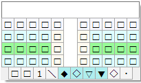<br/>
のいずれかで右クリックすると、以下のようなメニューが表示されます。
ここで「設定画面」を選択してください。

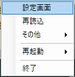


## 仮想鍵盤
### 仮想鍵盤がじゃまです
いろいろな対処法があります。

**1. 最初から表示しない**

[設定ダイアログ](#設定ダイアログ)を開き、
「基本設定」>「仮想鍵盤表示」>「無表示」にチェックを入れ、「適用」をクリックします。

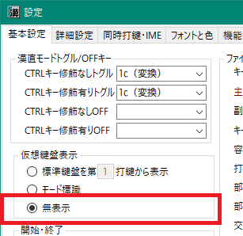

**2. テキストカーソルから離れた位置に表示する**

[設定ダイアログ](#設定ダイアログ)を開き、
「詳細設定」>「仮想鍵盤・モード標識」>「カレットからの相対表示位置」の
X座標、Y座標を適当な値に変更して「適用」をクリックします。

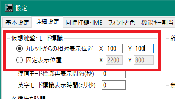

**3. 仮想鍵盤をドラッグして移動する**

仮想鍵盤をマウスでドラッグして一時的に別の位置に固定することができます。
下記ツイートを参考にしてください。

https://twitter.com/kanchokker/status/1459442675849912322

### 仮想鍵盤が変な表示になりました

## 配列選択
### どんな配列が使えますか
(後で書く)

### 配列の選択方法
[設定ダイアログ](#設定ダイアログ)を開き、
「基本設定」>「ファイル」>「主テーブルファイル」のドロップダウンを開きます。
`tables` というフォルダーに格納されているテーブルファイルの一覧が表示されるので、
そこから利用したい配列(テーブルファイル)を選択してください。

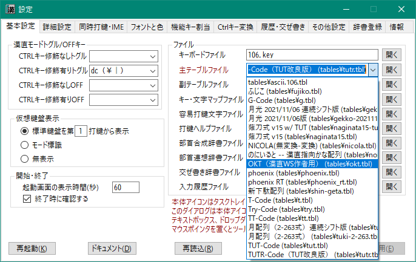

### 選択した配列(テーブルファイル)の内容を確認したい
テーブルファイル名を格納しているコンボボックスの右にある「開く」ボタンをクリックします。

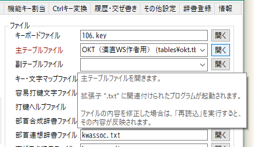

ツールチップにも記述されていますが、選択されているテーブルファイルのパスを引数として、
`.txt` という拡張子を持つファイルに関連付けられたプログラムを起動します。
とくに何も関連付けをしていない場合は、メモ帳が開くと思います。

選択したテーブルファイルによっては、そこからサブテーブルをインクルードしているかもしれません。

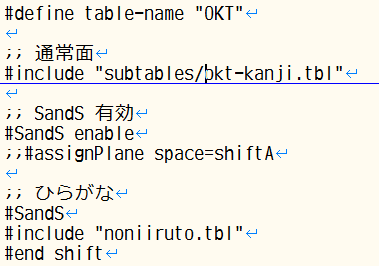

その場合は、利用者自身でエディタ等でそのサブテーブルファイルを開いてください。
なお「サクラエディタ」では、上記の `"subtables/okt-kanji.tbl"` のところに
テキストカーソルを置いて F12 を押すと、カーソル位置のファイルを開いてくれます。

## IME連携
### IME のON/OFFに合わせて漢直もON/OFFしたい

[設定ダイアログ](#設定ダイアログ)を開き、
「同時打鍵・IME」>「IME連携」>「IMEの状態に合わせて漢直をON/OFFする」にチェックを入れ、
「適用」をクリックします。

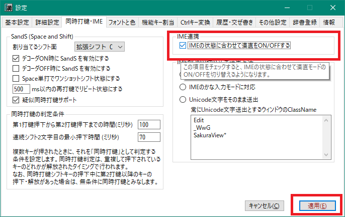

### IME にひらがなが送られません
IMEに対して文字をUnicodeのまま送っているか、または送出方法がIMEの入力モードと合っていないと思われます。
[設定ダイアログ](#設定ダイアログ)を開き、
「同時打鍵・IME」>「IMEがONの時の文字送出方法」で、使用しているIMEの入力モードに合った項目を選択し、
「適用」をクリックします。

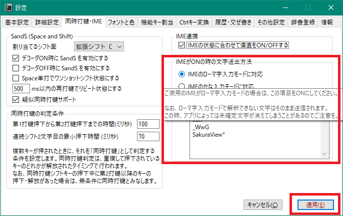

## 同時打鍵
同時打鍵とは、2つ以上のキーが同時に押下された時に、
それらのキーの組み合わせに対して定義された文字列を出力する機能です。
たとえば、W と J が単打の時はそれぞれ「き」と「あ」が出力されるが、
同時に押下された場合は「ぎ」を出力する、というようなことが可能になります。

なお、W を押している時間帯と J を押している時間帯が一瞬でも重なっていれば「同時」です。

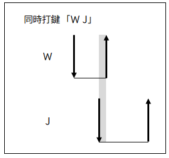

ただし、時間的には同時でも、それを「同時打鍵」として扱うかどうかは、また別の判定条件があります。

必ず同時打鍵として扱うケースとして以下の場合があります。
下図のように第1打鍵の解放が第2打鍵の解放よりも後の場合は無条件で同時打鍵として扱われます。

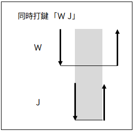

### 同時打鍵で意図しない文字が入力されてしまうのを防ぎたい
「同時に打鍵されているけど、こういう場合は同時打鍵とみなさない」という条件が2つあります。

#### 第1打鍵から第2打鍵までの時間に制約をかける
下図のように、第1打鍵の押下から第2打鍵の押下までの時間が 80msである場合、 デフォルトの設定では同時打鍵と判定されます。
打鍵速度の速い方だと、単打のつもりでもこれくらいの時間間隔でキー入力することがあるかと思います。

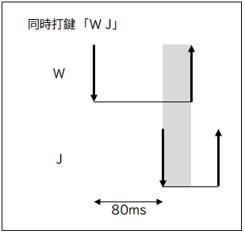

2つのキーの押下間隔に制約をかけて、ある一定時間以下に2つのキーが押下された場合に限り同時打鍵と判定する、
という条件を設定することができます。
[設定ダイアログ](#設定ダイアログ)の
「同時打鍵・IME」>「同時打鍵の判定条件」>「第1打鍵から第2打鍵までの時間(ミリ秒)」で設定してください。
下図は制約時間をデフォルトの 100ms から 70msに変更する例です。

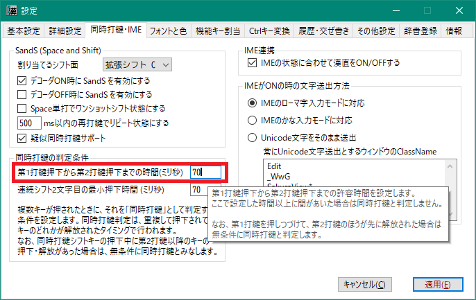

#### 連続シフト可のときに2文字めを同時打鍵と判定したくない
たとえば「薙刀式」の J は、単打だと「あ」になりますが、同時打鍵の場合は相手キーを濁音化するシフトキーになります。
この機能は「連続シフト」が可能になっており、たとえば J を押しながら W, R と押すと「ぎじ」と出力されます。
この時、本当は「ぎし」と出したかったのだけど意図せず「ぎじ」になってしまった、ということもあろうかと思います。

このようなケースを制御するために、連続シフトの2文字目のキー押下時間に制約をかけることができます。
[設定ダイアログ](#設定ダイアログ)の
「同時打鍵・IME」>「同時打鍵の判定条件」>「連続シフト2文字目の最小押下時間(ミリ秒)」で設定してください。
下図は制約時間をデフォルトの 70ms から 90msに変更する例です。

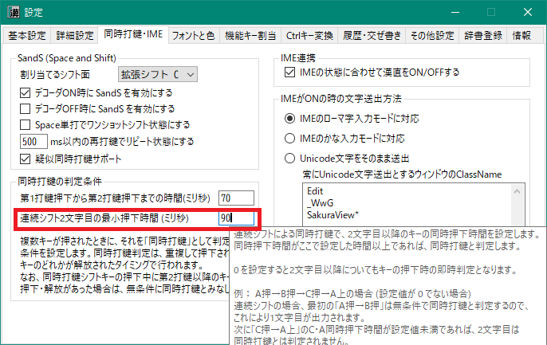

上図のように条件を変更すると、下図のようなケースでは2文字目の R を打鍵してから最初のシフトキー J
を解放するまでの時間 80ms が同時打鍵条件を下回っているので、同時打鍵ではなく単打と判定され「し」が出力されます。

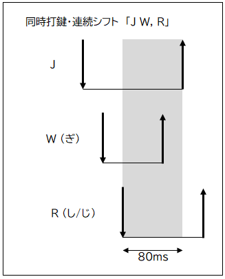

### タイマーを使って一定時間後に同時打鍵判定をする
親指シフトでは、キーを押してから一定時間(100msとか200msとか)が経過すると、
**そのキーが押下中であっても**それを単打と判定して文字の出力を行います。

これと同様の挙動を行いたい場合は、下図のように「第1打鍵が文字キーの場合にタイマーを併用する」に
チェックを入れてください。

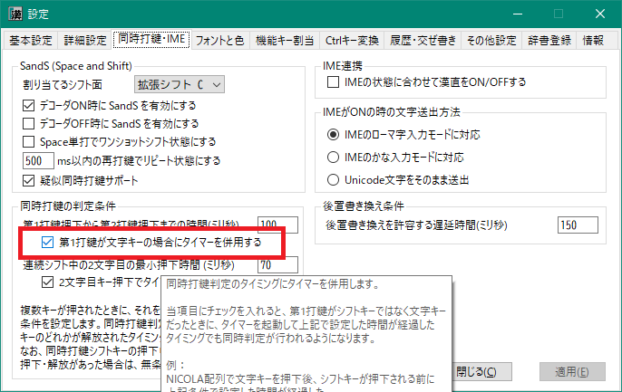


## 配列作成
### 新しい配列(テーブルファイル)を作成したい
配列は、`tables` フォルダの配下にある `.tbl` という拡張子を持つテキストファイルで定義します。
このファイルのことを「テーブルファイル」と呼称しています。

テーブルファイルには、キーを表す「漢直キーコード」とそれに対応する出力文字(列)を記述します。

### 使用するキーとその漢直キーコード
テーブルファイルに記述するのは、下図のキーボードレイアウトで
数字の背景色が青と緑になっているキー(0～48)です。
背景色の付いた数字は、各キーに割り振られた「**漢直キーコード**」を示しています。


漢直キーコードと出力文字(列)の対応は「[矢印記法](#矢印記法とは何ですか)」で記述するのが基本です。
でもすべての定義をこの記法で書くのは面倒なので、
より直感的に書ける記法が用意されています。

### 単打用テーブル
下図は「月配列（2-263式）」(tuki-2-263.tbl)からの抜粋です。

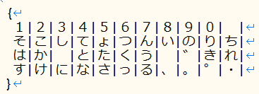

`{` と `}` で囲まれたところに、漢直キーコード 0 ～ 48 のキーに対応する文字（あるいは文字列）を、
キーボードの4段に対応する形で `|` で区切って文字を並べます。
文字(列)の前後には任意個の半角空白文字を置くこともできます。
出力文字がないところには、0個以上の任意個の半角空白文字を並べます。

他に、以下のような簡略化がなされています。

- 出力文字(列)が半角英数字および全角文字だけからなる場合は、ダブルクォートで囲む必要がない
- 出力文字の記述のないキーについては、本来のキーボードによる打鍵文字が出力される
    - スペースキーに対応する文字や機能を設定したい場合は5段目に書く
- 各段の後半部で出力文字の記述のないキーが末尾まで連続する場合は、その部分を省略できる（ただし、最低でも1つの `|` は必要）
- 「゛」と「゜」は直前の出力文字を濁音化(半濁音化)する機能を呼び出す

### 順次打鍵での前置シフト
下図は「月配列（2-263式）」(tuki-2-263.tbl)からの抜粋です。

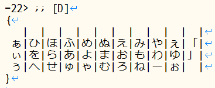

[矢印記法](#矢印記法とは何ですか)で前置シフトキーの漢直キーコードを記述した後、単打の場合と同様にテーブル構造を記述します。
なお `;`
は、それ以降行末までコメントであることを表します。


### SandS による連続シフト
スペースキーにシフトキーと同様の機能を持たせ、拡張シフト面に割り当てる設定です。
下図は「薙刀式 v15(仮)」(naginata15.tbl)からの抜粋です。

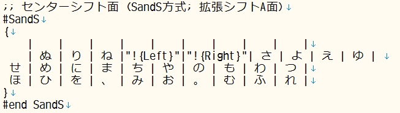

テーブル記述の前後を `#SandS` と `#end SandS` で
囲みます。`#` は行頭に位置する必要があります。

### 連続シフトありの前置シフト
同時打鍵で連続シフトありだけれども、シフトキーが前置の場合のみ有効なケース。

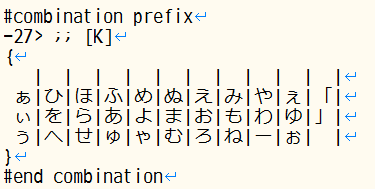

テーブル記述の前後を `#combination prefix` と `#end combination` で
囲みます。`#` は行頭に位置する必要があります。

### 連続シフトありの相互シフト同時打鍵
同時打鍵で連続シフトあり、かつシフトキーの順序が前後しても構わないケース。
下図は「薙刀式 v15(仮)」(naginata15.tbl)からの抜粋です。

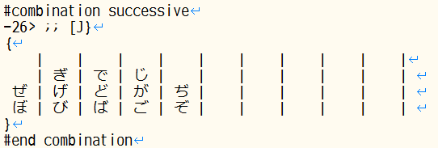

テーブル記述の前後を `#combination successive` と `#end combination` で
囲みます。`#` は行頭に位置する必要があります。

### ワンショット(連続シフトなし)の相互シフト同時打鍵
同時打鍵かつシフトキーの順序が前後しても構わないが、連続シフトは不可のケース。
下図は「新下駄配列」(shin-geta.tbl)からの抜粋です。

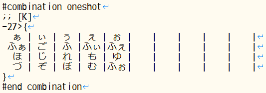

テーブル記述の前後を `#combination oneshot` と `#end combination` で
囲みます。`#` は行頭に位置する必要があります。

### 「無変換」キーや「変換」キーを同時打鍵シフトキーとして使いたい
親指シフトの親指キーとして「無変換」「変換」キーを使いたい場合は、
それらのキーに対応する漢直キーコードを[矢印記法](#矢印記法とは何ですか)のところに記述します。

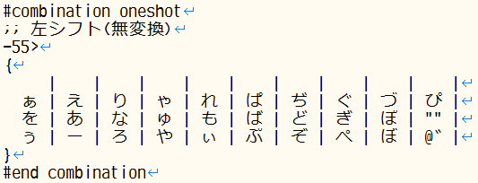

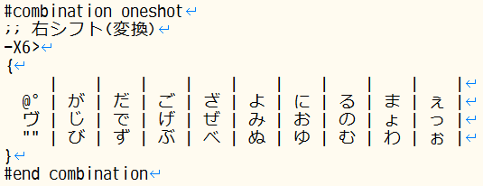

「無変換」などの特殊キー(機能キー)の漢直キーコードは 50～99 となりますが、`X0～X49` と書くこともできます。
この場合「変換」キーは `X6` となります。

### 「無変換」キーや「変換」キーを拡張シフトキーとして使いたい
SandS と同様に「無変換」や「変換」もシフトキーとして使いたいというケース。
同時打鍵ではなく、あくまでも「シフトキー」と同様の使い方をしたい場合となります。
下図は「薙刀式 v15 w/ TUT」(naginata15-tut.tbl)からの抜粋です。

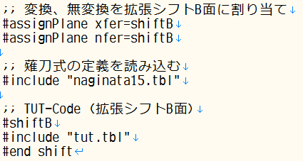

まず `#assignPlane` で `xfer`(変換)や`nfer`(無変換)
キーに拡張シフト面を割り当てます。
拡張シフト面は、 `shiftB` ～ `shiftF` の5面から選択します。
(`shiftA` は `SandS` のデフォルトとして予約済みのため)

その後、 `#shiftB`(～`shiftF`) と `#end shift` でテーブル定義部を囲みます。
`#end shift` が来るまでテーブル定義は拡張シフト面に定義されることになるので、
適切な場所で必ず `#end shift` を記述してください。

### 同じ構造のテーブルの記述を省略したい
月系のかな配列では D と K の中指前置に対して同じテーブルが使われます。
このようなケースでは、テーブル記述をいったん変数に記録しておいて、後でそれを呼び出すことができます。

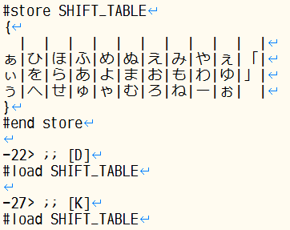

`#store 変数名` と `#end sotre`
で囲んだ部分が `変数名` で指定される変数に格納されます。
変数に格納された部分は、後で `#load 変数名`
で呼び出すことができます。

### 別のテーブルファイルを使い回したい
テーブルファイル全体を使い回したい場合は `#include` を使います。
下図は「月配列（2-263式）連続シフト版」(tuki-2-263.pfx.tbl)からの抜粋です。

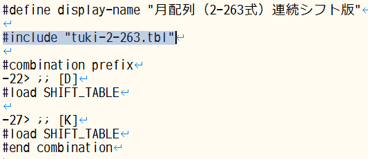


行頭から `#include` と記述し、続けてダブルクォートで囲んで読み込むテーブルファイル名を記述します。
テーブルファイルは、インクルード元ファイルからの相対パスで記述してください。


### 選択時に表示される説明文を設定したい
テーブルファイル選択用のコンボボックスに表示される説明文を設定するのには `#define display-name`
を使います。


`#define display-name`
の後にダブルクォートで囲んで説明文を記述します。

### Google日本語入力の書き換えシステムをエミュレートしたい
Google日本語入力のローマ字テーブル設定では「入力」「出力」「次の入力」の3項目を設定することができます。
本ツールでは、「後置シフト」を導入してこの書き換えシステムと同等の機能を実現しています。

後置シフトには2通りの書き方があります。

#### 前置書き換え方式

仕組みとしては後置シフトなんだけれども、前置されるキーが共通しているために「前置書き換え」と称しています。
下図は「ブリ中トロ配列」(chutoro.211023.tbl)からの抜粋です。

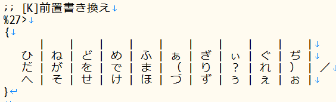

まず共通の前置キーを `%n>` という形式の記法で記述します。矢印記法に似ていますが、
先頭部が `%` になっています。
上図では共通の前置キー `K` に該当する `27` という漢直キーコードを記述しています。

`{ }` で囲まれたブロック内には、後置するキーに対応して、書き換え後の文字(列)を記述します。
「ブリ中トロ配列」での `K` 単打は「。」なのですが、その直後に `A` を打鍵すると、
画面上は「。」が消えて「だ」に書き換わります。


#### 後置書き換え方式
後置シフトキーが共通している場合は、こちらの記法を用います。
下図は「ブリ中トロ配列」(chutoro.211023.tbl)からの抜粋です。

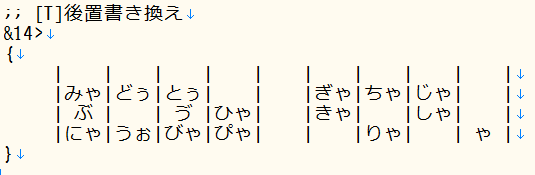

まず共通の後置キーを `&n>` という形式の記法で記述します。矢印記法に似ていますが、
先頭部が `&` になっています。
上図では共通の前置キー `T` に該当する `14` という漢直キーコードを記述しています。

`{ }` で囲まれたブロック内には、前接するキーに対応して、書き換え後の文字(列)を記述します。
「ブリ中トロ配列」での `S` 単打は「か」なのですが、その直後に `T` を打鍵すると、
画面上は「か」が消えて「ぶ」に書き換わります。

なお、後置キーが複数打鍵からなる場合は、その複数キーの漢直キーコードを `,`
で連結してください。下図は、`DA` という2打鍵の後置シフトキーの場合の記述例です。

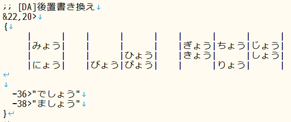

#### 濁音化や半濁音化する簡単なやり方はありますか
もちろんあります。濁音化させる後置シフトキーのところに「゛」を、
半濁音化させるキーのところに「゜」を記述してください。下図は「月光」からの抜粋です。

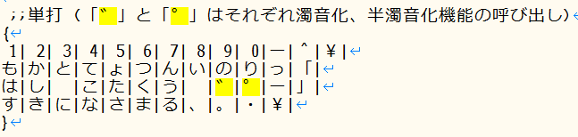

#### 「。」の出力を確定させたい
IMEを併用している場合は「。」の後で Enter を打鍵すれば確定となりますが、
漢直WSを素で使用している場合は、下図のように「ブロッカー設定/解除」に適当なキーを割り当て、
それを打鍵してください。

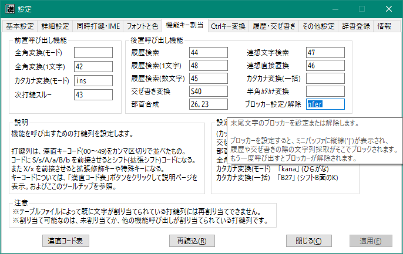

上図では「無変換」キーに割り当てています。
「。」の出力後に無変換キーを打鍵すると下図のようにミニバッファに縦棒 `|` が表示され、
そこから左側の文字列には書き換えが及ばなくなります。

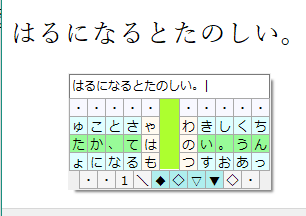

#### 「～ましょう」の末尾「う」を書き換え対象にしたくない
[後置書き換え方式](#後置書き換え方式)のところに示した図では
「ましょう」をダブルクォートで囲んでいます。

このように文字列をダブルクォートで囲むと、その全体が「出力」文字列となり、
「次の入力」は空になって、書き換え対象から外れます。

ダブルクォートで囲まない場合は、デフォルトで末尾1文字が書き換え対象となります。
これを複数文字に拡張したい場合は、書き換え対象文字列の直前に `/` を入れてください。

```
  -38>たの/しい
```


### Google日本語入力用ローマ字テーブルを出力したい
漢直WSを使用せず、直接Google日本語入力上でかな配列を利用したい場合は、
下図のように「その他設定」>「Google日本語入力 ローマ字テーブルファイル出力」で
「出力」ボタンをクリックしてください。
漢直系、月系、ブリ中トロなど、同時打鍵を使用していない配列で有効です。

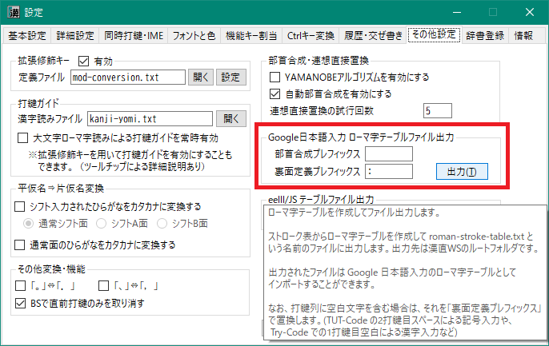

漢直WS上でかな配列を試行錯誤して、ある程度固まったらローマ字テーブルを出力し、
それをGoogle日本語入力にインポートする、というような利用が可能です。


### テーブルファイルの例
以下は「月配列(2-263)」を定義しているテーブルファイルの内容です。

```
#define display-name "月配列（2-263式）"

;; DvrakJより引用・改変
;; 
;; 月配列（2-263式）
;; http://jisx6004.client.jp/tsuki.html
;; 

;;単打
#store NORMAL_TABLE
{
１|２|３|４|５|６|７|８|９|０|  |
そ|こ|し|て|ょ|つ|ん|い|の|り|ち|
は|か|  |と|た|く|う|  |゛|き|れ|
す|け|に|な|さ|っ|る|、|。|゜|・|
}
#end store

#store SHIFT_TABLE
{
  |  |  |  |  |  |  |  |  |  |  |
ぁ|ひ|ほ|ふ|め|ぬ|え|み|や|ぇ|「|
ぃ|を|ら|あ|よ|ま|お|も|わ|ゆ|」|
ぅ|へ|せ|ゅ|ゃ|む|ろ|ね|ー|ぉ|  |
}
#end store

;;単打
#load NORMAL_TABLE
-28>@゛  ;; 濁音化(「@゛」で濁音化機能になる)
-39>@゜  ;; 半濁音化(「@゜」で半濁音化機能になる)

-22> ;; [D]
#load SHIFT_TABLE

-27> ;; [K]
#load SHIFT_TABLE
```

### 矢印記法とは何ですか
テーブルファイルにおける最も基本的な記法です。以下のような形式で記述します。
```
-{漢直キーコード}>"出力文字列"
```
`{漢直キーコード}`にはキーに割り振られた 0～48 の漢直キーコードを記述します。たとえば、
```
-10>"あ"
```
と記述してあると、`Q` を押したときに「あ」が出力されます。

複数キーの打鍵によって出力文字を定義する場合は、矢印記法を重ねることができます。
```
-23>-25>"愛"
```
これは、`FH`と打鍵したときに「愛」を出力する定義となっています。
複数キーの打鍵列では、次のような簡略記法も使えます。
```
-20,21,22,23,26,27,28,29>"くぁwせdrftgyふじこlp"
```
これは、`ASDFJKL;` と順に打鍵したときに「くぁwせdrftgyふじこlp」と出力する定義です。


## カタカナの出し方
TUT-Code など、カタカナの定義されていない配列を使用している場合に、ひらがなをカタカナに変換して出力することができます。
次の2通りの方法があります。

### 一時的にカタカナモードに変更する
ひらがなを出力するストローク列を打鍵したときにカタカナに変換して出力するモードがあります。
たとえば「ストローク」と出力したい場合は一時的にこのモードに変更してから「すとろーく」と打鍵します。

モードを切り替えるにはまずカタカナモードと通常モードの切り替え機能を呼び出す機能キーの設定が必要です。
下図のように設定ダイアログの「機能キー割当」タブで「前置呼び出し機能」の「カタカナ変換(モード)」
に適当なキーを設定してください。(下図では「英数」キーを設定)

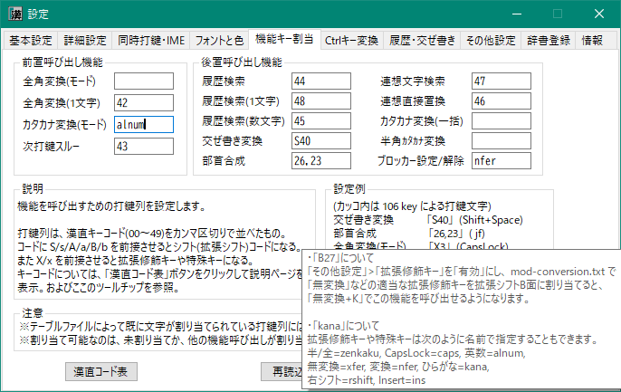

「適用」をクリックすると、以降、「英数」キーを押すたびにカタカナモードと通常モードが切り替わります。

### ひらがなを出力した後、一括でカタカナに変換する
いったんひらがなを出力した後、それを一括でカタカナに変換します。
ただし出力文字列の末尾のひらがなを全てカタカナに変換してしまうので注意が必要です。

こちらも変換のためのキーの設定が必要になります。上図で「後置呼び出し機能」の「カタカナ変換(一括)」
に適当なキーを設定してください。

カタカナ変換の対象となる部分の前にもひらがながある場合は、そこにあらかじめ「ブロッカー」を
設定しておいてください。

## 利用条件と免責
- 本プログラムおよびソースコードの利用は無償かつ自由ですが、無保証です。
  - 利用に際しては、それに起因するいかなる損害についても作者に責を負わせないことに同意ください。
  - 部首合成モジュールは新たに作成しました。したがってGPLの適用はありません。
  - 新しく追加した部首合成アルゴリズムや動的交ぜ書き方法が他の漢直ツールにも普及してくれると嬉しいです。
- 辞書その他のデータの利用については、引用元のライセンスに従ってください。

