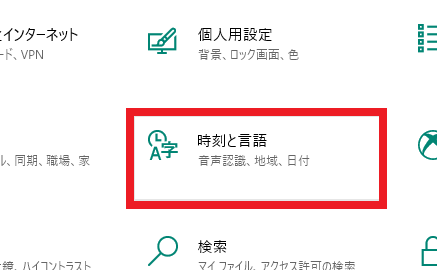
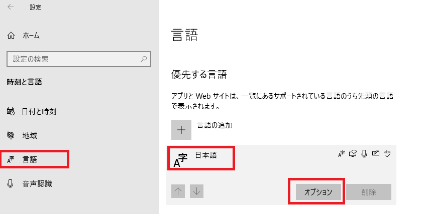
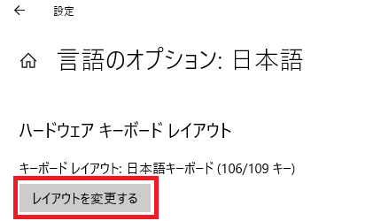
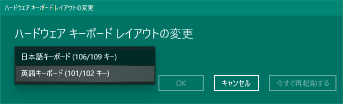

###### [FAQ HOME](../FAQ.md#FAQ-HOME)

# 英語キーボードの選択手順

**1. OSの「設定」から「時刻と言語」をクリック**

**2. 「言語」>「日本語」>「オプション」の順にクリック**

**3. 「レイアウトを変更する」をクリック**

**4. 「英語キーボード(101/102キー)」を選択**

(しかし、なんでこんなに分かりくいところにあるんでしょうね)

