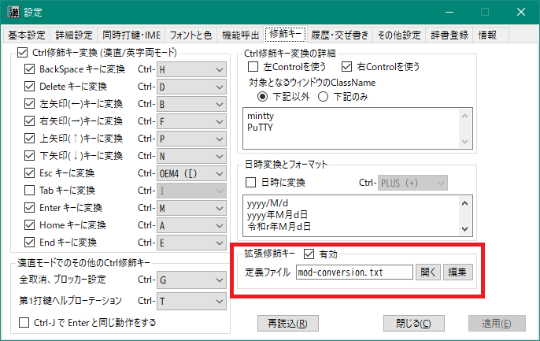

###### [FAQ HOME](FAQ.md#../FAQ-HOME)

# FAQ キーアサイン編

## 目次
- [機能キーを修飾キーとして使う(拡張修飾キー)](#機能キーを修飾キーとして使う拡張修飾キー)
- [拡張シフト面の割り当て](#拡張シフト面の割り当て)
- [拡張修飾キーの割り当て](#拡張修飾キーの割り当て)
- [特殊キーに対する単打設定](#特殊キーに対する単打設定)
- [機能名一覧](#機能名一覧)
- [複合機能キーの記述](#複合機能キーの記述)
    - [機能キー記述](#機能キー記述)
    - [Ctrl修飾とShift修飾](#Ctrl修飾とShift修飾)
    - [3項演算記述](#3項演算記述)
    - [使用できる機能キーの名前](#使用できる機能キーの名前)
    - [任意の仮想キーコードの使用](#任意の仮想キーコードの使用)

## 機能キーを修飾キーとして使う(拡張修飾キー)
Space(SandS有効時)、CapsLock, 英数, 無変換, 変換, 右シフト, 左右コントロールの8つの機能キーを修飾キーとして使用し、
通常シフト面、拡張シフト面A～F のいずれかに割り当てることができます。

この機能を使用する場合は、下図のように「修飾キー」>「拡張修飾キー」で
「有効」にチェックを入れ、修飾キー変換の定義ファイル名を設定してください。



初期状態では、あらかじめ用意してある `mod-conversion-sample.txt`
というファイルが `mod-conversion.txt` という名前のファイルにコピーされて、
そのファイル名が設定されています。
「開く」ボタンをクリックすると、テキストエディタでそのファイルを開いて内容を確認することができます。

「編集」ボタンをクリックすると、下図のような「拡張修飾キー設定」ダイアログが開きます。
拡張修飾キーに対する割り当てを修正する場合は、
エディタで上記ファイルを直接編集するよりもこちらを使うほうが便利です。


使い方については、各コントロールや「説明」のところにマウスポインタを置くとツールチップが表示されるので、
それを参照してください。

「書き出し」をクリックすると、表示されている内容が定義ファイルに書き出されるので、
「再読込」をクリックしてそれらの修正内容を反映させてください。

もし、複数のキー割り当てを一括で変更したいのであれば、定義ファイルをエディタなどで直接修正したほうが簡単かもしれません。
この場合も、修正完了後、「再読込」をクリックすると、設定ダイアログのほうにも修正結果が反映されます。

なお、定義ファイルに記述する場合の書式などについては `mod-conversion.sample.txt` 
に詳細を記述してあるので、こちらを参照してください。

## 拡張シフト面の割り当て
「拡張修飾キー設定」ダイアログの下部にあるラジオボタンで「シフト面設定」をクリックしてください。


SandS, CapsLock, 英数, 無変換, 変換, 右シフト, 左右コントロールの8つの機能キーに対して、
通常シフト面、拡張シフト面A～F のいずれかに割り当てることができます。

割り当て先のシフト面を表示しているセルの上でマウスをダブルクリックすると、
それに対応するコンボボックスがドロップダウンされるので、割り当てる拡張シフト面を選択してください。

ふつうに「拡張修飾キー」コンボボックスで対象のキーを選択してから、
「漢直ON時シフト面」「漢直OFF時シフト面」コンボボックスで、
割り当てる拡張シフト面を選択することもできます。

なお、選択した結果は直ちに表に反映されますが、「書き出し」を実行するまでは定義ファイルには反映されません。

## 拡張修飾キーの割り当て
「拡張修飾キー設定」ダイアログの下部にあるラジオボタンで「修飾キー設定」をクリックしてください。


上部の「拡張修飾キー」コンボボックスで拡張修飾キーを選択した上で、
対象となる被修飾キーの行の「割り当てキー／機能名」列のセルに割り当てるキー名や機能名を入力します。

使用可能なキー名や機能名については、当該セル上でダブルクリックまたは右クリックすると
下図のようなダイアログが開くので、ここから選択してください。
表の前半が機能名に、後半がキー名になっています。


選択したキー名、あるいは `A`〜`Z` のキー名の頭に `^` を付加することで、 Ctrl修飾されたキーを表すことができます。
たとえば、`^Left` は「Ctrl＋左矢印」に、`^S` は「Ctrl＋S」になります。
これらのキーを入力する場合は、いったんセルを選択状態にした後、F2 を押すかセルを再クリックすると、
セルへの直接入力モードになります。

`!{+End}!{^X}` のような[複合機能キー呼び出し](#複合機能キーの記述)や、
`A26` のような拡張シフト面に対するストロークコードも記述することができます。
この場合もセル直接入力モードを使ってください。

## 特殊キーに対する単打設定
「拡張修飾キー設定」ダイアログの下部にあるラジオボタンで「単打設定」をクリックしてください。


「単打キー」列に記載された特殊キー(機能キー)の単打(キーを押してすぐ離す操作)に対して、
「割り当てキー／機能名」列に記載のキーや機能を割り当てることができます。
入力方法は、前項「拡張修飾キーの割り当て」と同様です。

## 機能名一覧

|コマンド名|機能|
|-|-|
|ModeToggle|漢直モードのトグル|
|ModeToggleFollowCaret|漢直モードのトグル（カレットへの再追従）|
|Activate|漢直モードに入る|
|Deactivate|漢直モードから出る|
|ExchangeCodeTable|主・副テーブルファイルを切り替える|
|SelectCodeTable1|主テーブルファイルに切り替える|
|SelectCodeTable2|副テーブルファイルに切り替える|
|KanaTrainingToggle|かな入力練習モードと通常モードを切り替える|
|ClearStroke|打鍵中のストロークを取り消して、第1打鍵待ちに戻る|
|FullEscape|入力途中状態をクリアし、ミニバッファ末尾にブロッカーを置く|
|Unblock|ミニバッファ末尾のブロッカーを解除する|
|BlockerToggle|ミニバッファ末尾のブロッカーを設定・解除する|
|HistNext|履歴を先頭から選択|
|HistPrev|履歴を末尾から選択|
|VkbShowHide|仮想鍵盤の表示/非表示の切り替え|
|HelpRotate|ストロークヘルプの正順回転|
|HelpUnRotate|ストロークヘルプの逆順回転|
|DateRotate|日時変換の入力(フォーマットの正順切替)|
|DateUnrotate|日時変換の入力(フォーマットの逆順切替)|
|StrokeHelp|最後に入力した文字のストロークヘルプ (ストローク表に定義がないか、2回続けて呼び出すと部首合成ヘルプになる)|
|BushuCompHelp|部首合成ヘルプ表示|
|RomanStrokeGuide|打鍵ガイドへのローマ字による読み入力のON/OFF(読み入力OFF後にガイド開始)|
|UpperRomanStrokeGuide|英大文字ローマ字による読み打鍵ガイドモード|
|HiraganaStrokeGuide|打鍵ガイドへのひらがなによる読み入力のON/OFF(読み入力OFF後にガイド開始)|
|ZenkakuConversion|全角変換入力モードのON/OFF|
|KatakanaConversion|カタカナ入力モードのON/OFF|
|EisuModeToggle|英数モードと通常モードのトグル|
|EisuDecapitalize|英数モードで先頭文字を小文字化する|
|Space|Space に変換|
|DirectSpace|デコーダを通さずに直接Spaceをアプリに送る|
|ShiftSpace|Shift+Space に変換|
|LeftShiftBlocker|交ぜ書きブロッカーの左移動|
|RightShiftBlocker|交ぜ書きブロッカーの右移動|
|LeftShiftMazeStartPos|交ぜ書き開始位置の左移動 （ただし直前の右移動の実行前の状態にのみ戻る）|
|RightShiftMazeStartPos|交ぜ書き開始位置の右移動|
|CopyAndRegisterSelection|アクティブウィンドウに Ctrl-C を送りつけて、選択されている部分をクリップボードにコピーし、それをデコーダの辞書に送って登録する。<br/>形式はミニバッファへのコピペによる辞書登録と同じで、履歴、交ぜ書き、連想の3通りの登録が可能|

※ コマンド名は大文字・小文字を区別しません。


## 複合機能キーの記述
### 機能キー記述
打鍵に割り当てられる出力文字列は、ダブルクォートで囲むことで複数の文字を含むことができます。
この文字列中に `!{keyName}`というような文字列を記述すると、*keyName* に相当する機能キーを出力できます。

例： `無変換+P` に対して
```
"!{Up}"
```
という記述をすると、無変換キーを押しながら`P` を押下したときにカレット(文字カーソル)を上移動できるようになります。

*keyName* と機能キーの対応については、後述の
[使用できる機能キーの名前](#使用できる機能キーの名前)
を参照してください。

機能キーを複数出力する例については、下記を参照ください。

#### 仮想キーコード記述
上述の「機能キー記述」と似た方法で、任意の仮想キーコードを出力することもできます。

仮想キーコードを出力するには、文字列として `!{VKxx}` という記述をします。
たとえば「ImeOn」(仮想コーコード: 0x16)を出力したい場合は、次のように記述します。

```
-xfer>"!{VK16}"
```

これは、「変換」キーに仮想キーコード 0x16 の出力を割り当てています。
### Ctrl修飾とShift修飾
*keyName* には '^' および '+' を前接させることができます。
`^` を前接させると  Ctrl 修飾となり、`+` を前接させると Shift 修飾となります。
Ctrl修飾の場合は、*keyName* として `A`～`Z` を用いることもできます。

例：拡張シフトB面（「複数のシフト面」参照）の`W`(Qwerty/106)に `Ctrl+Shift+右矢印 - Ctrl+X` （カーソルの左1単語のカット）を割り当てる
```
-B11>"!{^+Left}!{^X}"
```

'^' や '+' には、'<'(左)と'>'(右)の指定も行えます。

例：拡張シフト面の D を打鍵したとき、 右Ctrl-D を出力する
```
-B22>"!{>^D}"
```

### 3項演算記述
`(...)?(...):(...)` というような形式で3項演算を記述することができます。

第1項(条件部)には式を適用するウィンドウクラス名を記述します。
先頭の条件部で指定されたウィンドウクラス名がアクティブウィンドウのクラス名とマッチしたら第2項を返し、
マッチしなかったら第3項を返します。

例：拡張シフト面の W を打鍵したとき、 mintty や PuTTY なら Ctrl-W を出力し、
それ以外なら Ctrl-Shift-左矢印, Ctrl-X を出力する (つまり文字カーソルの左単語の削除)
```
-B11>"(mintty|PuTTY)?(!{^W}):(!{^+Left}!{^X})"
```

上記のように、ウィンドウクラス名は `|` をはさんで連結することによって複数個を指定することができます。

### 使用できる機能キーの名前

機能キーと keyName の対応は下記のようになります。keyName は大文字・小文字を区別しません。

|機能キー|keyName|
|-|-|
|エスケープ|Esc, Escape|
|半角／全角|Zenkaku|
|タブ|Tab|
|CapsLock|Caps, CapsLock|
|英数|Alnum, AlphaNum, Eisu|
|無変換|Nfer|
|変換|Xfer|
|ひらがな|Kana, Hiragana|
|IME オン|ImeOn|
|IME オフ|ImeOff|
|BackSpace| BS, Back, BackSpace|
|Enter|Enter|
|Pause|Pause|
|Insert|Ins, Insert|
|Delete|Del, Delete|
|Home|Home|
|End|End|
|Page Up|PgUp, PageUp|
|Page Down|PgDn, PageDown|
|↑|Up, UpArrow|
|↓|Down, DownArrow|
|←|Left, LeftArrow|
|→|Right, RightArrow|

どのキーを押したときにどのような仮想キーコードが発生するかは、同梱の `KeyboardHookMonitor`
を使って調べられます。
[こちら](https://github.com/oktopus1959/KeyboardHookMonitor#readme)に説明があります。

### 任意の仮想キーコードの使用
「IME オン」(0x16)、「IME オフ」(0x1a)、「F13」(0x7c) のように、
一般的な物理キーボードには存在しないキーを出力したい場合は、
`VKxx` または `vkxx` (`xx` のところは16進数)という名前を指定してください。

例： HとJの同時押しで「IMEオン」を出力する

```
#combination oneShot
-$H,$J>"!{vk16}"
#end combination
```

（なお、「IME オン」「IME オフ」については、`ImeOn` `ImeOff` というキー名も用意してあります）
