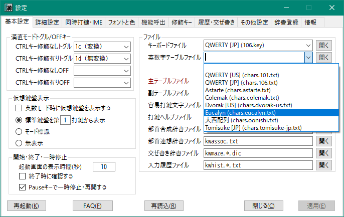
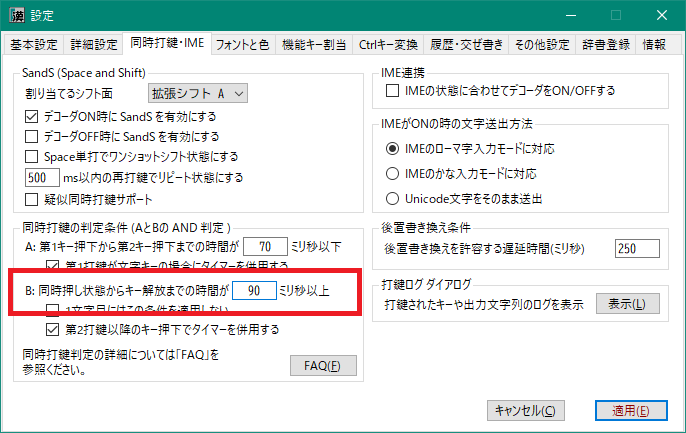
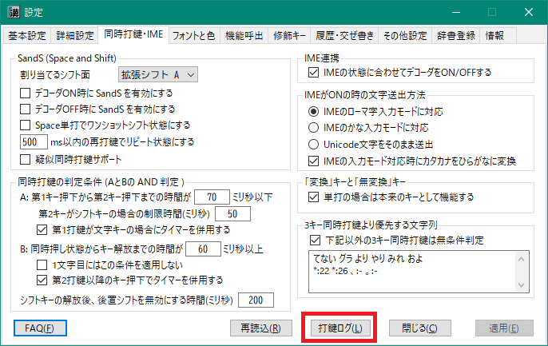

###### [FAQ HOME](../FAQ.md#FAQ-HOME)

# FAQ 基本編

## 目次

- [設定ダイアログ](#設定ダイアログ)
    - [設定ダイアログの開き方](#設定ダイアログの開き方)
- [キーボードの選択](#キーボードの選択)
    - [独自レイアウトのキーボードを使いたい](#独自レイアウトのキーボードを使いたい)
- [IEM ON（あ）/ OFF（Ａ） キーを使いたい](#IEM-ON（あ）-OFF（Ａ）-キーを使いたい)
- [英数字配列の選択](#英数字配列の選択)
    - [独自の英数字配列を使いたい](#独自の英数字配列を使いたい)
    - [英数字配列の仮想鍵盤を表示したい](#英数字配列の仮想鍵盤を表示したい)
- [漢直WSを一時的に停止したい](#漢直WSを一時的に停止したい)
    - [マウスを使う方法](#マウスを使う方法)
    - [Pauseキーで一時停止・再開する](#Pauseキーで一時停止再開する)
- [仮想鍵盤](#仮想鍵盤)
    - [表示のずれを直したい](#表示のずれを直したい)
    - [仮想鍵盤がじゃまです](#仮想鍵盤がじゃまです)
    - 仮想鍵盤が変な表示になりました
    - [第2打鍵待ちを自動でキャンセルしたい](#第2打鍵待ちを自動でキャンセルしたい)
- [打鍵ガイド](#打鍵ガイド)
    - [最後に出力した文字の打鍵列を知りたい](#最後に出力した文字の打鍵列を知りたい)
    - [画面に表示されている文字の打鍵列を知りたい](#画面に表示されている文字の打鍵列を知りたい)
    - [「読み」で漢字を検索してその打鍵列を知りたい](#読みで漢字を検索してその打鍵列を知りたい)
- [配列選択](#配列選択)
    - [どんな配列が使えますか](#どんな配列が使えますか)
    - [配列の選択方法](#配列の選択方法)
    - [選択した配列(テーブルファイル)の内容を確認したい](#選択した配列テーブルファイルの内容を確認したい)
    - [自分でサブフォルダーを作成したい](#自分でサブフォルダーを作成したい)
- [IME連携](#IME連携)
    - [IME のON/OFFに合わせてかな配列入力モードもON/OFFしたい](#IME-のONOFFに合わせてかな配列入力モードもONOFFしたい)
    - [IME にひらがなが送られません](#IME-にひらがなが送られません)
- [同時打鍵](#同時打鍵)
    - [必ず同時打鍵として扱うケース](#必ず同時打鍵として扱うケース)
    - [同時打鍵で意図しない文字が入力されてしまうのを防ぎたい](#同時打鍵で意図しない文字が入力されてしまうのを防ぎたい)
    - [3キー同時打鍵](#3キー同時打鍵)
    - [タイマーを使って一定時間後に同時打鍵判定をする](#タイマーを使って一定時間後に同時打鍵判定をする)
    - [自分がどのようなタイミングで打鍵しているかを知りたい](#自分がどのようなタイミングで打鍵しているかを知りたい)
- [カタカナの出し方](#カタカナの出し方)
    - [一時的にカタカナモードに変更する](#一時的にカタカナモードに変更する)
    - [ひらがなを出力した後、一括でカタカナに変換する](#ひらがなを出力した後一括でカタカナに変換する)
    - [英数モードで英単語またはローマ字からカタカナに変換](#英数モードで英単語またはローマ字からカタカナに変換)
- [英数モード](#英数モード)
- [かな入力練習モード](#かな入力練習モード)
- 交ぜ書き変換を使いたい
- 部首合成変換を使いたい

## 設定ダイアログ
### 設定ダイアログの開き方
2通りの方法があります。

#### Ctrlキーを押しながらタスクトレイアイコンを左クリック
タスクトレイに格納されている本体アイコン


を、Ctrlキーを押しながらクリックしてください。
 <p style="margin-left:2em; font-size:small">
<code>kanchoku.user.ini</code> に <code>openSettingsDlgWhenIconClicked=true</code> という行を追加すると、
Ctrlキーを押さずにアイコンをクリックするだけで設定画面を開くようになります。 </p>

#### タスクトレイアイコン、または仮想鍵盤を右クリック
タスクトレイアイコン、または仮想鍵盤

 

のいずれかで右クリックすると、以下のようなメニューが表示されます。
ここで「設定画面」を選択してください。


## キーボードの選択
使用しているキーボードの物理配列に合わせて、下図のように「キーボードファイル」を選択します。


下記のファイルがあらかじめ用意されています。

|名前|説明|
|-|-|
|QWERTY [JP]|QWERTY配列の日本語キーボード|
|QWERTY [US]|QWERTY配列の英語キーボード|
|QWERTY [US on JP]|OSは日本語キーボードの設定のまま、 QWERTY配列の英語キーボードを使う|
|Colemak [US]|Colemak配列の英語キーボード|
|Dvorak [US]|Dvorak配列の英語キーボード|

英語キーボードを使用する場合は、「QWERTY [US on JP]」を選択するか、
またはあらかじめOSの設定で「英語キーボード(101/102キー)」を選択しておいてください
（手順は[こちら](FAQ-SelectKeyboard.md)を参照）。

### 独自レイアウトのキーボードを使いたい
自作キーボードなど、QWERTY以外のレイアウトのキーボードをお使いの場合は、そのレイアウトに合わせた
「キーボードファイル」を作成します。

キーボードファイルは、拡張子を `.key` という名前にして、漢直WSのルートフォルダ配下の `tables/_keyboard` に作成します。 

配列の記法には、「カンマ区切り記法」と「縦棒区切り記法」があります。
縦棒区切り記法のほうが便利ですが、説明の都合上、先にカンマ区切り記法を取りあげます。

#### カンマ区切り記法
たとえば、Colmak配列であれば、次のようになります。

`tables/_keyboard/colemak.key`


- `#` で始まる行はコメント
- 先頭行の `#NAME: ～` は、ファイル選択時のドロップダウンに表示される名前を設定する
- `MODE=US` で英語キーボードであることを宣言している（日本語キーボードの場合は不要）
- 5行目以下の部分が、物理キーの配列の定義（末尾のカンマは必須）

下図の `0`～ `48` の位置のキー（青と緑）の「仮想キーコード」を16進数にして、順に並べていきます。
たとえば5行目の先頭は`0`番目の位置にある「1」の仮想キーコードの16進数表現である `31` になっています。
また8行目の末尾は `39`番目の位置にある「/」の仮想キーコードの16進数表現である `bf` になっています。


仮想キーコードについては「[仮想キーコード](https://learn.microsoft.com/ja-jp/windows/win32/inputdev/virtual-key-codes)」を参照ください。

#### 縦棒区切り記法
こちらは Dvorak配列の例です。

5行～9行にかけて `|` で区切って文字が並んでいます。
縦棒区切り記法では、このように入力したい文字をほとんどそのまま記述することができます。

`tables/_keyboard/dvorak.key`


- 末尾の `|` は必須
- 1文字で記述したものはその文字に対応する仮想キーコードとして扱われる
（例: 先頭の `1` は 0x31 という仮想キーコードに対応している）
- 2文字で記述したものは16進の仮想キーコードを表す
    - Space は `20` と記述する
    - （もしあれば）2つめの `\` は仮想キーコードで表す（例: `c1`）

## IEM ON（あ）/ OFF（Ａ） キーを使いたい
最近のキーボードだと、「無変換」「変換」「ひらがな」のかわりに 「IME OFF(A)」と「IME ON(あ)」
キーが載っている場合もあるようです。

このキーを漢直WSにおける「無変換」や「変換」キーの代替として使いたい場合は、キーボードファイル (106.keyなど)
に下記を追記してください。

```
nfer=1a
xfer=16
```


## 英数字配列の選択
こちらは、キーの位置に対する論理的な文字配列の選択となります。物理的なキー配列とは独立して設定することができます。

下図のようにして、英数字・記号の配列を選択します。



以下の配列があらかじめ用意されています。使用するキーボードの言語種別に合わせて適切なものを選択してください。

|配列名|対応キーボード|
|-|-|
|QWERTY [JP]|日本語|
|QWERTY [US]|英語|
|Astarte|日英両用|
|Colemak|日英両用|
|Dvorak [US]|英語キーボード|
|Eucalyn|日英両用|
|大西配列|日英両用|
|Tomisuke [JP]|日本語キーボード|

「英数字テーブルファイル」を空にすると、「キーボードファイル」で選択した物理キー配列に合わせて、
英数字・記号の配列が自動生成されます。

### 独自の英数字配列を使いたい
独自の英数字配列を使いたい場合は、そのレイアウトに合わせた「英数字テーブルファイル」を作成します。

英数字テーブルファイルは、拡張子を `chars.*.txt` という名前にして、漢直WSのルートフォルダ配下の
`tables/_keyboard` に作成します。 

たとえば、大西配列であれば、次のようになります。

`tables/_keyboard/chars.onishi.txt`


`## NORMAL` ～ `## END` の間に、上図の `0` ～ `48` までのキーを押下したときに入力される文字を順に記述します。

不足している部分（上図の場合は、`42`～`48`）は、`QWERTY` 配列から自動的にコピーして埋められます。
この仕組みにより、日/英両キーボードに共通した配列定義が作りやすくなっています。

シフトされたときに入力される文字配列は NORMAL部分から自動的に生成されますが、
もしシフト文字用の配列を独自に定義したい場合は、
`## SHIFT` ～ `## END` の間に文字を記述してください。(例: `chars.106.jp.txt` を参照)

また日本語キーボードには `\` が2つ存在しますが、 `## YEN=nn` で位置を指定したほうのシフト文字が `|` になり、
もう一方が `_` になります。
指定のない場合は、最初に出現した `\` が YEN に対応するものとなります。
Tomisuke配列のように `\ _` が `\ |` よりも先に出現するような配列の場合は、明示的に `## YEN=43`
などと記述してください。

実際に漢直WSが使用する配列定義は、`tmp/chars.current.txt` に出力されたものになります。
思ったような挙動にならない場合は、このファイルを確認してみてください。

### 英数字配列の仮想鍵盤を表示したい
新しい英数字配列を練習している場合は、下図のようにその配列を示す仮想鍵盤が表示されていると便利でしょう。


英数字配列の仮想鍵盤を表示するには、下図に示す項目にチェックを入れてください。


## 漢直WSを一時的に停止したい

### マウスを使う方法
2通りの方法があります。

#### Shiftキーを押しながらタスクトレイアイコンを左クリック
タスクトレイに格納されている本体アイコン


を、Shiftキーを押しながらクリックしてください。 
一時停止中は、タスクトレイアイコンが下図のように変わります。

 

再開するには、タスクトレイアイコンをもう一度 Shift クリックしてください。

#### タスクトレイアイコンを右クリック
以下のようなメニューが表示されます

ここで「一時停止」を選択してください。


再開する場合は、もう一度右クリックして「再開」を選択してください。


### Pauseキーで一時停止・再開する
下図のように、「Pauseキーで一時停止・再開する」にチェックを入れておくと、
`Pause` キーを押すたびに漢直WSを一時停止・再開できるようになります。


## 仮想鍵盤
漢直WSを起動し、漢字かな入力モードに入ると、初期状態ではテキストカーソルの近くに下図のような
「仮想鍵盤」が表示されます。
NICOLA配列のように同時打鍵を取り入れている場合は、シフトキーを長押しすると、
そのシフトに応じた出力文字の表示に切り替わります。
また、「□」になっているところは、複数打鍵が必要な文字に対する入口のキーを示します。


仮想鍵盤には、次に打鍵するキーに対してどのような文字が出力されるかが表示されます。

以下に実際のキーボードのレイアウトとそれに対応する仮想鍵盤のキーの位置を図示しておきます。
数字は「[漢直キーコード](../KEYBOARD.md#TOP)」と呼称しているものです。


### 表示のずれを直したい

モニターを高DPIにした場合、仮想鍵盤での文字表示が、枠の中央からずれる場合があります。
また、高DPIでなくとも、別のフォントを選択した場合は、やはり表示がずれることがあります。


そのような場合は、設定ダイアログの「フォントと色」>「仮想鍵盤フォント」のところで、
「左余白」と「上余白」を設定してみてください。


なお、「余白情報」ボタンをクリックすると、現在の余白量が表示されます。
これを参考にしながら値を変えてみてください。
下図は、余白量を調整する前の余白情報です。


### 仮想鍵盤がじゃまです
いろいろな対処法があります。

**1. 最初から表示しない**

[設定ダイアログ](#設定ダイアログ)を開き、
「基本設定」>「仮想鍵盤表示」>「無表示」にチェックを入れ、「適用」をクリックします。


**2. テキストカーソルから離れた位置に表示する**

[設定ダイアログ](#設定ダイアログ)を開き、
「詳細設定」>「仮想鍵盤・モード標識」>「カレットからの相対表示位置」の
X座標、Y座標を適当な値に変更して「適用」をクリックします。


特定のアプリ(正確にはウィンドウ)だけ、仮想鍵盤の表示位置を変えることもできます。
たとえば、Chrome ブラウザを使っていて、上部のURLエリアに検索文字列を入力すると、
入力文字列に応じた候補がドロップダウンで表示されます。

このとき、仮想鍵盤が表示されていると候補が見にくくなってしまいます。
そのような場合は、Chrome のウィンドウにテキストカーソルがあるときだけ、
仮想鍵盤をカーソルから離れた位置に表示させましょう。

設定の詳細については、
 [相対位置や固定位置の個別設定](../MANUAL.md#相対位置や固定位置の個別設定)を参照ください。

**3. 一時的に仮想鍵盤を非表示にする**

[設定ダイアログ](#設定ダイアログ)を開き、
「詳細設定」>「仮想鍵盤・モード標識」>「仮想鍵盤の一時的な非表示」で適当な Ctrl修飾キーを選択して
「適用」をクリックします。

以降、仮想鍵盤が表示されているときに選択した Ctrl修飾キーを打鍵すると、
漢字かな入力モードはONのままで仮想鍵盤が非表示になります。
もう一度、Ctrl修飾キーを打鍵すると仮想鍵盤が再表示されます。

下図では `Ctrl-]` を選択しています。


**4. 仮想鍵盤をドラッグして移動する**

仮想鍵盤をマウスでドラッグして一時的に別の位置に固定することができます。
下記ツイートを参考にしてください。

https://twitter.com/kanchokker/status/1459442675849912322

**5. 最初から固定位置に表示する**

[設定ダイアログ](#設定ダイアログ)を開き、
「詳細設定」>「仮想鍵盤・モード標識」>「固定表示位置」の
X座標、Y座標を適当な値に変更して「適用」をクリックします。

なお、前項で説明したように、仮想鍵盤をドラッグして好みの位置に移動してから
「現在位置取得」ボタンをクリックすると、現在の仮想鍵盤の位置が設定できます。


### 仮想鍵盤が変な表示になりました
(To be described)

### 第2打鍵待ちを自動でキャンセルしたい
漢直など文字の入力に複数打鍵が必要な配列において、第1打鍵を誤った場合に
第2打鍵待ちを自動でキャンセルすることができます。

下図のように「詳細設定」>「各種待ち時間」>「第2打鍵待ちをキャンセルするまでの時間(ミリ秒)」を設定してください。


なお、この設定をした場合でも、第1打鍵を長押しすることで一時的に第2打鍵待ちの状態を継続することができます。

## 打鍵ガイド
### 最後に出力した文字の打鍵列を知りたい
特殊機能 `StrokeHelp` を呼び出すと、ミニバッファに表示されている末尾文字について、
その打鍵ヘルプを表示することができます。
特殊機能の呼び出しについては、「[FAQ キーアサイン編](FAQ-キーアサイン.md)」を参照してください。

### 画面に表示されている文字の打鍵列を知りたい
1文字をミニバッファにコピペすると、
- その文字の打鍵ヘルプ
- あるいは、部首合成ヘルプ

を表示します。
ここで打鍵ヘルプが表示された場合に、強制的に部首合成ヘルプを表示するには、
「[FAQ キーアサイン編](FAQ-キーアサイン.md)」を参照して、
特殊機能 `BushuCompHelp` を適当なキーに割り当てて呼び出してください。

### 「読み」で漢字を検索してその打鍵列を知りたい
ローマ字(あるいはひらがな)で漢字の読みを入力すると、
その読みを持つ文字の打鍵ガイドを表示することができます。
利用方法については、「[利用者ガイド](../MANUAL.md)」の
「ローマ字(またはひらがな)入力による打鍵ガイド」を参照ください。

## 配列選択
### どんな配列が使えますか
以下の配列を同梱しています。

|配列名|種別|特徴|
|--|--|--|
|T-Code|漢直|2ストローク、カタカナあり、ひらがな・カタカナが無規則|
|TUT-Code|漢直|多ストローク、カタカナなし、ひらがなの配置が規則的|
|TUT-Code改|漢直|TUTの拡張版。拗音等の短縮や鏡像反転を追加|
|TT-Code|漢直|T-Code + 多ストローク (fj/jf で拡張面に移動)|
|G-Code|漢直|多ストローク、カタカナあり、ひらがなの配置が規則的|
|phoenix|漢直|多ストローク、ひらがなが左右逆順も同文字、カタカナなし|
|Try-Code|漢直|T-Code + 多ストローク (スペースをプレフィックスとする3打鍵)|
|OKT-Code|漢直|作者個人用(T-Codeから派生)|
|飛鳥123|かな配列|親指シフトの改良版の横綱|
|ブリ中トロ|かな配列|後置書き換え方式が炸裂。同時打鍵不使用なのでGoogle日本語入力でも利用可|
|月光|かな配列|月系。単打＋DK前置。(半)濁音は後置書き換え方式。同時打鍵不使用なのでGoogle日本語入力でも利用可|
|かわせみ|かな配列|同時打鍵を取り入れ、行段系ながら単打率高し。覚えやすさと効率のバランス|
|薙刀式|かな配列|同時打鍵、SandSを使用し、1モーラを1アクションで。清濁同置、アルペジオ重視|
|NICOLA|かな配列|本家親指シフト|
|phoenix RT|かな配列|phoenix のかな部分を取り出し、いくつかの操作を追加したもの|
|新下駄|かな配列|同時打鍵を駆使し、1モーラを1アクションで。かな配列では最速候補の一つ|
|月2-263|かな配列|月系標準配列の一つ。同時打鍵不使用なのでGoogle日本語入力でも利用可|
|ゆきね|かな配列|薙刀式をベースにして初心者にも使いやすくするような改良を加えた|
|ローマ字|その他|書き換えシステムのデモ用配列。実用性はあまりない|
|ふじこ|その他|8キー同時打鍵デモ用のネタ配列。ASDFJKL; を同時に打鍵すると…|

### 配列の選択方法
[設定ダイアログ](#設定ダイアログ)を開き、
「基本設定」>「ファイル」>「主テーブルファイル」のドロップダウンを開きます。
現在選択されているフォルダーに格納されているテーブルファイルの一覧が表示されるので、
そこから利用したい配列(テーブルファイル)を選択してください。


`..` は一つ上のフォルダーを表しています。
`.￥` で始まっているものはサブフォルダーを表しています。

下図は `..` を選択して一つ上のフォルダーである `tables` に移動してその一覧を表示したものです。
`tables` はテーブルファイルを格納している最上位フォルダーとなります。


かな配列を選択したい場合は「.\\かな系」を選択してください。


同系列の古いバージョンは「旧版」フォルダーに格納してあります。
また、ある配列のシフト方法を変更したりしたものは「変種」フォルダーに格納しました。

### 選択した配列(テーブルファイル)の内容を確認したい
テーブルファイル名を格納しているコンボボックスの右にある「開く」ボタンをクリックします。


ツールチップにも記述されていますが、選択されているテーブルファイルのパスを引数として、
「`.txt` という拡張子を持つファイルに関連付けられたプログラム」を起動します。
とくに何も関連付けをしていない場合は、メモ帳が開くと思います。

選択したテーブルファイルによっては、そこからサブテーブルをインクルードしているかもしれません。


その場合は、利用者自身でエディタ等でそのサブテーブルファイルを開いてください。
なお「サクラエディタ」では、上記の `"subtables/okt-kanji.tbl"` のところに
テキストカーソルを置いて F12 を押すと、カーソル位置のファイルを開いてくれます。

### 自分でサブフォルダーを作成したい
お好きな名前のサブフォルダーを作成してください。(ただし、空白文字は含めないほうが良いでしょう)

なお、`_` または `.` で始まる名前の場合は「隠しフォルダー」になり、
ファイル選択のドロップダウンには表示されなくなります。

## IME連携
### IME のON/OFFに合わせてかな配列入力モードもON/OFFしたい

漢直系の配列ではなく、かな配列を利用しているような場合に有用な設定となります。

[設定ダイアログ](#設定ダイアログ)を開き、
「同時打鍵・IME」>「IME連携」>「IMEの状態に合わせてデコーダをON/OFFする」にチェックを入れ、
「適用」をクリックします。


### IME にひらがなが送られません
IMEに対して文字をUnicodeのまま送っているか、または送出方法がIMEの入力モードと合っていないと思われます。
[設定ダイアログ](#設定ダイアログ)を開き、
「同時打鍵・IME」>「IMEがONの時の文字送出方法」で、使用しているIMEの入力モードに合った項目を選択し、
「適用」をクリックします。


## 同時打鍵
同時打鍵とは、2つ以上のキーが同時に押下された時に、
それらのキーの組み合わせに対して定義された文字列を出力する機能です。
たとえば、W と J が単打の時はそれぞれ「き」と「あ」が出力されるが、
同時に押下された場合は「ぎ」を出力する、というようなことが可能になります。

「同時打鍵」と判定するためには、下図のように
W を押している時間帯と J を押している時間帯が一瞬でも重なってる必要があります。


漢直WS では、この「同時」の時間帯が無い場合は、どんなに近接した打鍵であっても「同時打鍵」とはみなしません。
ただし、「同時」の時間帯がある、というのは必要条件にすぎず、それを「同時打鍵」として扱うかどうかに関しては、
さらに別の判定条件があります。

### 必ず同時打鍵として扱うケース
下図のように第1打鍵の解放が第2打鍵の解放よりも後の場合は無条件で
（たとえ W から J までの打鍵間隔がどれだけ長くても）同時打鍵として扱われます。


### 同時打鍵で意図しない文字が入力されてしまうのを防ぎたい

「単打のつもりでキーを連打していたら意図せず同時打鍵と判定されて別の文字が出力された」
というケースがよく生じます。これをある程度解消するために、
「同時に打鍵されている（キーの重なりがある）けど、こういう場合は同時打鍵とみなさない」
という制約を設けることができます。

#### 第1打鍵から第2打鍵までの時間に制約をかける
下図のように、第1打鍵の押下から第2打鍵の押下までの時間が 80msである場合、 デフォルトの設定では同時打鍵と判定されます。
打鍵速度の速い方だと、単打のつもりでもこれくらいの時間間隔でキー入力することがあるかと思います。


2つのキーの押下間隔に制約をかけて、ある一定時間以下に2つのキーが押下された場合に限り同時打鍵と判定する、
という条件を設定することができます。
[設定ダイアログ](#設定ダイアログ)の
「同時打鍵・IME」>「同時打鍵の判定条件」>「A: 第1キー押下から第2押下までの時」で設定してください。
下図は制約時間をデフォルトの 100ms から 70msに変更する例です。


#### 第2打鍵がシフトキーの場合に、さらに短い時間制約をかける
NICOLA(親指シフト)のようにシフトキーと文字キーのどちらが先に押下されてもシフトが有効になるような
「相互シフト」方式の場合、なるべくシフトをその直後の文字キーにかけたい、
ということがあるかと思います。

たとえば下図において、第1打鍵(J)と左シフトキーの押下間隔は 70ms、一方、
左シフトと第3打鍵(K)の押下間隔は 80msです。


このようなケースでは、通常、左シフトは第1打鍵のほうにかかりますが、
第2打鍵がシフトキーだった場合にさらに短い時間制約を設定することで、
なるべく第3打鍵のほうにかかるようにすることができます。


第1打鍵(J)～左シフトキーの押下間隔が 70ms なので、上図設定例だと、
「50ms」という制約によって適用されなくなり、左シフトは第3打鍵(K)にかかるようになります。

#### 第2打鍵の押下から第1打鍵の解放までの時間に制約をかける
たとえば下図のような感じで、キー押下の重なり時間を短くしてキーを連打しているときには同時打鍵と判定せず、
単打判定してほしい、というケースです。上図の条件だけでは、このケースは同時打鍵と判定されてしまいます。


このようなケースを制御するために、キー押下の重なり時間がある一定時間以上の場合に限り同時打鍵と判定する、
という条件を設定することができます。
[設定ダイアログ](#設定ダイアログ)の
「同時打鍵・IME」>「同時打鍵の判定条件」>「B: 同時押し状態からキー解放までの時間」で設定してください。
下図は制約時間をデフォルトの 70ms から 90msに変更する例です。



この条件は、3キー以上の同時押し状態の場合も同様に適用されます。
この場合は、下図のように末尾キーの押下からどれかのキーの解放までの時間で判定されます。


（この例では3キーの同時打鍵ではなく、E,M,K の順次打鍵と判定される）

なお「NICOLA配列」のように「同時打鍵で2キーまで」と決まっており、かつ一方のキーがシフトキーである場合は、
第2キーの押下時に同時打鍵判定が行われ、条件Bについては適用されません。

また「1文字目にはこの条件を適用しない」は初期設定ではチェックが外れていますが、
あえて「条件A だけで1文字目の同時打鍵判定をやりたい」という場合は、ここにチェックを入れてください。

#### 連続シフト可のときに2文字めを同時打鍵と判定したくない
たとえば「薙刀式」の J は、単打だと「あ」になりますが、同時打鍵の場合は相手キーを濁音化するシフトキーになります。
この機能は「連続シフト」が可能になっており、たとえば J を押しながら W, R と押すと「ぎじ」と出力されます。
この時、本当は「ぎし」と出したかったのだけど意図せず「ぎじ」になってしまった、ということもあろうかと思います。

このようなケースも上記の「条件B」で制御できます。
上図のように条件を変更すると、下図のようなケースでは2文字目の R を打鍵してから最初のシフトキー J
を解放するまでの時間 80ms が条件Bの制約時間(90ms)を下回っているので、同時打鍵ではなく単打と判定され「し」が出力されます。


#### 連続シフト可のときに同時打鍵と単打の交互打鍵をうまく判定できるようにしたい
「薙刀式」のような相互シフトかつ連続シフト可の場合に、たとえば「どろどろ」と入力するときは
下図のような打鍵列になるでしょう。


上図のケースだと、最初の「A(ろ)」を押してから次の「J(シフト)」を押すまでの時間が 50ms なので、
通常であれば、J が A にかかって「ぜ」になってしまいます(薄い青で網かけした部分)。

このようなケースで、「シフトキーはなるべくその後に打鍵されるキーにかけたい」ということがあるでしょう。

下図のように「シフトキーの解放後、後置シフトを無効にする時間」を 300ms に設定してあると、
上図のように最初のシフトキーの解放後、300ms 以内に押された文字キー(上図の最初の「A」)は、
その直後にシフトキーが押下されたとしても、単打として扱われます。


言いかえると、この時間帯に文字キーが押下された場合、
その直後に同時打鍵シフトキーが押下されても、それは直前の文字キーにかかりません。

**注意**<br/>
ここでの文字キーは「純粋な」文字キーが対象であり、シフトキーにもなりうるキーは対象外です。
たとえば「薙刀式」でいうと「J(あ; 濁音化)」や「I(る; 拗音化ょ)」などは対象外となります。

この設定は、同時打鍵と単打が交互に出現するような場合に有効と考えられます。

なお、文字キーの前にシフトキーが押下された場合、あるいはこの時間間隔を 0 に設定した場合は、
当条件は発動されません。

### 3キー同時打鍵
3キーの同時打鍵の判定も基本的には2キーの場合と同様です。

下図は、「のにいると」で `Space`, `E`, `O` の3キーを同時押しして
「しょ」を出す場合のキーの押下と解放のタイミングの例です。
この例では、
- `Space` を押してから3キー目の `O` を押すまでの時間が 70ms で、前項の図で設定した条件Aの 100ms 以下である
- `O` が押されてから `E` が離されるまでの時間が 80ms で、前項の図で設定した条件Bの 70ms 以上である

ことから同時打鍵の条件を満たしていることが分かります。


次図では条件Aが満たされていませんが、末尾キーである `O` が先に離されており、
「[必ず同時打鍵として扱うケース](#必ず同時打鍵として扱うケース)」に該当するので、
これも同時打鍵として扱われることになります。


### タイマーを使って一定時間後に同時打鍵判定をする
親指シフトでは、キーを押してから一定時間(100msとか200msとか)が経過すると、
**そのキーが押下中であっても**それを単打と判定して文字の出力を行います。


これと同様の挙動を行いたい場合は、下図のように「第1打鍵が文字キーの場合にタイマーを併用する」に
チェックを入れてください。


「薙刀式」のように同時打鍵列が文字キーだけの場合は、「シフトを受ける側のキー」だけを「文字キー扱い」
とします。
具体的には「J D」の組合せの場合、「J(あ)」はシフトキー扱い、「D(と)」は文字キー扱いとなります。
したがって、このタイマーを有効にしていると、「J を長押ししながら D を打って『ど』を出す」 ことは可能ですが、
「D を長押ししながら J を打って『ど』を出す」という操作ができなくなりますので、ご注意を。

また、連続シフト可のときの2文字めの同時打鍵判定にもタイマーを使用できます。
上図の「連続シフトの2文字目以降のキー押でタイマーを併用する」にチェックを入れてください。

### 自分がどのようなタイミングで打鍵しているかを知りたい
同時打鍵判定条件 A と B の制約時間を設定するには、
利用者自身がどのようなタイミングでキーを打鍵しているかを知る必要があります。
このような用途のために「打鍵ログ」を表示する機能を用意してあります。



上図のように「同時打鍵・IME」>「打鍵ログ」ボタンをクリックしてください。
下図のようなダイアログが表示され、キーの押下・解放および文字出力の様子がタイムスタンプとともに表示されます。


第2列目(diff ms)は直前のイベントからの経過時間(ミリ秒)を表示しています。
たとえば1文字目の「ぎ」の出力を見ると、「J」押下(Down)から「W」押下まで 50ms が経過し、
その後「J」が解放(Up)されるまでに 108ms が経過していることが分かります。
なお、英大文字はキーの押下(Down)を、小文字はキーの解放(Up)を表しています。

タイマーによるキー解放は、条件によっては適用されないこともあります。
その場合は、キーが `N/A` と表示されます。

このログを参照して利用者自身のキー打鍵のタイミングの傾向を確認し、
同時打鍵判定条件 A と B の制約時間を適切に設定してください。

## カタカナの出し方
TUT-Code やかな系など、カタカナの定義されていない配列を使用している場合、
次の3通りの方法でカタカナを出力することができます。

- カタカナモードに変更して、ひらがなをカタカナに変換
- ひらがなを出力した後、一括でカタカナに変換する
- 英数モードで英単語またはローマ字からカタカナに変換

### 一時的にカタカナモードに変更する
ひらがなを出力するストローク列を打鍵したときにカタカナに変換して出力するモードがあります。
たとえば「ストローク」と出力したい場合は一時的にこのモードに変更してから「すとろーく」と打鍵します。

モードを切り替えるにはまずカタカナモードと通常モードの切り替え機能を呼び出す機能キーの設定が必要です。
下図のように設定ダイアログの「機能呼出」タブで「前置呼び出し機能」の「カタカナ変換(モード)」
に適当なキーを設定してください。(下図では「ひらがな」キーを設定)


「適用」をクリックすると、以降、「ひらがな」キーを押すたびにカタカナモードと通常モードが切り替わります。

### ひらがなを出力した後、一括でカタカナに変換する
いったんひらがなを出力した後、それを一括でカタカナに変換します。
ただし出力文字列の末尾のひらがなを全てカタカナに変換してしまうので注意が必要です。

こちらも変換のためのキーの設定が必要になります。上図で「後置呼び出し機能」の「カタカナ変換(一括)」
に適当なキーを設定してください。

カタカナ変換の対象となる部分の前にもひらがながある場合は、そこにあらかじめ「ブロッカー」を
設定しておいてください。

### 英数モードで英単語またはローマ字からカタカナに変換
「[英数モード](#英数モード)」で入力中に履歴検索を呼び出すと、入力した英字列で履歴辞書の検索を行い、
マッチするものがあれば定義されているカタカナに変換します。

<p style="padding-left:2em;"><font size="-1">「その他変換・機能」>「□が押されたら入力した英字列をカタカナに変換」
で指定したキーを入力することでも履歴検索を呼び出せます。</font></p>

#### 英単語辞書による変換
たとえば、`Computer` と入力したところで履歴検索を呼び出すと「コンピュータ」に変換されます。
これは、付属の `kwhist.roman.txt` というファイルに 「Computer|コンピュータ」というエントリが
登録されており、履歴検索によって `|` の前半部にマッチしたらその後半部が出力されるためです。

<p style="padding-left:2em;"><font size="-1"><code>kwhist.roman.txt</code> には
<a href="https://clrd.ninjal.ac.jp/unidic/">UniDic</a> から抽出した3万8千語弱の単語が登録されています。</font></p>

もし望みの単語が登録されていない場合は、メモ帳などで「Gundam|ガンダム」というような文字列を入力し、
これを仮想鍵盤のミニバッファにコピペしてください。利用者用の履歴辞書として登録されます。

<p style="padding-left:2em;"><font size="-1"><code>kwhist.roman.txt</code> に直接エントリを追加しても構いませんが、
KanchokuWSのアップデートの際などに誤ってこのファイルを上書きしたりしないようにご注意ください。</font></p>

「ファイルサーバ」のような複合語を一度に変換したい場合は、「FileServer」のように単語ごとに
先頭文字を大文字にしてください。
ただしこの場合は、履歴検索でヒットした先頭候補がそのまま出力されるので、ご注意を。
望みのカタカナに変換されなかった場合は、いったんキャンセルして、単語ごとに検索してみてください。
個別に望みのカタカナを選択した後は、次からはその選択した語が先頭候補になります。

#### ローマ字変換
履歴辞書にマッチするエントリがなかった場合は、英字列をローマ字変換します。
たとえば、「Gandam」と入力して履歴検索を実行すると、「ガンダム」に変換されます。
ローマ字からカタカナへの変換規則は `kwroman.def.txt` というファイルで定義しているので、
このファイルを修正することで変換規則を自分用にカスタマイズすることもできます。

<p style="padding-left:2em;"><font size="-1">ローマ字変換が不要の場合は、
<code>kwroman.def.txt</code> ファイルを削除するかまたは別の名前に変更してから、「再読込」を実行してください。</font></p>

なお、デフォルトで提供しているこのローマ字変換はやや特殊なルールを採用しています。たとえば、
- a,i,u,e,o の後に h を入力すると長音(ー)になる
- 子音1文字だけで代表文字に変換する (d→ド、 s→ス など)
- 子音に y を後接させると子音や場所により、イ段、ィ後接、イ後接などになる
があります。


## 英数モード
「その他設定」>「その他変換・機能」>「英大文字押下で英数モードに移行」にチェックを入れると、
`Shift-A` などで英大文字を入力したときに「英数モード」に移行するようになります。


英数モードでは、打鍵したキーがそのまま文字として入力されます。


英数モードには `EisuModeToggle` （[拡張修飾キー](FAQ-キーアサイン.md#拡張修飾キーの割り当て)）
を実行することでも入れます。
`ESC` を打鍵していったん英数モードから抜けてしまった後でも、
`EisuModeToggle` を実行すればモードを抜ける前の状態に戻ります。

#### 先頭文字の小文字化
英数モードで EisuDecapitalize （「[拡張修飾キー](FAQ-キーアサイン.md#拡張修飾キーの割り当て)」参照）を実行すると、
先頭文字を小文字化します。
たとえば、EisuDecapitalize を `Ctrl-L` に割り当てた上で、「IPhone」と入力した後 `Ctrl-L` を打鍵すると
「iPhone」に変換されます。

#### 英字列をカタカナに変換する
「[英数モードで英単語またはローマ字からカタカナに変換](#英数モードで英単語またはローマ字からカタカナに変換)」を参照ください。

スペースキーでカタカナ変換を行いたい場合は、「□が押されたら入力した文字列をカタカナに変換」に
 `_` を設定してください。

なお、カタカナ変換直後に ESC キーを打鍵すると、カタカナ変換をキャンセルして、再度、英数モードに戻ります。

#### 英数モードを抜ける
英数モードを抜けるには、以下のいずれかを実行してください。

- ESC (または Ctrl-`[`) を打鍵する
- 「英大文字が□文字連続したら英数モードを抜ける」で設定した文字数だけ英大文字を連続入力する
- 「Spaceを□回連続入力したら英数モードを抜ける」で設定した回数だけスペースキーを連続打鍵する
    - 回数を 0 に設定すると、スペースキーを押下した直後に英数モードを抜ける
    - 回数を 1 に設定すると、スペースキーを押下した直後に英数モードを抜け、Spaceが出力される
    - 回数を 2 以上に設定すると、スペースキーを設定回数だけ連続押下した時に英数モードを抜けるが、最後のSpaceは出力されない
- 変換、無変換、矢印キーなどの機能キーを押下する
- EisuModeToggle を実行
- EisuDecapitalize を2回連続実行
- SelectCodeTable1,2,3のいずれかを実行

後三者については、「修飾キー」>「拡張修飾キー」を有効にした上で、「編集」ボタンをクリックし、
下記画面で適当なキーに該当機能を割り当てて実行してください。


拡張修飾キーの設定方法については [キーアサイン編](FAQ-キーアサイン.md#FAQ-HOME) を参照ください。

## かな入力練習モード
JISかなのタイピングを練習できるサイトやツールを利用している場合は、
一時的に「かな入力練習モード」に変更すると便利です。

このモードに変更するには、右クリックメニューから「その他」>「かな入力練習モード切り替え」
をクリックするか、


または、「[キーアサイン編](FAQ-キーアサイン.md#FAQ-HOME)」で説明している方法で、
適当なキーにモード変更機能を割り当てるとよいでしょう。
下図では `Pause` キーに割り当てています。


「かな入力練習モード」に入ると、下図のように仮想鍵盤の中央部が薄いピンク色に変わります。
(この色は、設定ダイアログの「フォントと色」で変更できます。)


「かな入力練習モード」では、打鍵されたかな文字に対して、
IMEがOFFの状態でもそれを表す「JISかなキー」を出力するようになります。
たとえば、「あ」→`3`、「を」→`Shift+0`、「び」→`v@` のような出力となります。

