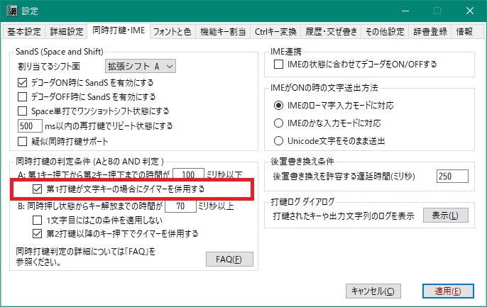

# FAQ 基本編

## 目次

- [設定ダイアログ](#設定ダイアログ)
    - [設定ダイアログの開き方](#設定ダイアログの開き方)
- [仮想鍵盤](#仮想鍵盤)
    - [仮想鍵盤がじゃまです](#仮想鍵盤がじゃまです)
    - 仮想鍵盤が変な表示になりました
- 打鍵ガイド
    - 最後に出力した文字の打鍵列を知りたい
    - 画面に表示されている文字の打鍵列を知りたい
    - 「読み」で漢字を検索してその打鍵列を知りたい
- [配列選択](#配列選択)
    - どんな配列が使えますか
    - [配列の選択方法](#配列の選択方法)
    - [選択した配列(テーブルファイル)の内容を確認したい](#選択した配列テーブルファイルの内容を確認したい)
- [IME連携](#IME連携)
    - [IME のON/OFFに合わせて漢直もON/OFFしたい](#IME-のON/OFFに合わせて漢直もON/OFFしたい)
    - [IME にひらがなが送られません](#IME-にひらがなが送られません)
- [同時打鍵](#同時打鍵)
    - [同時打鍵で意図しない文字が入力されてしまうのを防ぎたい](#同時打鍵で意図しない文字が入力されてしまうのを防ぎたい)
    - [タイマーを使って一定時間後に同時打鍵判定をする](#タイマーを使って一定時間後に同時打鍵判定をする)
- [カタカナの出し方](#カタカナの出し方)
    - [一時的にカタカナモードに変更する](#一時的にカタカナモードに変更する)
    - [ひらがなを出力した後、一括でカタカナに変換する](#ひらがなを出力した後一括でカタカナに変換する)
- [かな入力練習モード](#かな入力練習モード)

## 設定ダイアログ
### 設定ダイアログの開き方
タスクトレイに格納されている本体アイコン 
 
または仮想鍵盤 
  
のいずれかで右クリックすると、以下のようなメニューが表示されます。
ここで「設定画面」を選択してください。

## 仮想鍵盤
### 仮想鍵盤がじゃまです
いろいろな対処法があります。

**1. 最初から表示しない**

[設定ダイアログ](#設定ダイアログ)を開き、
「基本設定」>「仮想鍵盤表示」>「無表示」にチェックを入れ、「適用」をクリックします。

**2. テキストカーソルから離れた位置に表示する**

[設定ダイアログ](#設定ダイアログ)を開き、
「詳細設定」>「仮想鍵盤・モード標識」>「カレットからの相対表示位置」の
X座標、Y座標を適当な値に変更して「適用」をクリックします。

**3. 仮想鍵盤をドラッグして移動する**

仮想鍵盤をマウスでドラッグして一時的に別の位置に固定することができます。
下記ツイートを参考にしてください。

https://twitter.com/kanchokker/status/1459442675849912322

**4. 最初から固定位置に表示する**

[設定ダイアログ](#設定ダイアログ)を開き、
「詳細設定」>「仮想鍵盤・モード標識」>「固定表示位置」の
X座標、Y座標を適当な値に変更して「適用」をクリックします。

なお、前項で説明したように、仮想鍵盤をドラッグして好みの位置に移動してから
「現在位置取得」ボタンをクリックすると、現在の仮想鍵盤の位置が設定できます。

### 仮想鍵盤が変な表示になりました
(To be described)

## 配列選択
### どんな配列が使えますか
(後で書く)

### 配列の選択方法
[設定ダイアログ](#設定ダイアログ)を開き、
「基本設定」>「ファイル」>「主テーブルファイル」のドロップダウンを開きます。
`tables` というフォルダーに格納されているテーブルファイルの一覧が表示されるので、
そこから利用したい配列(テーブルファイル)を選択してください。

### 選択した配列(テーブルファイル)の内容を確認したい
テーブルファイル名を格納しているコンボボックスの右にある「開く」ボタンをクリックします。

ツールチップにも記述されていますが、選択されているテーブルファイルのパスを引数として、
「`.txt` という拡張子を持つファイルに関連付けられたプログラム」を起動します。
とくに何も関連付けをしていない場合は、メモ帳が開くと思います。

選択したテーブルファイルによっては、そこからサブテーブルをインクルードしているかもしれません。

その場合は、利用者自身でエディタ等でそのサブテーブルファイルを開いてください。
なお「サクラエディタ」では、上記の `"subtables/okt-kanji.tbl"` のところに
テキストカーソルを置いて F12 を押すと、カーソル位置のファイルを開いてくれます。

## IME連携
### IME のON/OFFに合わせて漢直もON/OFFしたい

[設定ダイアログ](#設定ダイアログ)を開き、
「同時打鍵・IME」>「IME連携」>「IMEの状態に合わせて漢直をON/OFFする」にチェックを入れ、
「適用」をクリックします。

### IME にひらがなが送られません
IMEに対して文字をUnicodeのまま送っているか、または送出方法がIMEの入力モードと合っていないと思われます。
[設定ダイアログ](#設定ダイアログ)を開き、
「同時打鍵・IME」>「IMEがONの時の文字送出方法」で、使用しているIMEの入力モードに合った項目を選択し、
「適用」をクリックします。

## 同時打鍵
同時打鍵とは、2つ以上のキーが同時に押下された時に、
それらのキーの組み合わせに対して定義された文字列を出力する機能です。
たとえば、W と J が単打の時はそれぞれ「き」と「あ」が出力されるが、
同時に押下された場合は「ぎ」を出力する、というようなことが可能になります。

なお、W を押している時間帯と J を押している時間帯が一瞬でも重なっていれば「同時」です。

ただし、時間的には同時でも、それを「同時打鍵」として扱うかどうかは、また別の判定条件があります。

必ず同時打鍵として扱うケースとして以下の場合があります。
下図のように第1打鍵の解放が第2打鍵の解放よりも後の場合は無条件で同時打鍵として扱われます。

### 同時打鍵で意図しない文字が入力されてしまうのを防ぎたい
「同時に打鍵されているけど、こういう場合は同時打鍵とみなさない」という条件が2つあります。

#### 第1打鍵から第2打鍵までの時間に制約をかける
下図のように、第1打鍵の押下から第2打鍵の押下までの時間が 80msである場合、 デフォルトの設定では同時打鍵と判定されます。
打鍵速度の速い方だと、単打のつもりでもこれくらいの時間間隔でキー入力することがあるかと思います。

2つのキーの押下間隔に制約をかけて、ある一定時間以下に2つのキーが押下された場合に限り同時打鍵と判定する、
という条件を設定することができます。
[設定ダイアログ](#設定ダイアログ)の
「同時打鍵・IME」>「同時打鍵の判定条件」>「第1打鍵から第2打鍵までの時間(ミリ秒)」で設定してください。
下図は制約時間をデフォルトの 100ms から 70msに変更する例です。

#### 連続シフト可のときに2文字めを同時打鍵と判定したくない
たとえば「薙刀式」の J は、単打だと「あ」になりますが、同時打鍵の場合は相手キーを濁音化するシフトキーになります。
この機能は「連続シフト」が可能になっており、たとえば J を押しながら W, R と押すと「ぎじ」と出力されます。
この時、本当は「ぎし」と出したかったのだけど意図せず「ぎじ」になってしまった、ということもあろうかと思います。

このようなケースを制御するために、連続シフトの2文字目のキー押下時間に制約をかけることができます。
[設定ダイアログ](#設定ダイアログ)の
「同時打鍵・IME」>「同時打鍵の判定条件」>「連続シフト2文字目の最小押下時間(ミリ秒)」で設定してください。
下図は制約時間をデフォルトの 70ms から 90msに変更する例です。

上図のように条件を変更すると、下図のようなケースでは2文字目の R を打鍵してから最初のシフトキー J
を解放するまでの時間 80ms が同時打鍵条件を下回っているので、同時打鍵ではなく単打と判定され「し」が出力されます。

### タイマーを使って一定時間後に同時打鍵判定をする
親指シフトでは、キーを押してから一定時間(100msとか200msとか)が経過すると、
**そのキーが押下中であっても**それを単打と判定して文字の出力を行います。

これと同様の挙動を行いたい場合は、下図のように「第1打鍵が文字キーの場合にタイマーを併用する」に
チェックを入れてください。

## カタカナの出し方
TUT-Code など、カタカナの定義されていない配列を使用している場合に、ひらがなをカタカナに変換して出力することができます。
次の2通りの方法があります。

### 一時的にカタカナモードに変更する
ひらがなを出力するストローク列を打鍵したときにカタカナに変換して出力するモードがあります。
たとえば「ストローク」と出力したい場合は一時的にこのモードに変更してから「すとろーく」と打鍵します。

モードを切り替えるにはまずカタカナモードと通常モードの切り替え機能を呼び出す機能キーの設定が必要です。
下図のように設定ダイアログの「機能キー割当」タブで「前置呼び出し機能」の「カタカナ変換(モード)」
に適当なキーを設定してください。(下図では「英数」キーを設定)

「適用」をクリックすると、以降、「英数」キーを押すたびにカタカナモードと通常モードが切り替わります。

### ひらがなを出力した後、一括でカタカナに変換する
いったんひらがなを出力した後、それを一括でカタカナに変換します。
ただし出力文字列の末尾のひらがなを全てカタカナに変換してしまうので注意が必要です。

こちらも変換のためのキーの設定が必要になります。上図で「後置呼び出し機能」の「カタカナ変換(一括)」
に適当なキーを設定してください。

カタカナ変換の対象となる部分の前にもひらがながある場合は、そこにあらかじめ「ブロッカー」を
設定しておいてください。

## かな入力練習モード
JISかなのタイピングを練習できるサイトやツールを利用している場合は、
一時的に「かな入力練習モード」に変更すると便利です。

このモードに変更するには、右クリックメニューから「その他」>「かな入力練習モード切り替え」
をクリックするか、

または、「[キーアサイン編](FAG-キーアサイン.md)」で説明している方法で、
適当なキーにモード変更機能を割り当てるとよいでしょう。
下図では `Pause` キーに割り当てています。

「かな入力練習モード」に入ると、下図のように仮想鍵盤の中央部が溥いピンク色に変わります。
(この色は、設定ダイアログの「フォントと色」で変更できます。)

「かな入力練習モード」では、打鍵されたかな文字に対して、
IMEがOFFの状態でもそれを表す「JISかなキー」を出力するようになります。
たとえば、「あ」→`3`、「を」→`Shift+0` のような出力となります。

**注意** 
濁音や半濁音文字は、清音文字と濁点または半濁点文字の組み合わせとして出力します。
もしお使いのかな配列が濁音や半濁音を単独で出力できない仕様である場合、
たとえば、「び」を出力するときに先に「ひ」を出力してしまうと、
その後に濁点を出力できずに詰むことがあります。

そのような配列をお使いの場合は、あらかじめ、配列を拡張して濁点・半濁点を登録しておくか、
または、「[キーアサイン編](FAG-キーアサイン.md)」で説明している方法で、
適当なキーに濁点・半濁点を割り当てておくとよいでしょう。

