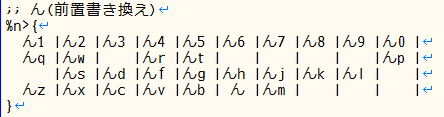
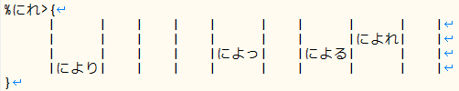

###### [FAQ HOME](../FAQ.md#FAQ-HOME)

# FAQ 書き換えシステム編

## 目次

- [Google日本語入力の書き換えシステムをエミュレートしたい](#Google日本語入力の書き換えシステムをエミュレートしたい)
- [ローマ字配列の例](#ローマ字配列の例)
- [かな配列の例](#かな配列の例)
- [基本的な記述法](#基本的な記述法)
- [同時打鍵で後置書き換えを行う](#同時打鍵で後置書き換えを行う)
- [単打テーブルを利用する後置書き換え記法](#単打テーブルを利用する後置書き換え記法)
- [1対1の書き換え規則](#1対1の書き換え規則)
- [多ストローク配列の場合](#多ストローク配列の場合)
- [単打テーブルを利用する前置書き換え記法](#単打テーブルを利用する前置書き換え記法)
- [複数文字を対象にした書き換え](#複数文字を対象にした書き換え)
- [濁音化や半濁音化する簡単なやり方はありますか](#濁音化や半濁音化する簡単なやり方はありますか)
- [書き換え対象文字の出力を確定させたい](#書き換え対象文字の出力を確定させたい)
- [Google日本語入力用ローマ字テーブルを出力したい](#Google日本語入力用ローマ字テーブルを出力したい)

## Google日本語入力の書き換えシステムをエミュレートしたい
Google日本語入力のローマ字テーブル設定では「入力」「出力」「次の入力」の3項目を設定することができます。
本ツールでは、「後置シフト」を導入してこの書き換えシステムと同等の機能を実現しています。

## ローマ字配列の例
下記は、「ローマ字配列」におけるウ段の実装例です。`q` の後に `u` と打つと「く」が、
`w` の後に `u` と打つと「う」が入力されます。

```
&u>{う
  q: く
  w: う
  r: る
(途中省略)
  m: む
  lt: っ
  xt: っ
}
```

## かな配列の例
下記は筆者が作成している「のにいると」というかな配列での例です。
```
&H>{っ
にれ: によっ
}
```
「にれ」と入力した後、`H` を打鍵すると「によっ」に書き換わります。

## 基本的な記述法
まず後置シフトキーを `&X>` という形式の記法で記述します。
[矢印記法](FAQ-配列作成.md#矢印記法とは何ですか)に似ていますが、
先頭部が `&` になっています。`X` のところには[漢直キーコード](../KEYBOARD.md)
（または[簡略記法](#簡略記法)）で後置シフトとなるキーを定義します。

ローマ字配列の例では共通の後置キー「U」に対する[簡略記法](#簡略記法)を用いて `u` と記述していますが、
他に `&U>` や `&16>` (漢直コード) といった書き方もできます。

`{` と `}` で囲まれたブロック内には、一行ずつ、
```
書き換え対象文字列: 書き換え後文字列
```
を記述します。

直前の出力文字列の末尾がどれかの「書き換え対象文字列」にマッチすれば、
その部分を「書き換え後文字列」に置換します。なお、「書き換え後文字列」の詳細については、
「[変換後文字列のうち、書き換え対象部分を明示したい](#変換後文字列のうち書き換え対象部分を明示したい)」
を参照してください。

ブロック開始記号 `{` の直後には、ブロック内に記述されたパターンにマッチしなかった場合の
デフォルトの出力文字を記述します。

## 同時打鍵で後置書き換えを行う
`#combination` ディレクティブで囲まれた場所に記述することで、同時打鍵による書き換え設定も可能です。
次図は、「M+カンマ」の同時打鍵で、「き」を「きゃ」などに書き換える例です。


上図では `{` の直後に `"!{Left}"` と記述されているので、
直前の出力文字が「き」「に」「り」以外の場合は、
左矢印キーが出力されます(通常はテキストカーソルの左移動となる)。

## 単打テーブルを利用する後置書き換え記法
数多くの文字に対して共通の後置シフトキーによる書き換えを定義したい場合は、 単打テーブルを利用すると便利です。

下図は「ローマ字配列」(`tables/その他/roman.tbl`)からの抜粋です。「ア段」のブロックが後置シフトになっています。


先に単打テーブルを用意しておきます。

共通の後置キーを `&X>` という形式の記法で記述します。これは基本記法と同様です。
上図では共通の後置キー「A」に対する[簡略記法](#簡略記法)を用いて `a` と記述しています。

`{ }` で囲まれたブロック内には、書き換え対象となる文字を出力する単打キーの位置に、
書き換え後の文字(列)を記述します。
実際には「書き換え対象文字」を意識する必要はなく、打鍵列で考えればよいでしょう。

「ローマ字配列」での「Q」単打による出力は「q」なのですが、その直後に「A」を打鍵すると、
画面上は「q」が消えて「くぁ」に書き換わります。

#### 後置キーが複数打鍵からなる場合
後置キーが複数打鍵からなる場合は、その複数キーの漢直キーコード(または簡略記法)を `,`
で連結してください。下図は、`YA` という2打鍵の後置シフトキーの場合の記述例です。


なお、この記法は、実際に「複数打鍵による後置キー」を設定しているわけではなく、
後置キー列の末尾（上図の例では `a`）に対して、複数打鍵からなる書き換え対象文字列を設定しています。
本質的には前述の「基本的な記述法」における「ウ段」の `lt: っ` などと同じです。
たとえば、上図の `qya` で「くゃ」となる例は、以下のようにも書けます。

```
&a>{
  qy: くゃ
}
```

## 1対1の書き換え規則
「すへて」と入力したら「すべて」と書き換えたい、という場合は、
```
&すへて>すべて
```
のように一行で書くことができます。
ただし、この場合、「す」「へ」「て」はすべて単打テーブルに存在している必要があります。

## 多ストローク配列の場合
T-Codeのような多ストローク配列で「過乗」→「過剰」というような書き換えをしたい場合は、次のように記述します。

```
&乗>{
過: 過剰
}
```

つまり `&` の後に後接文字を記述するわけです。これを使うと以下のような記述もできます。

```
&図>{
宿: 縮図
}
```

これは「宿図」→「縮図」という書き換えを定義しています。

多ストロークの場合も、次のように1対1記法を使うことができます。

```
&過乗>過剰
&宿図>縮図
```

## 単打テーブルを利用する前置書き換え記法
逆に、数多くの後置キーに対して共通の書き換え対象文字を定義したい場合は、こちらの記法が便利です。
書き換え対象となる前置文字が共通しているために「前置書き換え」と称しています。

下図は「ローマ字配列」(roman.tbl)からの抜粋です。



「単打テーブルを利用する後置書き換え記法」と同様、先に単打テーブルを用意しておいてください。

まず書き換え対象となる共通の前置文字に対応するキーを `%X>` という形式の記法で記述します。
後置書き換えに似ていますが、先頭部が `%` になっています。
`X` のところには、漢直キーコード（または[簡略記法](#簡略記法)）の他に、
**書き換え対象となる前置文字列**を直接記述することもできます。

簡略記法と文字の両方に解釈できる場合は簡略記法のほうが優先されます。
なので、上図の `%n>` における「n」は文字「n」ではなく簡略記法の `n` と解釈されます。
(この例の場合は結果的に同じになりますが)

またこの例は、下記のように漢直キーコードを使っても同じ結果が得られます。

```
%35>{
　・・・
}
```

`{ }` で囲まれたブロック内には、後置するキーに対応して、書き換え後の文字(列)を記述します。
「ローマ字配列」で「N」を単打するといったん「n」が出力されますが、その直後に「K」を打鍵すると、
画面上は「n」が消えて「んk」に書き換わります。

なお `/` の意味については、
「[変換後文字列のうち、書き換え対象部分を明示したい](#変換後文字列のうち書き換え対象部分を明示したい)」
を参照してください。

#### 複数文字の前置文字列の例
下図は、「にれ」という書き換え対象文字列に対して、テーブル形式で書き換え後文字列を定義している例です。



#### 同時打鍵で前置書き換えを行う
`#combination` ディレクティブで囲まれた場所に記述することで、同時打鍵による書き換え設定も可能です。
次図は、「Space, S」の同時打鍵で、「、」を「ぱ」に書き換える例です。


同時打鍵の書き方には他に次のようなものがあります。


#### 後続キーが複数打鍵からなる場合
ローマ字で「sha」を「しゃ」に定義したい場合、`{ }` のブロックを使わず、
次のようなシンプルな記法を使うことができます。


これは以下の後置記法と同等です。

```
&h,a>{
 -s>しゃ
}
```

逆にブロックをネストさせて複数打鍵からなる書き換えを行いたい場合は、各段階でブロックを定義してください。


## 複数文字を対象にした書き換え
変換後文字列のうち、その後の後置シフトにおける書き換え対象となるのは末尾の1文字だけです。

たとえば、下記の例では末尾の「い」だけが書き換え対象文字列となります。
```
  -38>たのしい
```

Google日本語入力の用語になぞらえると、「たのし」が「出力」文字列となり、
「い」が「次の入力」になります。

また、文字列をダブルクォートで囲んだ場合はその全体が書き換え対象文字列になりません。
下記の例では「たのしい」全体が書き換え対象文字列となりません。
```
  -38>"たのしい"
```

さて、「しい」という文字列に対して「た」を後接させたら「しかった」に書き換えたいとした場合、
```
&た>{
  しい: しかった
}
```
という定義を書けばよいのですが、上記の「たのしい」や「"たのしい"」が直前の入力文字列だった場合は、
書き換え対象文字列が、「い」のみ、または空文字列となり、「しい: しかった」というパターンにマッチしません。

このような場合は、書き換え対象文字列の直前に `/` を入れてください。

```
  -38>たの/しい
```

こうすることで、末尾の2文字以上の文字列を書き換え対象(すなわちGoogle日本語入力における「次の入力」)
にすることができます。

書き換え対象文字が `;` などの記号文字の場合は、その直前に `\` を置いてエスケープしてください。

```
  -12>ん/\;
```

逆に末尾文字を書き換え対象にしたくない場合は、ダブルクォートで囲むか、末尾に `/` を置いてください。

```
  -20>"あ"
  -21>い/
```

## 濁音化や半濁音化する簡単なやり方はありますか
もちろんあります。濁音化させる後置シフトキーのところに「゛」を、
半濁音化させるキーのところに「゜」を記述してください。下図は「月光」からの抜粋です。


## 書き換え対象文字の出力を確定させたい
「。」などが書き換え対象文字である場合に、次のキー入力でそれを書き換えられないようにする方法です。

#### 1. ブロッカーで確定させる

IMEを併用している場合は「。」の後で Enter を打鍵すれば確定となりますが、
漢直WSを素で使用している場合は、下図のように「ブロッカー設定/解除」に適当なキーを割り当て、
それを打鍵してください。


上図では「無変換」キーに割り当てています。
「。」の出力後に無変換キーを打鍵すると下図のようにミニバッファに縦棒 `|` が表示され、
そこから左側の文字列には書き換えが及ばなくなります。


#### 2. 時間経過で確定させる
書き換え対象文字が入力されてからの経過時間によって自動的に確定させることもできます。

設定ダイアログ >「変換・書換」>「書き換えシステム」で、
「～に含まれる文字に対して」のテキストボックスに対象文字の集合を設定し、
それに続くテキストボックスに入力文字確定までの時間を設定してください。


時間経過による確定を行わない場合は、確定までの時間として `0` を設定してください。


## Google日本語入力用ローマ字テーブルを出力したい
漢直WSを使用せず、直接Google日本語入力上でかな配列を利用したい場合は、
下図のように「変換・書換」>「Google日本語入力 ローマ字テーブルファイル出力」で
「出力」ボタンをクリックしてください。
漢直系、月系、ブリ中トロなど、同時打鍵を使用していない配列で有効です。


漢直WS上でかな配列を試行錯誤して、ある程度固まったらローマ字テーブルを出力し、
それをGoogle日本語入力にインポートする、というような利用が可能です。


