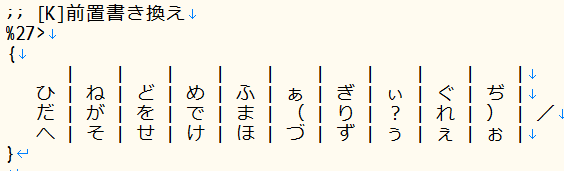
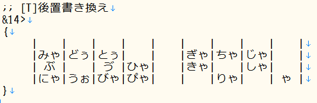
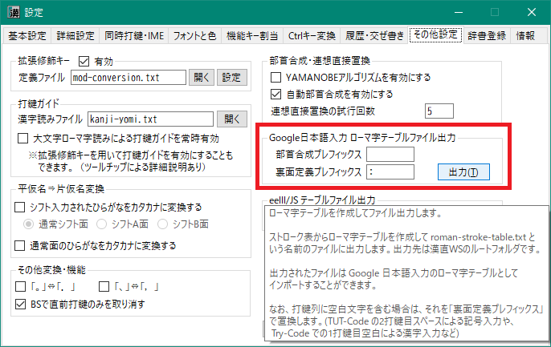

###### [FAQ HOME](../FAQ.md#FAQ-HOME)

# FAQ 配列作成編

## 目次

- [新しい配列(テーブルファイル)を作成したい](#新しい配列テーブルファイルを作成したい)
- [使用するキーとその漢直キーコード](#使用するキーとその漢直キーコード)
- [単打用テーブル](#単打用テーブル)
- 多ストローク用テーブル
- [シフト用テーブル](#シフト用テーブル)
    - [順次打鍵での前置シフト](#順次打鍵での前置シフト)
    - [SandS による連続シフト](#SandS-による連続シフト)
    - [連続シフトありの前置シフト](#連続シフトありの前置シフト)
    - [連続シフトありの相互シフト同時打鍵](#連続シフトありの相互シフト同時打鍵)
    - [ワンショット(連続シフトなし)の相互シフト同時打鍵](#ワンショット連続シフトなしの相互シフト同時打鍵)
- [「無変換」キーや「変換」キーを同時打鍵シフトキーとして使いたい](#無変換キーや変換キーを同時打鍵シフトキーとして使いたい)
    - [「無変換」キーや「変換」キーを単打したときはそのまま「無変換」「変換」キーとしたい](#無変換キーや変換キーを単打したときはそのまま無変換変換キーとしたい)
- [「無変換」キーや「変換」キーを拡張シフトキーとして使いたい](#無変換キーや変換キーを拡張シフトキーとして使いたい)
- [同じ構造のテーブルの記述を省略したい](#同じ構造のテーブルの記述を省略したい)
- [別のテーブルファイルを使い回したい](#別のテーブルファイルを使い回したい)
- かな配列と漢直配列を同時に使用したい
- [選択時に表示される説明文を設定したい](#選択時に表示される説明文を設定したい)
- [Google日本語入力の書き換えシステムをエミュレートしたい](#Google日本語入力の書き換えシステムをエミュレートしたい)
    - [前置書き換え方式](#前置書き換え方式)
    - [後置書き換え方式](#後置書き換え方式)
    - [濁音化や半濁音化する簡単なやり方はありますか](#濁音化や半濁音化する簡単なやり方はありますか)
    - [「。」の出力を確定させたい](#の出力を確定させたい)
    - [変換後文字列のうち、書き換え対象部分を明示したい](#変換後文字列のうち書き換え対象部分を明示したい)
    - [Google日本語入力用ローマ字テーブルを出力したい](#Google日本語入力用ローマ字テーブルを出力したい)
- [テーブルファイルの例](#テーブルファイルの例)
- [矢印記法とは何ですか](#矢印記法とは何ですか)
    - [ブロック内でのプレースホルダー記法](#ブロック内でのプレースホルダー記法)
    - [既定のプレースホルダー](#既定のプレースホルダー)

## 新しい配列(テーブルファイル)を作成したい
配列は、`tables` フォルダの配下にある `.tbl` という拡張子を持つテキストファイルで定義します。
このファイルのことを「テーブルファイル」と呼称しています。

テーブルファイルには、キーを表す「漢直キーコード」とそれに対応する出力文字(列)を記述します。

## 使用するキーとその漢直キーコード
テーブルファイルに記述するのは、下図のキーボードレイアウトで
数字の背景色が青と緑になっているキー(0～48)です。
背景色の付いた数字は、各キーに割り振られた「**漢直キーコード**」を示しています。


漢直キーコードと出力文字(列)の対応は「[矢印記法](#矢印記法とは何ですか)」で記述するのが基本です。
でもすべての定義をこの記法で書くのは面倒なので、
より直感的に書ける記法が用意されています。

## 単打用テーブル
下図は「月配列（2-263式）」(tuki-2-263.tbl)からの抜粋です。


`{` と `}` で囲まれたところに、漢直キーコード 0 ～ 48 のキーに対応する文字（あるいは文字列）を、
キーボードの4段に対応する形で `|` で区切って文字を並べます。
文字(列)の前後には任意個の半角空白文字を置くこともできます。
出力文字がないところには、0個以上の任意個の半角空白文字を並べます。

以下のような特徴があります。

- 出力文字(列)が半角英数字および全角文字だけからなる場合は、ダブルクォートで囲む必要がない
- 同時打鍵に使われるキーの場合でも、単打では記述された文字が出力される
- 出力文字の記述のないキー
    - 同時打鍵に使われないキーは、単打により本来のキーボードによる打鍵文字が出力される
    - 同時打鍵にも使われるキーの場合は、単打では文字の出力を行わない
    - スペースキーに対応する文字や機能を設定したい場合は5段目に書く
- 各段の後半部で出力文字の記述のないキーが末尾まで連続する場合は、その部分を省略できる（ただし、最低でも1つの `|` は必要）
- 「゛」と「゜」は直前の出力文字を濁音化(半濁音化)する機能を呼び出す

## シフト用テーブル
### 順次打鍵での前置シフト
下図は「月配列（2-263式）」(tuki-2-263.tbl)からの抜粋です。


[矢印記法](#矢印記法とは何ですか)で前置シフトキーの漢直キーコードを記述した後、単打の場合と同様にテーブル構造を記述します。
なお `;`
は、それ以降行末までコメントであることを表します。


### SandS による連続シフト
スペースキーにシフトキーと同様の機能を持たせ、拡張シフト面に割り当てる設定です。
下図は「薙刀式 v15(仮)」(naginata15.tbl)からの抜粋です。


テーブル記述の前後を `#SandS` と `#end SandS` で
囲みます。

### 連続シフトありの前置シフト
同時打鍵で連続シフトありだけれども、シフトキーが前置の場合のみ有効なケース。


テーブル記述の前後を `#combination prefix` と `#end combination` で
囲みます。

### 連続シフトありの相互シフト同時打鍵
同時打鍵で連続シフトあり、かつシフトキーの順序が前後しても構わないケース。
下図は「薙刀式 v15(仮)」(naginata15.tbl)からの抜粋です。


テーブル記述の前後を `#combination successive` と `#end combination` で
囲みます。

### ワンショット(連続シフトなし)の相互シフト同時打鍵
同時打鍵かつシフトキーの順序が前後しても構わないが、連続シフトは不可のケース。
下図は「新下駄配列」(shin-geta.tbl)からの抜粋です。


テーブル記述の前後を `#combination oneshot` と `#end combination` で
囲みます。

## 「無変換」キーや「変換」キーを同時打鍵シフトキーとして使いたい
親指シフトの親指キーとして「無変換」「変換」キーを使いたい場合は、
それらのキーに対応する漢直キーコードを[矢印記法](#矢印記法とは何ですか)のところに記述します。


「無変換」などの特殊キー(機能キー)の漢直キーコードは 50～99 となりますが、`X0～X49` と書くこともできます。
この場合「変換」キーは `X6` となります。

**注意**<br/>
「無変換」キーや「変換」キーを同時打鍵シフトキーとして使う場合は、
これらのキーを「拡張シフトキー」として使用しないでください。

[キーアサイン編](FAQ-キーアサイン.md#FAQ-HOME)で説明している拡張修飾キー設定をして場合でも、
これらのキーを拡張シフトキーとして強制的に使用不可とするためのディレクティブ

- #disableExtKey nfer
- #disableExtKey xfer

を用意していますので、必要に応じて活用してください。
(`tables/nicola.tbl` に例があります。)

### 「無変換」キーや「変換」キーを単打したときはそのまま「無変換」「変換」キーとしたい
下記のような設定をテーブルファイルに追加してください。
```
;; 「無変換」「変換」を単打したとき、そのまま「無変換」「変換」キーとする設定
-$nfer>"!{Nfer}"
-$xfer>"!{Xfer}"
```

## 「無変換」キーや「変換」キーを拡張シフトキーとして使いたい
SandS と同様に「無変換」や「変換」もシフトキーとして使いたいというケース。
同時打鍵ではなく、あくまでも「シフトキー」と同様の使い方をしたい場合となります。
下図は「薙刀式 v15 w/ TUT」(naginata15-tut.tbl)からの抜粋です。


まず `#assignPlane` で `xfer`(変換)や`nfer`(無変換)
キーに拡張シフト面を割り当てます。
拡張シフト面は、 `shiftB` ～ `shiftF` の5面から選択します。
(`shiftA` は `SandS` のデフォルトとして予約済みのため)

その後、 `#shiftB`(～`shiftF`) と `#end shift` でテーブル定義部を囲みます。
`#end shift` が来るまでテーブル定義は拡張シフト面に定義されることになるので、
適切な場所で必ず `#end shift` を記述してください。

## 同じ構造のテーブルの記述を省略したい
月系のかな配列では D と K の中指前置に対して同じテーブルが使われます。
このようなケースでは、テーブル記述をいったん変数に記録しておいて、後でそれを呼び出すことができます。


`#store 変数名` と `#end sotre`
で囲んだ部分が `変数名` で指定される変数に格納されます。
変数に格納された部分は、後で `#load 変数名`
で呼び出すことができます。

## 別のテーブルファイルを使い回したい
テーブルファイル全体を使い回したい場合は `#include` を使います。
下図は「月配列（2-263式）連続シフト版」(tuki-2-263.pfx.tbl)からの抜粋です。


行頭から `#include` と記述し、続けてダブルクォートで囲んで読み込むテーブルファイル名を記述します。
テーブルファイルは、インクルード元ファイルからの相対パスで記述してください。


## 選択時に表示される説明文を設定したい
テーブルファイル選択用のコンボボックスに表示される説明文を設定するのには `#define display-name`
を使います。


`#define display-name`
の後にダブルクォートで囲んで説明文を記述します。

## Google日本語入力の書き換えシステムをエミュレートしたい
Google日本語入力のローマ字テーブル設定では「入力」「出力」「次の入力」の3項目を設定することができます。
本ツールでは、「後置シフト」を導入してこの書き換えシステムと同等の機能を実現しています。

後置シフトには2通りの書き方があります。なお、先に単打テーブルを定義しておいてください。

### 前置書き換え方式

仕組みとしては後置シフトなんだけれども、書き換え対象となる前置文字が共通しているために「前置書き換え」と称しています。
下図は「ブリ中トロ配列」(chutoro.211023.tbl)からの抜粋です。



まず書き換え対象となる共通の前置文字に対応するキーを `%n>` という形式の記法で記述します。
矢印記法に似ていますが、先頭部が `%` になっています。
上図では「ブリ中トロ配列」での「。」単打に対応する `27` という漢直キーコード
(キー文字では `K`)を記述しています。

`{ }` で囲まれたブロック内には、後置するキーに対応して、書き換え後の文字(列)を記述します。
「ブリ中トロ配列」で `K` を単打するといったん「。」が出力されますが、その直後に `A` を打鍵すると、
画面上は「。」が消えて「だ」に書き換わります。


### 後置書き換え方式
後置シフトキーが共通している場合は、こちらの記法を用います。
下図は「ブリ中トロ配列」(chutoro.211023.tbl)からの抜粋です。



まず共通の後置キーを `&n>` という形式の記法で記述します。矢印記法に似ていますが、
先頭部が `&` になっています。
上図では共通の後置キー `T` に該当する `14` という漢直キーコードを記述しています。

`{ }` で囲まれたブロック内には、書き換え対象となる前接文字を出力する単打キーの位置に、
書き換え後の文字(列)を記述します。
実際には、「書き換え対象文字」を意識する必要はなく、打鍵列で考えればよいでしょう。

「ブリ中トロ配列」での `S` 単打は「か」なのですが、その直後に `T` を打鍵すると、
画面上は「か」が消えて「ぶ」に書き換わります。

なお、後置キーが複数打鍵からなる場合は、その複数キーの漢直キーコードを `,`
で連結してください。下図は、`DA` という2打鍵の後置シフトキーの場合の記述例です。


### 濁音化や半濁音化する簡単なやり方はありますか
もちろんあります。濁音化させる後置シフトキーのところに「゛」を、
半濁音化させるキーのところに「゜」を記述してください。下図は「月光」からの抜粋です。


### 「。」の出力を確定させたい
「。」が書き換え対象文字である場合に、次のキー入力でそれを書き換えられないようにする方法です。

#### 1. ブロッカーで確定させる

IMEを併用している場合は「。」の後で Enter を打鍵すれば確定となりますが、
漢直WSを素で使用している場合は、下図のように「ブロッカー設定/解除」に適当なキーを割り当て、
それを打鍵してください。


上図では「無変換」キーに割り当てています。
「。」の出力後に無変換キーを打鍵すると下図のようにミニバッファに縦棒 `|` が表示され、
そこから左側の文字列には書き換えが及ばなくなります。


#### 2. 時間経過で確定させる

書き換え対象文字が入力されてからの経過時間によって自動的に確定させることもできます。

設定ダイアログ >「同時打鍵・IME」>「後置書き換え条件」で
「後置書き換えを許容する遅延時間(ミリ秒)」に入力文字確定までの時間を設定してください。


時間経過による確定を行わない場合は、許容時間として `0` を設定してください。

### 変換後文字列のうち、書き換え対象部分を明示したい
変換後文字列が2文字以上の場合や、文字列をダブルクォートで囲んだ場合は、
それらの文字列はその後の後置シフトにおける書き換え対象文字列にはなりません。

つまり、その全体がGoogle日本語入力における「出力」文字列となり、
「次の入力」は空になって、書き換え対象から外れます。

文字列の一部を書き換え対象(すなわち「次の入力」)にしたい場合は、
書き換え対象文字列の直前に `/` を入れてください。

```
  -38>たの/しい
```

なお、変換後文字列が 1文字の場合は、デフォルトで書き換え対象となります。
これを書き換え対象にしたくない場合は、ダブルクォートで囲むか、末尾に `/` を置いてください。

```
  -20>"あ"
  -21>い/
```


### Google日本語入力用ローマ字テーブルを出力したい
漢直WSを使用せず、直接Google日本語入力上でかな配列を利用したい場合は、
下図のように「その他設定」>「Google日本語入力 ローマ字テーブルファイル出力」で
「出力」ボタンをクリックしてください。
漢直系、月系、ブリ中トロなど、同時打鍵を使用していない配列で有効です。



漢直WS上でかな配列を試行錯誤して、ある程度固まったらローマ字テーブルを出力し、
それをGoogle日本語入力にインポートする、というような利用が可能です。


## テーブルファイルの例
以下は「月配列(2-263)」を定義しているテーブルファイルの内容です。

```
#define display-name "月配列（2-263式）"

;; DvrakJより引用・改変
;; 
;; 月配列（2-263式）
;; http://jisx6004.client.jp/tsuki.html
;; 

;;単打
#store NORMAL_TABLE
{
１|２|３|４|５|６|７|８|９|０|  |
そ|こ|し|て|ょ|つ|ん|い|の|り|ち|
は|か|  |と|た|く|う|  |゛|き|れ|
す|け|に|な|さ|っ|る|、|。|゜|・|
}
#end store

#store SHIFT_TABLE
{
  |  |  |  |  |  |  |  |  |  |  |
ぁ|ひ|ほ|ふ|め|ぬ|え|み|や|ぇ|「|
ぃ|を|ら|あ|よ|ま|お|も|わ|ゆ|」|
ぅ|へ|せ|ゅ|ゃ|む|ろ|ね|ー|ぉ|  |
}
#end store

;;単打
#load NORMAL_TABLE
-28>@゛  ;; 濁音化(「@゛」で濁音化機能になる)
-39>@゜  ;; 半濁音化(「@゜」で半濁音化機能になる)

-22> ;; [D]
#load SHIFT_TABLE

-27> ;; [K]
#load SHIFT_TABLE
```

## 矢印記法とは何ですか
テーブルファイルにおける最も基本的な記法です。以下のような形式で記述します。
```
-{漢直キーコード}>"出力文字列"
```
`{漢直キーコード}`にはキーに割り振られた 0～99 の漢直キーコードを記述します。たとえば、
```
-10>"あ"
```
と記述してあると、`Q` を押したときに「あ」が出力されます。

複数キーの順次打鍵によって出力文字を定義する場合は、矢印記法を重ねることができます。
```
-23>-25>"愛"
```
これは、`FH`と打鍵したときに「愛」を出力する定義となっています。
複数キーの打鍵列では、次のような簡略記法も使えます。
```
-20,21,22,23,26,27,28,29>"くぁwせdrftgyふじこlp"
```
これは、`ASDFJKL;` と順に打鍵したときに「くぁwせdrftgyふじこlp」と出力する定義です。

なお、漢直キーコードが 0～39 および 41, 44, 46 のものについては、`$a` や `$.` といった簡略記法が可能です。
`$` の直後に対応する QWERTY 文字を指定してください。
使えるのは、 `$0` ～ `$9`, `$A` ～ `$Z`, `$a` ～ `$z` および
`$;` `$,` `$.` `$/` `$-` `$@` `$:` です。

記述例：
```
-$a,$.>ぬ
```
上記例で、`$a` の後の `,` は、漢直キーコードの並びを区切るカンマであることに注意。

### ブロック内でのプレースホルダー記法
配列を `|` によるブロックで記述した場合、1つのセルに長い文字列があると見ためのレイアウトが崩れてしまうことがあります。

見ためのレイアウトを保持しつつ長い文字列を定義したい場合は、
いったんセルに対して「プレースホルダー」を設定しておき、後でそれを参照するようにすると便利です。

プレースホルダーは、 `$` の後に英数字が続いた形式をとります。
下図は「薙刀式」の単打面でのプレースホルダーの使用例です。
`T` `Y` `U` のキーに、それぞれ `$dn` `$up` `bs` というプレースホルダーを設定しておき、
後でそれらに実際の出力文字列(ここでは機能キーの呼び出し)を定義しています。


プレースホルダーとして、前述の簡略記法(`$A` など)を用いることもできます。
これらを用いる場合は、あらかじめプレースホルダーを設定する必要はありません。
下図は、上図を簡略記法で書き換えたものです。


### 既定のプレースホルダー
いくつかのキーについては、既定のプレースホルダー名が定義されています。

|名前|対応するキー|漢直キーコード|
|--|--|:--:|
|sc|セミコロン (`:`)|29|
|cm|カンマ (`,`)|37|
|pd|ピリオド (`.`)|38|
|sl|スラッシュ (`/`)|39|
|space|スペース|40|
|hp|ハイフン (`-`)|41|
|at|アットマーク (`@`)|44|
|cl|コロン (`:`)|46|
|ej<br/>hz|半角/全角|51|
|tab|Tab|52|
|caps|Caps Lock|53|
|alnum<br/>eisu|英数|54|
|nfer|無変換|55|
|xfer|変換|56
|kana|ひらがな|57|

これらのプレースホルダーおよび上述の簡略記法(`$A`など)は、ブロック外(トップレベル)でも使用することができます。

下図は、「月林檎配列」における使用例です。


