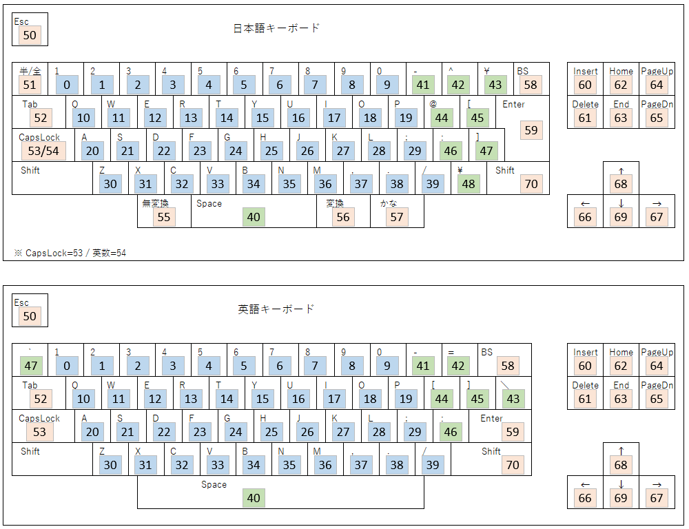

###### [FAQ HOME](../FAQ.md#FAQ-HOME)

# FAQ 配列作成編

## 目次

- [新しい配列(テーブルファイル)を作成したい](#新しい配列テーブルファイルを作成したい)
- [使用するキーとその配列キーコード](#使用するキーとその配列キーコード)
- [単打用テーブル](#単打用テーブル)
- 多ストローク用テーブル
- [シフト打鍵用テーブル](#シフト打鍵用テーブル)
    - [順次打鍵での前置シフト](#順次打鍵での前置シフト)
    - [SandS による連続シフト](#SandS-による連続シフト)
    - [連続シフトありの前置シフト](#連続シフトありの前置シフト)
    - [先押し後離し方式の同時打鍵](#先押し後離し方式の同時打鍵)
    - [連続シフトありの相互シフト同時打鍵](#連続シフトありの相互シフト同時打鍵)
    - [ワンショット(連続シフトなし)の相互シフト同時打鍵](#ワンショット連続シフトなしの相互シフト同時打鍵)
    - [Spaceキーとの同時打鍵を定義したい](#Spaceキーとの同時打鍵を定義したい)
    - [漢直モードがOFFの時(英数モードの時)も同時打鍵を有効にしたい](#漢直モードがOFFの時英数モードの時も同時打鍵を有効にしたい)
    - [打鍵列の定義が重複したときに警告を出したい](#打鍵列の定義が重複したときに警告を出したい)
    - [打鍵列の定義が重複しても警告を出したくない](#打鍵列の定義が重複しても警告を出したくない)
    - [かな配列からも漢直を呼び出したい](#かな配列からも漢直を呼び出したい)
- [矢印記法とは何ですか](#矢印記法とは何ですか)
    - [簡略記法](#簡略記法)
    - [ブロック内でのプレースホルダー記法](#ブロック内でのプレースホルダー記法)
    - [既定のプレースホルダー](#既定のプレースホルダー)
- [「無変換」キーや「変換」キーを同時打鍵シフトキーとして使いたい](#無変換キーや変換キーを同時打鍵シフトキーとして使いたい)
    - [「無変換」キーや「変換」キーを単打したときはそのまま「無変換」「変換」キーとしたい](#無変換キーや変換キーを単打したときはそのまま無変換変換キーとしたい)
- [「無変換」キーや「変換」キーを拡張シフトキーとして使いたい](#無変換キーや変換キーを拡張シフトキーとして使いたい)
- [同じ構造のテーブルの記述を省略したい](#同じ構造のテーブルの記述を省略したい)
- [別のテーブルファイルを使い回したい](#別のテーブルファイルを使い回したい)
- かな配列と漢直配列を同時に使用したい
- [ファイル選択時に表示される説明文を設定したい](#ファイル選択時に表示される説明文を設定したい)
- [テーブルファイルの中で、配列固有の設定を記述したい](#テーブルファイルの中で配列固有の設定を記述したい)


## 新しい配列(テーブルファイル)を作成したい
配列は、`tables` フォルダの配下にある `.tbl` という拡張子を持つテキストファイルで定義します。
このファイルのことを「テーブルファイル」と呼称しています。

テーブルファイルには、キーを表す「配列キーコード」とそれに対応する出力文字(列)を記述します。

新しい配列を作成する場合は、まずは既存のテーブルファイルを開いてみて、雰囲気をつかんでください。

## 使用するキーとその配列キーコード
テーブルファイルに記述するのは、下図のキーボードレイアウトで
数字の背景色が青と緑になっている文字キー(0～48)および背景色がピンク色になっている特殊キー(50～99)です。
背景色の付いた数字は、各キーに割り振られた「**配列キーコード**」を示しています。



配列キーコードと出力文字(列)の対応は「矢印記法」
（詳細は「[矢印記法とは何ですか](#矢印記法とは何ですか)」を参照）で記述するのが基本です。
でもすべての定義をこの記法で書くのは面倒なので、
より直感的に書ける記法が用意されています。

## 単打用テーブル
下図は「月配列（2-263式）」(tuki-2-263.tbl)からの抜粋です。


`{` と `}` で囲まれたところに、配列キーコード 0 ～ 48 のキーに対応する文字（あるいは文字列）を、
キーボードの4段に対応する形で `|` で区切って文字を並べます。
文字(列)の前後には任意個の半角空白文字を置くこともできます。
出力文字がないところには、0個以上の任意個の半角空白文字を並べます。

以下のような特徴があります。

- 出力文字(列)が半角英数字および全角文字だけからなる場合は、ダブルクォートで囲む必要がない
- 同時打鍵に使われるキーの場合でも、単打では記述された文字が出力される
- 出力文字の記述のないキー
    - 同時打鍵に使われないキーは、単打により本来のキーボードによる打鍵文字が出力される
    - 同時打鍵にも使われるキーの場合は、単打では文字の出力を行わない
    - スペースキーに対応する文字や機能を設定したい場合は5段目に書く
- 各段の後半部で出力文字の記述のないキーが末尾まで連続する場合は、その部分を省略できる（ただし、最低でも1つの `|` は必要）
- 「゛」と「゜」は直前の出力文字を濁音化(半濁音化)する機能を呼び出す

## シフト打鍵用テーブル
### 順次打鍵での前置シフト
下図は「月配列（2-263式）」(tuki-2-263.tbl)からの抜粋です。


[矢印記法](#矢印記法とは何ですか)で前置シフトキーの配列キーコードを記述した後、単打の場合と同様にテーブル構造を記述します。
なお `;`
は、それ以降行末までコメントであることを表します。


### SandS による連続シフト
スペースキーにシフトキーと同様の機能を持たせ、拡張シフト面に割り当てる設定です。
下図は「薙刀式 v15(仮)」(naginata15.tbl)からの抜粋です。


テーブル記述の前後を `#SandS` と `#end SandS` で
囲みます。

### 連続シフトありの前置シフト
同時打鍵で連続シフトありだけれども、シフトキーが前置の場合のみ有効なケース。
あるいは3打鍵以上で打鍵順序を固定したいケース。


テーブル記述の前後を `#combination prefix` (または `#combination ordered`) と
`#end combination` で囲みます。

### 先押し後離し方式の同時打鍵
同時打鍵で、シフトキーが文字キーより先に押され、文字キーより後に離されるケース。


上図のように、`#combination` 句に `stacklike` 修飾子を付加します。

`stacklike` の付加された `#combination` ブロックは、それを付加しないブロックと共存できます。


上図のような定義があると、「っ、り」とロールオーバー打健した場合は「おり」が出力され、
「っ、り」を先押し後離しで打鍵した場合は「っぽ」が出力されます。

### 連続シフトありの相互シフト同時打鍵
同時打鍵で連続シフトあり、かつシフトキーの順序が前後しても構わないケース。
下図は「薙刀式 v15(仮)」(naginata15.tbl)からの抜粋です。


テーブル記述の前後を `#combination successive` と `#end combination` で
囲みます。

### ワンショット(連続シフトなし)の相互シフト同時打鍵
同時打鍵かつシフトキーの順序が前後しても構わないが、連続シフトは不可のケース。
下図は「新下駄配列」(shin-geta.tbl)からの抜粋です。


テーブル記述の前後を `#combination oneshot` と `#end combination` で
囲みます。

### Spaceキーとの同時打鍵を定義したい
定義方法は他のキーと同様です。ただし、SandS を無効にしておく必要があります。

```
#SandS disable
#combination successive
-40>{
   ！ | 　 | 　 | 　 | 　 | 　 | 　 | （ | ） | ？ |
   ほ | だ | じ | せ | ふ | む | そ | う | よ | ゆ |
   ね | ば | 　 | ろ | や | わ | め | 　 | え | ど |
   ち | み | お | け | ぐ | ご | ず | つ | び | へ |
}
#end combination
```

### 漢直モードがOFFの時(英数モードの時)も同時打鍵を有効にしたい
通常は、同時打鍵定義は漢直モードがONのときだけ有効です。
これを、漢直モードがOFF(英数モード)のときだけ有効にしたり、どちらのモードでも有効にしたりすることができます。

#### 英数モードのときだけ有効な同時打鍵定義
次のように、同時打鍵定義のところを `#enableComboOnEisu` と `#end enableComboOnEisu`
で囲んでください。
下記は、漢直モードが OFF (英数モード)の時だけ、`JH` の同時押しで IME ON にする設定です。

```
;; IME ON
#combination oneShot
#enableComboOnEisu
-J,H>"!{ImeOn}"
-$F,$G>"!{ImeOff}"
#end enableComboOnEisu
#end combination
```

#### 漢直モードでも英数モードでも有効な同時打鍵定義
次のように、同時打鍵定義のところを `#enableComboOnBoth` と `#end enableComboOnBoth`
で囲んでください。
下記は、どちらのモードでも `FG` の同時押しで IME OFFにする設定です。
```
;; IME OFF
#combination oneShot
#enableComboOnBoth
-F,G>"!{ImeOff}"
#end enableComboOnBoth
#end combination
```

#### 同じ同時打鍵に対して両モードで異なる定義をする
下記は、`JH` の同時押しで、漢直モード時は IME OFF、英数モード時は IME ON にする設定です。
```
;; IME ON/OFF
#combination oneShot
-J,H>"!{ImeOff}"
#enableComboOnEisu
-J,H>"!{ImeOn}"
#end enableComboOnEisu
#end combination
```

### 打鍵列の定義が重複したときに警告を出したい
次のような打鍵列を定義すると、A のキーには文字「あ」と2ストロークの第1打鍵の両方が定義されてしまいます。
デフォルトでは後から定義したほうが優先され、黙って前に定義したものを上書きしてしまいます。

```
-a>あ
-a,s>あす
```
このようなケースで、上書きが発生した時に警告を出すように設定することができます。
下図のように「詳細設定」>「テーブルファイル読み込み時の重複チェック」で「重複チェックを行う」
にチェックを入れてください。


### 打鍵列の定義が重複しても警告を出したくない
逆に打鍵列の定義が重複しても意図したものなので警告を出したくない場合は、
テーブルファイルの当該箇所を `#ignoreWarning overwrite` ～ `#enableWarning overwrite`
で囲んでください。

```
#ignoreWarning overwrite
-a>あ
-a,s>あす
#enableWarning overwrite
```

### かな配列からも漢直を呼び出したい
複数キーの同時押しに漢直配列(複数キーの順次打鍵)の呼び出しを割り当てることで、
かな配列と漢直配列を同時に使用することができるようになります。

以下のような矢印記法の拡張記法を用います。

1. `-…>|`
    - `|` の直前までを同時打鍵として判定し、それに続くブロック内を順次打鍵として判定する
2. `-…>||`
    - `||` の直後のキーまでを同時打鍵として判定し、それに続くブロック内を順次打鍵として判定する

#### 1 の具体例
たとえば「薙刀式」のテーブルに次のような定義を追加して再読み込みをしてみます。

```
;; 連続シフト漢直
#combination
-J,K>|
{
  -S,W>恋
  -S,E>人
}
#end combination
```
次のように、「J, K」の同時打鍵の後にブロック内で定義された順次打鍵が開始されます。


―(j,k)→

―s→


この場合は、いったん漢字を打ち終わると、次に漢字を入力する際にはもう一度「j, k」の同時打鍵が必要になります。

#### 2 の具体例
次のような定義を追加して再読み込みをしてみます。
```
;; 連続シフト漢直
#combination
-J,K>||
{
  -S>{
    |    |    |    |    |    |    |    |    |    |
    | 恋 | 旅 | 東 |    |    |    |    |    |    |
    | 人 | 立 | 向 |    |    |    |    |    |    |
    |    |    |    |    |    |    |    |    |    |
  }
  
  -D> {
    |    |    |    |    |    |    |    |    |    |
    | 列 | 街 | 贈 |    |    |    |    |    |    |
    | 車 | 君 | 探 |    |    |    |    |    |    |
    |    |    |    |    |    |    |    |    |    |
  }
}
#end combination
```

- 「j,k」を押しながら「s」を押して離す (「j,k」は押したままにする)


- 「j,k」を押したまま「d」を押して離す


こちらは「j,k」を押しっぱなしにしながら連続的に漢字の入力が可能になります。

以下のように既存の漢直テーブルを取り込みたい場合もこちらの記法を使うとよいでしょう。

```
#combination
-J,K>||
#include "../漢直系/tutr.tbl"
```
ちなみに作者はこれを応用して、下記のようにスペースキーとの同時打鍵によって漢直の裏面配列を呼び出せるようにしています。
実際の定義については、`tables/漢直系/okt.tbl` を参照してください。
```
;; 起点Comboで漢字読み置換(with句があるのでユーザー定義置換ファイルも使う)
#yomiConvert with "user-yomi.txt"
;; 起点Combo
#combination
-40>||
#include "_subtables/okt-kanji.tbl"
#end combination
#yomiConvert end
```

## 矢印記法とは何ですか
テーブルファイルにおける最も基本的な記法です。以下のような形式で記述します。
```
-{配列キーコード}>"出力文字列"
```
`{配列キーコード}`にはキーに割り振られた 0～99 の[配列キーコード](../KEYBOARD.md)を記述します。たとえば、
```
-10>"あ"
```
と記述してあると、`Q` を押したときに「あ」が出力されます。

複数キーの順次打鍵によって出力文字を定義する場合は、矢印記法を重ねることができます。
```
-23>-25>"愛"
```
これは、`FH`と打鍵したときに「愛」を出力する定義となっています。
複数キーの打鍵列では、`>-` を `,` で置き換えた次のような簡略記法も使えます。
```
-20,21,22,23,26,27,28,29>"くぁwせdrftgyふじこlp"
```
これは、`ASDFJKL;` と順に打鍵したときに「くぁwせdrftgyふじこlp」と出力する定義です。

### 簡略記法
配列キーコードが 0～39 および 41, 44, 46 のものについては、`$a` や `$.` といった簡略記法が可能です。
`$` の直後に対応する QWERTY 文字を指定してください。
使えるのは、 `$0` ～ `$9`, `$A` ～ `$Z`, `$a` ～ `$z` および
`$;` `$,` `$.` `$/` `$-` `$@` `$:` です。
さらに、英1文字の場合は、`$` を省略することも可能です。

記述例： `a` `.` と打鍵したときに「ぬ」を出力する
```
-a,$.>ぬ
```
上記例で、`a` の後の `,` は、配列キーコードの並びを区切るカンマであることに注意。

### ブロック内でのプレースホルダー記法
配列を `|` によるブロックで記述した場合、1つのセルに長い文字列があると見ためのレイアウトが崩れてしまうことがあります。

見ためのレイアウトを保持しつつ長い文字列を定義したい場合は、
いったんセルに対して「プレースホルダー」を設定しておき、後でそれを参照するようにすると便利です。

プレースホルダーは、 `$` の後に英数字が続いた形式をとります。
下図は「薙刀式」の単打面でのプレースホルダーの使用例です。
`T` `Y` `U` のキーに、それぞれ `$dn` `$up` `bs` というプレースホルダーを設定しておき、
後でそれらに実際の出力文字列(ここでは機能キーの呼び出し)を定義しています。


プレースホルダーとして、前述の簡略記法(`$A` など)を用いることもできます。
これらを用いる場合は、あらかじめプレースホルダーを設定する必要はありません。
下図は、上図を簡略記法で書き換えたものです。


### 既定のプレースホルダー
いくつかのキーについては、既定のプレースホルダー名が定義されています。

|名前|対応するキー|配列キーコード|
|--|--|:--:|
|sc|セミコロン (`:`)|29|
|cm|カンマ (`,`)|37|
|pd|ピリオド (`.`)|38|
|sl|スラッシュ (`/`)|39|
|space|スペース|40|
|hp|ハイフン (`-`)|41|
|at|アットマーク (`@`)|44|
|cl|コロン (`:`)|46|
|ej<br/>hz|半角/全角|51|
|tab|Tab|52|
|caps|Caps Lock|53|
|alnum<br/>eisu|英数|54|
|nfer|無変換|55|
|xfer|変換|56
|kana|ひらがな|57|

これらのプレースホルダーおよび上述の簡略記法(`$A`など)は、ブロック外(トップレベル)でも使用することができます。

下図は、「月林檎配列」における使用例です。


## 「無変換」キーや「変換」キーを同時打鍵シフトキーとして使いたい
親指シフトの親指キーとして「無変換」「変換」キーを使いたい場合は、
それらのキーに対応する配列キーコードを[矢印記法](#矢印記法とは何ですか)のところに記述します。


「無変換」などの特殊キー(機能キー)の配列キーコードは 50～99 となりますが、`X0～X49` と書くこともできます。
この場合「変換」キーは `X6` となります。

**注意**<br/>
「無変換」キーや「変換」キーを同時打鍵シフトキーとして使う場合は、
これらのキーを「拡張シフトキー」として使用しないでください。

[キーアサイン編](FAQ-キーアサイン.md#FAQ-HOME)で説明している拡張修飾キー設定をしている場合でも、
これらのキーを拡張シフトキーとして強制的に使用不可とするためのディレクティブ

- #disableExtKey nfer
- #disableExtKey xfer

を用意していますので、必要に応じて活用してください。
(`tables/nicola.tbl` に例があります。)

### 「無変換」キーや「変換」キーを単打したときはそのまま「無変換」「変換」キーとしたい
「無変換」キーや「変換」キーを同時打鍵シフトキーとして使っている場合に、
それらを単打した時は本来の「無変換」「変換」キーとして使えるようにできます。

設定ダイアログの「同時打鍵・IME」>「『変換』キーと『無変換」キー」>
「単打の場合は本来のキーとして機能する」にチェックを入れてください。
(初期状態ではチェックが入っています)


逆に、これらのキーを単打したときには何も機能させたくない場合は、上図のチェックを外してください。

#### テーブルファイルによる設定
なお、下記のような設定をテーブルファイルに追加することでも同様の効果が得られます
(というか、上図のチェックを入れると下記の設定が自動的に追加されるようになります)。
なので、特定のキーだけ、本来の機能を実行させたいような場合は、
上図のチェックを外して特定キーのみ、下記設定を追加してください。

```
;; 「無変換」「変換」を単打したとき、そのまま「無変換」「変換」キーとする設定
-$nfer>"!{Nfer}"
-$xfer>"!{Xfer}"
```

下図は NICOLA における設定例です。


## 「無変換」キーや「変換」キーを拡張シフトキーとして使いたい
SandS と同様に「無変換」や「変換」もシフトキーとして使いたいというケース。
同時打鍵ではなく、あくまでも「シフトキー」と同様の使い方をしたい場合となります。
下図は「薙刀式 v15 w/ TUT」(naginata15-tut.tbl)からの抜粋です。


まず `#assignPlane` で `xfer`(変換)や`nfer`(無変換)
キーに拡張シフト面を割り当てます。
拡張シフト面は、 `shiftB` ～ `shiftF` の5面から選択します。
(`shiftA` は `SandS` のデフォルトとして予約済みのため)

その後、 `#shiftB`(～`shiftF`) と `#end shift` でテーブル定義部を囲みます。
`#end shift` が来るまでテーブル定義は拡張シフト面に定義されることになるので、
適切な場所で必ず `#end shift` を記述してください。

## 同じ構造のテーブルの記述を省略したい
月系のかな配列では D と K の中指前置に対して同じテーブルが使われます。
このようなケースでは、テーブル記述をいったん変数に記録しておいて、後でそれを呼び出すことができます。


`#store 変数名` と `#end sotre`
で囲んだ部分が `変数名` で指定される変数に格納されます。
変数に格納された部分は、後で `#load 変数名`
で呼び出すことができます。

## 別のテーブルファイルを使い回したい
テーブルファイル全体を使い回したい場合は `#include` を使います。
下図は「月配列（2-263式）連続シフト版」(tuki-2-263.pfx.tbl)からの抜粋です。


行頭から `#include` と記述し、続けてダブルクォートで囲んで読み込むテーブルファイル名を記述します。
テーブルファイルは、インクルード元ファイルからの相対パスで記述してください。


## ファイル選択時に表示される説明文を設定したい
テーブルファイル選択用のコンボボックスに表示される説明文を設定するのには `#define display-name`
を使います。


`#define display-name`
の後にダブルクォートで囲んで説明文を記述します。

## テーブルファイルの中で、配列固有の設定を記述したい
テーブルファイルの中で次のように記述すると、同時打鍵やIME、書き換えシステムなどに関する、
配列固有の設定を行うことができます。

```
#set PROPERTY_NAME=VALUE
```

たとえば `#set combinationMaxAllowedLeadTimeMs=80` と記述すると下図のように
「第1キー押下から第2キー押下までの時間」が設定できます。


上図を見ると分かりますが、設定した項目については入力コントロールが無効化されて、値が変更できないようになります。
これは、テーブルファイルによる配列固有の設定によって、
kanchoku.user.ini のグローバルな設定が上書きされないようにするためです。

テーブルファイルから設定できる項目は以下のとおりです。

|プロパティ名|型|設定項目|
|-|-|-|
|SandSEnabled|bool|漢直/かなモードでSandSを有効にするか|
|sandsEnabledWhenOffMode|bool|漢直/かなモードOFFでSandSを有効にするか|
|sandsAssignedPlane|整数|SandSを割り当てる面 (0:通常面, 1:シフト面, 2:シフトA面, ..., 7:シフトF面)|
|oneshotSandSEnabled|bool|スペース単打によるワンショットSandSを有効にするか|
|sandsEnablePostShift|bool|疑似同時打鍵をサポートするか|
|sandsEnableSpaceOrRepeatMillisec|整数|スペース再打鍵によるスペース入力またはリピート開始までの時間(ミリ秒)|
|combinationMaxAllowedLeadTimeMs|整数|同時打鍵判定で、第1キー押下から第2キー押下までの許容時間(ミリ秒)|
|comboMaxAllowedPostfixTimeMs|整数|同時打鍵判定で、第2キーがシフトキーの場合の制限時間(ミリ秒)|
|useCombinationKeyTimer1|bool|同時打鍵判定で、第1打鍵が文字キーの場合にタイマーを使用するか|
|combinationKeyTimeMs|整数|同時打鍵判定で、同時押し状態からキー解放までの下限時間(ミリ秒)|
|combinationKeyTimeMs3|整数|3キー以上の同時打鍵判定で、同時押し状態からキー解放までの下限時間(ミリ秒)|
|combinationKeyTimeOnlyAfterSecond|bool|同時打鍵判定で、同時打鍵の1文字目には上記条件を適用しないか|
|useCombinationKeyTimer2|bool|同時打鍵判定で、第2打鍵以降のキー押下でタイマーを使用するか|
|comboDisableIntervalTimeMs|整数|同時打鍵判定で、シフトキーの解放後、後置シフトを無効にする時間(ミリ秒)|
|onlyCharKeysComboShouldBeCoveringCombo|bool|同時打鍵判定で、文字キー同士の同時打鍵は第1打鍵を最後に離鍵した場合に限るか|
|imeCooperationEnabled|bool|IMEの状態に合わせてデコーダをON/OFFするか|
|imeSendInputInRoman|bool|IMEのローマ字入力モードに対応するか|
|imeSendInputInKana|bool|IMEのかな入力モードに対応するか|
|imeKatakanaToHiragana|bool|IMEの入力モード対応時にカタカナをひらがなに変更するか|
|useComboExtModKeyAsSingleHit|bool|「変換」「無変換」「ImeOn」「ImeOff」キーについて、単打の場合は本来のキーとして機能させるか|
|threeKeysComboUnconditional|bool|設定されている文字列以外の3キー同時押しを無条件に同時打鍵と判定するか|
|preRewriteTargetChars|文字列|書き換えシステムにおいて、自動確定の対象となる文字集合|
|preRewriteAllowedDelayTimeMs|整数|書き換えシステムにおいて、上記文字が入力されてから自動で確定するまでの時間(ミリ秒)|
|preRewriteAllowedDelayTimeMs2|整数|書き換えシステムにおいて、上記以外の文字が入力されてから自動で確定するまでの時間(ミリ秒)|
|preRewriteWaitTimeMsWhenTrainingMode|整数|かな入力練習モードで、上記文字が入力されてから出力されるまでの待ち時間(ミリ秒)|
|zenkakuModeKeySeq|整数(列)|機能呼出: 「全角変換(モード)」機能の呼び出しキー(列)|
|zenkakuOneCharKeySeq|整数(列)|機能呼出: 「全角変換(1文字)」機能の呼び出しキー(列)|
|katakanaModeKeySeq|整数(列)|機能呼出: 「カタカナ変換(モー)」機能の呼び出しキー(列)|
|nextThroughKeySeq|整数(列)|機能呼出: 「次打鍵スルー」機能の呼び出しキー(列)|
|historyKeySeq|整数(列)|機能呼出: 「履歴検索」機能の呼び出しキー(列)|
|historyOneCharKeySeq|整数(列)|機能呼出: 「履歴検索(1文字)」機能の呼び出しキー(列)|
|historyFewCharsKeySeq|整数(列)|機能呼出: 「履歴検索(数文字)」機能の呼び出しキー(列)|
|mazegakiKeySeq|整数(列)|機能呼出: 「交ぜ書き変換」機能の呼び出しキー(列)|
|bushuCompKeySeq|整数(列)|機能呼出: 「部首合成」機能の呼び出しキー(列)|
|bushuAssocKeySeq|整数(列)|機能呼出: 「連想文字検索」機能の呼び出しキー(列)|
|bushuAssocDirectKeySeq|整数(列)|機能呼出: 「連想直接変換」機能の呼び出しキー(列)|
|katakanaOneShotKeySeq|整数(列)|機能呼出: 「カタカナ変換(一括)」機能の呼び出しキー(列)|
|hanKataOneShotKeySeq|整数(列)|機能呼出: 「半角カタカナ変換」機能の呼び出しキー(列)|
|blkSetOneShotKeySeq|整数(列)|機能呼出: 「ブロッカー設定/解除」機能の呼び出しキー(列)|

下記は、「のにいると」配列における設定例です。
```
;; ---------------------------------------------------------
;; 当テーブル固有のパラメータ設定
;; ---------------------------------------------------------
;; 漢直/かなモードでSandSを有効にするか
;;#set SandSEnabled=false
;; 漢直/かなモードOFFでSandSを有効にするか
;;#set sandsEnabledWhenOffMode=false
;; SandSを割り当てる面 (0:通常面, 1:シフト面, 2:シフトA面, ..., 7:シフトF面)
;;#set sandsAssignedPlane=
;; スペース単打によるワンショットSandSを有効にするか
;;#set oneshotSandSEnabled=false
;; 疑似同時打鍵をサポートするか
;;#set sandsEnablePostShift=false
;; スペース再打鍵によるスペース入力またはリピート開始までの時間(ミリ秒)
;;#set sandsEnableSpaceOrRepeatMillisec=

;; 同時打鍵判定で、第1キー押下から第2キー押下までの許容時間(ミリ秒)
#set combinationMaxAllowedLeadTimeMs=100
;; 同時打鍵判定で、第2キーがシフトキーの場合の制限時間(ミリ秒)
#set comboMaxAllowedPostfixTimeMs=50
;; 同時打鍵判定で、第1打鍵が文字キーの場合にタイマーを使用するか
#set useCombinationKeyTimer1=true
;; 同時打鍵判定で、同時押し状態からキー解放までの下限時間(ミリ秒)
#set combinationKeyTimeMs=70
;; 3キー以上の同時打鍵判定で、同時押し状態からキー解放までの下限時間(ミリ秒)
#set combinationKeyTimeMs3=100
;; 同時打鍵判定で、同時打鍵の1文字目には上記条件を適用しないか
#set combinationKeyTimeOnlyAfterSecond=true
;; 同時打鍵判定で、第2打鍵以降のキー押下でタイマーを使用するか
#set useCombinationKeyTimer2=true
;; 同時打鍵判定で、シフトキーの解放後、後置シフトを無効にする時間(ミリ秒)
#set comboDisableIntervalTimeMs=200
;; 同時打鍵判定で、文字キー同士の同時打鍵は第1打鍵を最後に離鍵した場合に限るか
#set onlyCharKeysComboShouldBeCoveringCombo=true

;; IMEの状態に合わせてデコーダをON/OFFするか
#set imeCooperationEnabled=false
;; IMEのローマ字入力モードに対応するか
#set imeKatakanaToHiragana=true
;; IMEのかな入力モードに対応するか
#set imeSendInputInRoman=true
;; IMEの入力モード対応時にカタカナをひらがなに変更するか
#set imeSendInputInKana=false

;; 「変換」キーと「無変換」キーについて、単打の場合は本来のキーとして機能させるか
#set useComboExtModKeyAsSingleHit=true
;; 設定されている文字列以外の3キー同時押しを無条件に同時打鍵と判定するか
#set threeKeysComboUnconditional=false
;; 3キー同時押しのときに順次打鍵判定が優先される文字列
#define sequentialWords る。 やに だ、 ば、 う。 い。 より

;; 書き換えシステムにおいて、自動確定の対象となる文字集合
#set preRewriteTargetChars=。、
;; 書き換えシステムにおいて、上記文字が入力されてから自動で確定するまでの時間(ミリ秒)
#set preRewriteAllowedDelayTimeMs=200
;; 書き換えシステムにおいて、上記以外の文字が入力されてから自動で確定するまでの時間(ミリ秒)
#set preRewriteAllowedDelayTimeMs2=1500
;; かな入力練習モードで、上記文字が入力されてから出力されるまでの待ち時間(ミリ秒)
#set preRewriteWaitTimeMsWhenTrainingMode=100

;; 機能呼出: 「全角変換(モード)」機能の呼び出しキー(列)
;;#set zenkakuModeKeySeq=
;; 機能呼出: 「全角変換(1文字)」機能の呼び出しキー(列)
;;#set zenkakuOneCharKeySeq=
;; 機能呼出: 「カタカナ変換(モー)」機能の呼び出しキー(列)
;;#set katakanaModeKeySeq=
;; 機能呼出: 「次打鍵スルー」機能の呼び出しキー(列)
;;#set nextThroughKeySeq=
;; 機能呼出: 「履歴検索」機能の呼び出しキー(列)
;;#set historyKeySeq=44
;; 機能呼出: 「履歴検索(1文字)」機能の呼び出しキー(列)
;;#set historyOneCharKeySeq=
;; 機能呼出: 「履歴検索(数文字)」機能の呼び出しキー(列)
;;#set historyFewCharsKeySeq=
;; 機能呼出: 「交ぜ書き変換」機能の呼び出しキー(列)
;;#set mazegakiKeySeq=23,26
;; 機能呼出: 「部首合成」機能の呼び出しキー(列)
;;#set bushuCompKeySeq=26,23
;; 機能呼出: 「連想文字検索」機能の呼び出しキー(列)
;;#set bushuAssocKeySeq=
;; 機能呼出: 「連想直接変換」機能の呼び出しキー(列)
;;#set bushuAssocDirectKeySeq=46
;; 機能呼出: 「カタカナ変換(一括)」機能の呼び出しキー(列)
;;#set katakanaOneShotKeySeq=
;; 機能呼出: 「半角カタカナ変換」機能の呼び出しキー(列)
;;#set hanKataOneShotKeySeq=
;; 機能呼出: 「ブロッカー設定/解除」機能の呼び出しキー(列)
;;#set blkSetOneShotKeySeq=
```

実際の設定例については、`tables\その他\roman.tbl` または `tables\かな系\noniiruto.tbl` を参照ください。

