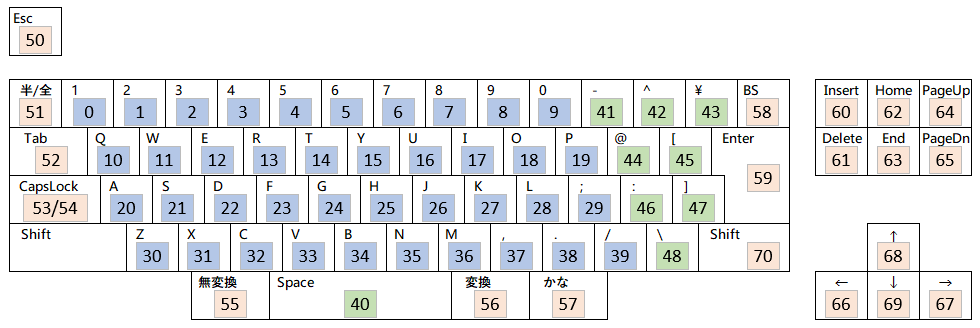

## 使用するキーとその漢直コード
テーブルファイルに記述するのは、下図のキーボードレイアウトで
数字の背景色が青と緑になっているキー(0～48)です。
背景色の付いた数字は、各キーに割り振られた「**漢直コード**」を示しています。

「無変換」などの特殊キー(機能キー)の漢直コードは 50～99 となりますが、`X0～X49` と書くこともできます。
この場合「変換」キーは `X6` となります。

また、下記の単打可能な特殊キーは名前でも記述できます。

|キー名|X記法|名前|
|-|-|-|
|半角/全角| X1|zenkaku|
|CapsLock|X3|caps|
|英数|X4|alnum|
|無変換|X5|nfer|
|変換|X6|xfer|
|ひらがな|X7|kana|
|右シフト|X20|rshift|
|Insert|X60|ins|
