###### TOP

# KanchokuWS -- 漢直Win Spoiler -- 利用者ガイド
KanchokuWS (漢直WS) は、[漢直Win（漢直窓）](https://github.com/kanchoku/kw)の使い勝手を受け継ぎ、
かつ、利用者を徹底的に甘やかすことを目標として新たに開発された、
Windows 用の漢字直接入力ツールです。
また、複数キーの同時打鍵もサポートしているので、
各種かな配列の実装プラットフォーム(エミュレータ)として利用することもできます。

本書は 漢直WS の、主に漢直ツールとしての利用者ガイド(マニュアル)となります。
かな配列の利用方法については、[FAQ](FAQ.md)を参照してください。

## 目次

- [元祖漢直窓から受け継いだ機能](#元祖漢直窓から受け継いだ機能)
- [KanchokuWS で搭載された新機能](#KanchokuWS-で搭載された新機能)
- [起動](#起動)
    - [起動画面と設定ダイアログ](#起動画面と設定ダイアログ)
- [漢直モードに入る](#漢直モードに入る)
    - [漢直モードキーの変更](#漢直モードキーの変更)
    - [仮想鍵盤とモード標識](#仮想鍵盤とモード標識)
- [漢直モードから出る](#漢直モードから出る)
- [終了と再起動](#終了と再起動)
- [設定ファイル、その他各種ファイル](#設定ファイルその他各種ファイル)
    - [kanchoku.ini の引き継ぎ](#kanchokuini-の引き継ぎ)
    - [各種ファイルの引き継ぎとUTF-8化](#各種ファイルの引き継ぎとUTF-8化)
    - [テーブルファイル](#テーブルファイル)
    - [キーボードファイルによる機能キーの仮想キーコード定義](#キーボードファイルによる機能キーの仮想キーコード定義)
    - [容易打鍵文字ファイル](#容易打鍵文字ファイル)
    - [辞書の自動保存と世代管理](#辞書の自動保存と世代管理)
- [補助入力機能](#補助入力機能)
    - [打鍵列への割り当て](#打鍵列への割り当て)
    - [ミニバッファとブロッカー](#ミニバッファとブロッカー)
- [入力履歴検索](#入力履歴検索)
    - [自動履歴検索](#自動履歴検索)
    - [履歴候補の縦列表示](#履歴候補の縦列表示)
    - [履歴操作の状態遷移図](#履歴操作の状態遷移図)
    - [履歴候補の操作](#履歴候補の操作)
    - [履歴の手動登録](#履歴の手動登録)
    - [変換形](#変換形)
- [交ぜ書き変換](#交ぜ書き変換)
    - [容易打鍵文字からなる候補の劣後](#容易打鍵文字からなる候補の劣後)
    - [交ぜ書きブロッカー](#交ぜ書きブロッカー)
    - [変換開始位置の移動](#変換開始位置の移動)
    - [縦列候補を表示しない](#縦列候補を表示しない)
    - [空白文字を変換開始位置とする](#空白文字を変換開始位置とする)
    - [無活用語に対する接続語尾設定](#無活用語に対する接続語尾設定)
    - [動的交ぜ書き](#動的交ぜ書き)
    - [活用型](#活用型)
    - [交ぜ書き辞書](#交ぜ書き辞書)
    - [辞書登録](#辞書登録)
- [連想文字入力](#連想文字入力)
    - [連想文字選択入力](#連想文字選択入力)
    - [連想文字直接置換](#連想文字直接置換)
    - [辞書登録](#辞書登録)
- [部首合成](#部首合成)
    - [計算順序](#計算順序)
    - [YAMANOBEアルゴリズム](#YAMANOBEアルゴリズム)
    - [部品としての使用頻度の低い文字を優先](#部品としての使用頻度の低い文字を優先)
    - [各ステップごとに逆順演算を適用](#各ステップごとに逆順演算を適用)
    - [再帰合成(部品から合成可能な文字を用いた足し算)](#再帰合成部品から合成可能な文字を用いた足し算)
    - [合成の次候補出力](#合成の次候補出力)
    - [部首合成ヘルプ](#部首合成ヘルプ)
    - [辞書登録](#辞書登録)
    - [辞書ファイルの再読み込み](#辞書ファイルの再読み込み)
- [自動部首合成](#自動部首合成)
    - [特定の組み合わせを自動部首合成の対象から外す](#特定の組み合わせを自動部首合成の対象から外す)
    - [合成元の2文字に戻す](#合成元の2文字に戻す)
    - [辞書登録](#辞書登録)
- [英数記号全角入力](#英数記号全角入力)
- [カタカナ入力](#カタカナ入力)
- [設定ダイアログ](#設定ダイアログ)
- [その他の機能](#その他の機能)
    - [キーボードフックとSendInputの全面採用](#キーボードフックとSendInputの全面採用)
    - [カレットに追随する仮想鍵盤](#カレットに追随する仮想鍵盤)
    - [高DPIモニターへの対応](#高DPIモニターへの対応)
    - [打鍵ヘルプ](#打鍵ヘルプ)
    - [ローマ字(またはひらがな)入力による打鍵ガイド](#ローマ字またはひらがな入力による打鍵ガイド)
    - [Ctrl-H や Ctrl-B,F,P,Nなどの特殊キーへの変換](#Ctrl-H-や-Ctrl-BFPNなどの特殊キーへの変換)
    - [Spaceキーによる 拡張シフト機能をサポート (SandS)](#Spaceキーによる-拡張シフト機能をサポート-SandS)
    - [機能キーを修飾キーとして使う(拡張修飾キー)](#機能キーを修飾キーとして使う拡張修飾キー)
    - [Google 日本語入力にインポートできるローマ字テーブルの出力](#Google-日本語入力にインポートできるローマ字テーブルの出力)
    - [eelll/JS にインポートできるテーブルファイルの出力](#eelllJS-にインポートできるテーブルファイルの出力)
    - [他のキー変換ツールとの競合解消](#他のキー変換ツールとの競合解消)
    - [直前打鍵位置の表示](#直前打鍵位置の表示)
    - [KeyboardHookMonitor](#KeyboardHookMonitor)
- [既知のバグ](#既知のバグ)
- [今後の機能追加予定(順不同)](#今後の機能追加予定順不同)
- [引用元](#引用元)
- [利用条件と免責](#利用条件と免責)

## 元祖漢直窓から受け継いだ機能
以下の機能は KanchokuWS でも利用可能です。

- テーブルファイルに基づく漢字直接入力
- 後置部首合成
- 後置交ぜ書き変換
- 英数記号全角入力
- カタカナ入力、カタカナ変換、半角カタカナ変換
- Shiftかな入力をカタカナ変換するモード

逆に言うと以下のような機能は受け継いでいません。

- 前置部首合成
- 前置交ぜ書き変換
- 熟語ガイド
- その他、いろんな機能

## KanchokuWS で搭載された新機能

- [キーボードフックとSendInputの全面採用](#キーボードフックとSendInputの全面採用)
- [入力履歴検索](#入力履歴検索)
- [動的交ぜ書き変換](#動的交ぜ書き)
- [ユーザー辞書の利用](#辞書登録)
- [連想文字入力](#連想文字入力)
- [部首合成の新アルゴリズム](#部首合成)
- [自動部首合成](#自動部首合成)
- [ローマ字(またはひらがな)入力による打鍵ガイド](#ローマ字またはひらがな入力による打鍵ガイド)
- [拡張シフト面](#複数のシフト面)
- [漢字を読みなどに変換しながらテーブルファイルをシフト面にロード](#漢字読み変換と裏文字変換)
- [SandS (Space and Shift)](#Spaceキーによる-Shift機能をサポート-SandS)
- [UTF-8の全面採用(サロゲートペアもサポート)](#各種ファイルの引き継ぎとUTF-8化)
- [設定ダイアログによるカスタマイズ](#設定ダイアログ)

## 起動
漢直WSのインストールは済んでいるものとします。
未だの方は [README](README.md) を参照してインストールしてください。

### 起動画面と設定ダイアログ
起動すると起動画面(スプラッシュウィンドウ)が表示されます。


辞書ファイルなどの読み込みが完了すると「OK」「設定」というボタンが表示されるので、
初めての起動の場合は「設定」をクリックしてみてください。
設定ダイアログが開くので、各タブを一通り開いて見てください。
どんな機能があるか、おおよそ分かるかと思います。
（設定ダイアログは、タスクトレイのアイコンの右クリックメニューからも開くことができます）

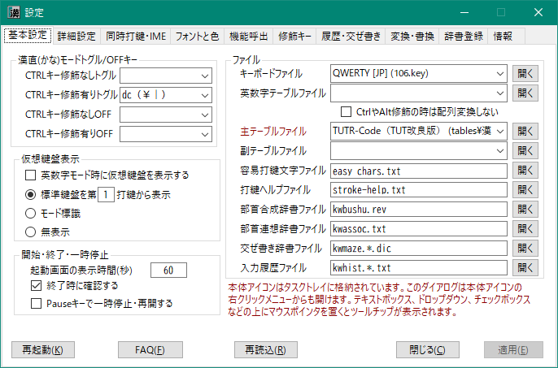

辞書ファイルを除き、ほとんどの設定項目および設定ファイルの変更は、
「設定」または「再読込」ボタンをクリックすることで反映されます。

なお、ほとんどの設定項目にはツールチップによる説明を付与してあります。
テキストボックス、ラジオボタン、チェックボックスなど、入力用コントロールに
マウスポインタを合わせてみてください。約30秒間、その項目に対するツールチップが表示されます。

「情報」タブにはバージョン番号、ビルド日時などの情報が記載されていますので、
作者への連絡の際は、それをお伝えください。

#### 起動画面の非表示
起動画面は、「OK」ボタンまたは「設定」ボタンをクリックするか、漢直モードに移行するか、
あるいは、一定時間が経過すると非表示になります。
最初から非表示したい場合は、設定ダイアログの「基本設定」>「開始・終了」>「起動画面の表示時間(秒)」を
0 に設定してください。

## 漢直モードに入る
以下の方法で漢直モードに入ることができます。
- タスクトレイに格納されたアイコン  をクリックする
- Ctrl-￥を押す (デフォルト状態の場合。設定ダイアログから変更可能)

漢直モードに入ると、アイコンは  に変化し、
さらに下のような仮想鍵盤が表示されます。

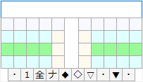

### 漢直モードキーの変更
漢直モードに入るためのキーは、設定ダイアログの「基本設定」>「漢直モードトグル/OFFキー」で設定できます。
下図は、「変換」キー（Ctrlキーの修飾なし）を漢直モードのON/OFFキーとして設定した画面です。


キーの指定は、仮想キーコード(16進表記)で行います。
主なキーについてはあらかじめコンボボックスに用意してありますが、
環境によっては別の仮想キーコードに変更されていることがあります。
実際にキーに割り当てられている仮想キーコードを確認するには、
同梱されている `KeyboardHookMonitor` を利用してください。
[こちら](https://github.com/oktopus1959/KeyboardHookMonitor#readme)に説明があります。

設定の詳細については、キー選択コンボボックスのツールチップを参照してください。

### 仮想鍵盤とモード標識

仮想鍵盤は、アクティブウィンドウのカレット（caret; テキストカーソル）位置に追随して移動します。
表示位置などの設定については、[カレットに追随する仮想鍵盤](#カレットに追随する仮想鍵盤)を参照してください。

すでに漢直に習熟している方にとっては、仮想鍵盤の表示は煩わしいかと思います。
そのような場合は、設定ダイアログの 「基本設定」>「仮想鍵盤表示」で「モード標識」を選択して、
モード標識表示に変更してみてください。
 のようなモード標識を表示するだけの状態になります。


モード標識の表示時間などは、「詳細設定」>「仮想鍵盤・モード標識」の「漢直モード標識再表示間隔」と
「英字モード標識表示時間」で設定することができます。詳細については同項目のツールチップを参照してください。


また、モード標識の表示すら不要という場合は、「基本設定」>「仮想鍵盤表示」で「無表示」を選択してください。


なお、モード標識表示時または無表示でも、 Ctrl-T を押すことで一時的に仮想鍵盤を表示することができます。


## 漢直モードから出る
以下の方法で漢直モードから出ることができます。
- タスクトレイに格納されたアイコン  をクリックする
- 仮想鍵盤またはモード標識をクリックする
- Ctrl-￥を押す (デフォルト状態の場合。設定ダイアログから変更可能)

## 終了と再起動
- タスクトレイに格納されている本体アイコン
- 仮想鍵盤
- モード標識

のいずれかで右クリックすると、以下のようなメニューが表示されます。


終了する場合は「終了」をクリックしてください。
この場合、デコーダが保持している辞書の内容が自動的にファイルに保存されます。

再起動する場合は、さらに下図のようなサブメニューが表示されます。


辞書内容を保存するか、破棄するかに応じて適切なほうをクリックしてください。
たとえば、辞書ファイルを手作業で更新したので、自動保存をしたくない場合などは
「辞書内容を破棄して再起動」を選択してください。


## 設定ファイル、その他各種ファイル
ルートフォルダにある kanchoku.ini および kanchoku.user.ini が設定ファイルです。
ただ、このファイルを直接修正することはあまり必要ありません。
上述の設定ダイアログによって必要なカスタマイズは行えるようになっています。

カスタマイズの結果は kanchoku.user.ini に書き込まれます。
kanchoku.ini と kanchoku.user.ini の両方に同じエントリがある場合は、
kanchoku.user.ini のほうが優先されます。

### kanchoku.ini の引き継ぎ
インストール直後には、最低限の設定が記述された kanchoku.user.ini だけが存在しています。
元祖漢直窓を使用されている場合は、その kanchoku.ini をそのまま使うこともできます。
引き継がれる設定は、以下のとおりです。

|項目|内容|
|-|-|
|hotKey|Ctrl修飾ありの漢直モード トグルキー|
|unmodifiedHotKey|Ctrl修飾なしの漢直モード トグルキー|
|offHotKey|Ctrl修飾ありの漢直モード OFFキー|
|unmodifiedOffHotKey|Ctrl修飾なしの漢直モード OFFキー|
|tableFile|漢直方式のテーブルファイル|
|keyboard|キーボードファイル|
|bushu|部首合成辞書ファイル|
|shiftKana|Shiftでカタカナを入力|
|weakBS|BSで直前の打鍵のみを取り消す|

元祖漢直窓の kanchoku.ini を使う場合は、それを KanchokuWS のルートフォルダにコピーしてから
起動（または再起動）してください。
なお、キーボードファイルとして 106.key 以外を設定している場合は、
「設定」-「基本設定」「ファイル」-「キー・文字マップファイル」
も対応したものに変更してから起動(または再起動)してください。

### 各種ファイルの引き継ぎとUTF-8化

KanchokuWS が使用するファイルは、設定ファイルを除き、すべて UTF-8 でエンコードされています。
もし、 ShiftJIS で書かれた既存ファイルを引き継ぎたい場合は、エディタなどで
UTF-8 に変換してからルートフォルダにコピーしてください。

#### サロゲートペア
KanchokuWS はサロゲートペアもサポートしています。
- テーブルファイル
- 交ぜ書き辞書ファイル
- 部首合成辞書ファイル

などのファイルで「𠮷」や「𩸽」などの文字を使って確認してみてください。
（部首合成辞書については、部品のほうにはサロゲートペアを使えません）

### テーブルファイル
テーブルファイルは、打鍵列と文字(列)のマッピングを定義するファイルです。
以下のテーブルファイルが用意されています。
(※かな配列系に関しては[FAQ基本編](FAQ/FAQ-基本.md)を参照)

|ファイル名|コード名|特徴|
|-|-|-|
|t.tbl|T-Code|2ストローク、カタカナあり、ひらがな・カタカナが無規則|
|tut.tbl|TUT-Code|多ストローク、カタカナなし|
|tutr.tbl|TUT-Code改|TUTの拡張版。拗音等の短縮や鏡像反転を追加|
|tt.tbl|TT-Code|T-Code + 多ストローク (fj/jf で拡張面に移動)|
|g.tbl|G-Code|多ストローク、カタカナあり|
|phoenix.tbl|phoenix|多ストローク、ひらがなが左右逆順も同文字、カタカナなし|
|try.tbl|Try-Code|T-Code + 多ストローク (スペースをプレフィックスとする3打鍵)|
|okt.tbl|OKT-Code|作者個人用(T-Codeから派生)|

T-Code 以外は、ひらがな（カタカナ）が覚えやすい配置になっているものがほとんどです
（というか、T-Code が変態なだけとも言いますが） 。
TUT や phoenix のようにカタカナがテーブルファイルに存在しないものは、
カタカナ入力モードやひらがな→カタカナ変換機能を使って入力することになります。

※ tutr.tbl については Hary氏の「[TUT-Code使うならこれだけは絶対やっとけ！](https://ameblo.jp/harycurl/entry-12108859013.html)」を参照してください。

打鍵列と文字の対応を記述するテーブルファイルの記法については、
元祖漢直Winの[ドキュメント](https://kanchoku.github.io/kw/doc/kanchoku_frame.html)の
「テーブルファイル」の項を参照ください。

#### 出力文字列中の機能キーの記述
##### 機能キー記述
打鍵に割り当てられる出力文字列は、ダブルクォートで囲むことで複数の文字を含むことができます。
この文字列中に `!{keyName}`というような文字列を記述すると、*keyName* に相当する機能キーを出力できます。

例：テーブルファイルに、後述の矢印記法を用いて
```
-7>-8>"（）!{left}"
```
という記述をすると、これは(Qwerty/106配列で) `89` と打鍵することで `（）` を出力し、
さらにカレット(文字カーソル)を左移動して両カッコの間に置くことができるようになります。

*keyName* と機能キーの対応については、後述の
[キーボードファイルによる機能キーの仮想キーコード定義](#キーボードファイルによる機能キーの仮想キーコード定義)
を参照してください。

機能キーを複数出力する例については、後述します。

##### 仮想キーコード記述
上述の「機能キー記述」と似た方法で、任意の仮想キーコードを出力することもできます。

仮想キーコードを出力するには、文字列として `!{VKxx}` という記述をします。
たとえば「ImeOn」(仮想コーコード: 0x16)を出力したい場合は、次のように記述します。

```
-xfer>"!{VK16}"
```

これは、「変換」キーに仮想キーコード 0x16 の出力を割り当てています。


##### Ctrl修飾とShift修飾
*keyName* には '^' および '+' を前接させることができます。
`^` を前接させると  Ctrl 修飾となり、`+` を前接させると Shift 修飾となります。
Ctrl修飾の場合は、*keyName* として `A`～`Z` を用いることもできます。

例：拡張シフトB面（「複数のシフト面」参照）の`W`(Qwerty/106)に `Ctrl+Shift+右矢印 - Ctrl+X` （カーソルの左1単語のカット）を割り当てる
```
-B11>"!{^+Left}!{^X}"
```

'^' や '+' には、'<'(左Ctrl/右Shift)と'>'(右Ctrl/右Shift)の指定も行えます。

例：拡張シフト面の D を打鍵したとき、 右Ctrl-D を出力する
```
-B22>"!{>^D}"
```

##### 3項演算記述
`(...)?(...):(...)` というような形式で3項演算を記述することができます。

第1項(条件部)には式を適用するウィンドウクラス名を記述します。
先頭の条件部で指定されたウィンドウクラス名がアクティブウィンドウのクラス名とマッチしたら第2項を返し、
マッチしなかったら第3項を返します。

例：拡張シフト面の W を打鍵したとき、 mintty や PuTTY なら Ctrl-W を出力し、
それ以外なら Ctrl-Shift-左矢印, Ctrl-X を出力する (つまり文字カーソルの左単語の削除)
```
-B11>"(mintty|PuTTY)?(!{^W}):(!{^+Left}!{^X})"
```

上記のように、ウィンドウクラス名は `|` をはさんで連結することによって複数個を指定することができます。

##### 拡張修飾キーからの呼び出し
テーブルファイルに記述した機能キーは、通常は漢直モードがONの場合だけしか呼び出せませんが、
後述の[拡張修飾キー](#機能キーを修飾キーとして使う拡張修飾キー)定義(mod-conversion.txt)で、たとえば
`nfer:11:B11` のように定義することで、漢直OFFの場合も呼び出せるようになります。


#### 複数のシフト面
従来のシフト面の他に、シフトA面～シフトF面の6面が追加されました。面としては、
「通常打鍵用の面」「通常シフト打鍵用の面」「拡張修飾キーによるシフト面(A)」～「同(F)」
の8面となります。以降、これらの追加されたシフト面を「拡張シフト面」と呼ぶことにします。

拡張シフト面を呼び出すための拡張修飾キーの定義については、
「[機能キーを修飾キーとして使う(拡張修飾キー)](#機能キーを修飾キーとして使う拡張修飾キー)」
を参照してください。

それぞれの面に対して、ブレース記法(`{ … }`)による出力文字設定が可能です。

|ディレクティブ|面|
|-|-|
|なし (または#noShift)|通常打鍵用の面。あるシフト面から通常面に戻るには #noShift を使う|
|#shift (または -P1>)|通常シフト打鍵用の面|
|#shiftA (または -P2>)|拡張修飾キーによるシフト面(A)|
|#shiftB (または -P3>)|拡張修飾キーによるシフト面(B)|
|・・・|・・・|
|#shiftF (または -P7>)|拡張修飾キーによるシフト面(F)|

記述例：
```
#shiftA
{
   "え" , "お" , "み" , "つ" , "や" , "め" , "ど" , "け" , "そ" , "せ",
   "も" , "れ" , "な" , "た" , "っ" , "あ" , "い" , "ま" , "す" , "こ",
   "る" , "と" , "に" , "が" , "は" , "で" , "し" , "の" , "て" , "を",
   "ん" , "う" , "り" , "か" , "き" , "だ" , "さ" , "く" , "ら" , "よ",
      @v, "ね" , "じ" , "ず" , "ば" , "ろ" , "、" , "。" , "。" ,
}
```

なお、すべての面において第二打鍵についてはシフトが無視されます。
たとえば、通常シフトキーを押しながら連続して 'a', 's' と押下した場合は、
'A', 's' というキー入力として扱われるということです。

矢印記法を使ってテーブル記述する場合は、二打鍵めは通常面のコードとして記述してください。

例： `-S20>-S21>"明日"` ではなく `-S20>-21>"明日"` と記述する

#### 同時打鍵

※ 同時打鍵については、[FAQ基本編](FAQ/FAQ-基本.md)に詳細な説明があります。

`#combination` と `#end combination` で囲まれたブロックは、同時打鍵定義ブロックとなります。

例：
```
;; 前置連続シフト
#combination prefix
#end combination
```

`#combination` は以下の引数を取ることができます。

|引数|説明|
|--|--|
|prefix|前置シフトかつ連続シフトあり（前置連続シフト）|
|successive|相互シフトかつ連続シフトあり（相互連続シフト）|
|oneshot|相互シフトかつ連続シフトなし（相互ワンショットシフト）|

**前置シフト**とは、シフトキーが被修飾キーよりも先に打鍵されるものをいいます。
上記の例でいえば、キーコード23(F)とキーコード26(J)が前置シフトです。
上記例で「E押→J押→R押」の順に押した場合は、 Eは単打、「J→R」が同時打鍵となり「てじ」と出力されます。

**連続シフト**とは、押下状態にあるキーは、それが解放されるまでは同時打鍵を構成するキーの候補として
扱われるということです。上記例で「J押→W押→E押→W上→R押→J上」と入力した場合は、
まず「W上」の時点で同時打鍵判定が実行され、そのときに押下状態にあった「J, W, E」の組み合わせで
同時打鍵を構成するもの(上記例だと 「JW⇒ぎ」、「JE⇒で」)が出力されます。
ここで解放されたW以外の「J,E」がシフト履歴として残ります。
次の「J上」の時点では、シフト履歴の「J,E」と新たに打鍵された「R」との組み合せを検索し、
「JR⇒じ」が出力されます。

**相互シフト**とは、キーの押下が前後しても、組み合わせが合っていれば同時打鍵とみなすものです。
もし、上記の例で、`#combination prefix` ではなく、
`#combination successive` だった場合は、
「J→E」でも「E→J」でも「で」が出力されることになります。

**ワンショットシフト**とは、同時打鍵の組み合わせが検出されたら、
キーのロールオーバー打ちを多用する場合は前置シフト方式を、1打鍵ずつ押下・解放を繰り返すような
打ち方の場合は、相互シフト方式を採用するとよいでしょう。


#### 矢印記法
※ 矢印記法については、[FAQ 配列作成編](FAQ/FAQ-配列作成.md)も参照してください。

元祖漢直窓で実装されていた矢印記法をサポートしました。以下の拡張記法が使用できます。
- コード番号を「Snn」と記述すると nn のシフトコードになります。
- コード番号を「Ann」と記述すると nn の拡張シフトA面コードになります。
- コード番号を「Bnn」と記述すると nn の拡張シフトB面コードになります。

たとえば、`-S40>@M` は「Shift+Space で交ぜ書き変換を呼び出す」ことを表します。
あるいは、`-B29>@B` は「拡張シフトB面に割り当てられた拡張修飾キー」＋「;」で「部首合成を呼び出す」
ことを表します。

- コード番号を「Xn」と記述すると以下の表のような特殊キーを表すコードになります。

|コード記述|対応する特殊キー|
|-|-|
|X1|半角/全角|
|X3|CapsLock|
|X4|英数|
|X5|無変換|
|X6|変換|
|X7|ひらがな|

これにより、たとえば、`-X7>@K` と書くと、「ひらがな」キーによって「カタカナ変換モード」の
ON/OFFを切り替えられるようになります。

##### 矢印記法における第1打鍵分散(矢印束記法)のサポート
矢印記法で第1打鍵として `*` を指定して `-*>-n>{ ・・・ }` のような書き方をすると、
第2打鍵 `n` を固定して、`{ ・・・ }` 内の文字位置を第1打鍵としてテーブル展開します。

たとえば、
```
-*>-40>
{
   "あ", "い", "う", ...
}
```
は、以下と同等です。
```
->0>-40> "あ"
->1>-40> "い"
->2>-40> "う"
…
```

これを使うと、たとえば TUT-Code の記号類（第2打鍵が空白）の記述が簡単になるかと思います。

#### 外部ファイルのインクルード
`#include "filename"` という記述により、その場所に `filename` の内容を展開できます。
利用例としては、`okt.tbl` の末尾の
```
-47>
#include "greek.tbl"

-47>-44>
#include "symbol1.tbl"

-47>-45>
#include "symbol2.tbl"

-47>-46>
#include "symbol3.tbl"

-47>-47>
#include "symbol4.tbl"
```
と、`greek.txt`, `symbol1.tbl` などを参照ください。
なお、`symbol?.tbl` は `phoenix.tbl` から切り出したものです。

#### 漢字読み変換と裏文字変換
`#yomiConvert` という記述により、それ以降の打鍵文字定義において、
「漢字読みファイル」（デフォルト: `kanji-yomi.txt`）を用いて、漢字を読みに変換して設定するようになります。

使用する読みは、以下の優先順に従います。
1. 2文字以上の音読み
2. 2文字以上の訓読み
3. 上記以外なら無変換

たとえば、「小」は「しょう」に、「事」は「こと」に変換されます。

`#yomiConvert end` という記述により、上記の変換モードを終了します。

以下、使用例です。
同じ打鍵定義ファイル `okt-kanji.tbl` を用いて通常面と拡張シフトA面の設定を行っています。
```
;; 通常面
#include "okt-kanji.tbl"

;; ShiftA面 漢字読み置換
#shiftA
#yomiConvert
#include "okt-kanji.tbl"
#yomiConvert end
```

たとえば SandS を拡張シフトA面に割り当てておくと、
Space+「品」⇒「ひん」、Space+「宿」⇒「しゅく」という入力ができるようになり、
交ぜ書きで「ひんしゅく」の入力が容易になります。

##### 裏文字変換
以下のように `#yomiConvert with "filename"` と記述すると、上記の読み変換定義を、
`filename` というファイルに記述されたマッピングに従った変換で上書きします。 
```
;; ShiftA面 漢字読み置換(with句があるのでユーザー定義置換ファイルも使う)
#shiftA
#yomiConvert with "user-yomi.txt"
#include "okt-kanji.tbl"
#yomiConvert end
```
ストロークが割り当てられていないが良く使用する文字を、
連想される文字の変換文字として裏定義しておくと便利かと思います。
たとえば T-Code では「畑」が定義されていませんが、「田」の裏定義で「畑」を設定しておくなど。

他には、似た字形の漢字を裏定義しておくという手もあります。たとえば「書」の裏定義として「粛」を設定しておくなど。
この場合は、`書 粛` というマッピングを定義します。
裏文字定義の具体例については、同梱の `user-yomi.txt` を参照してください。


もう一つの使用例です。106key の `:` (46)をプレフィックスキーとして通常面の文字の裏定義を行います。
```
;; ":" をプレフィックスとして漢字読み置換(with句があるのでユーザー定義置換ファイルも使う)
-46>
#yomiConvert with "user-yomi.txt"
#include "okt-kanji.tbl"
#yomiConvert end
```
プレフィックスキーを 40 にすると Try-Code のような感じになりますね。

#### 副テーブルファイル
テーブルファイルは2つまで設定することができます。ここでは、従来からあるものを「主テーブルファイル」、
追加したものを「副テーブルファイル」と呼ぶことにします。

副テーブルファイルは、下図のように設定ダイアログの「基本設定」>「ファイル」>「副テーブルファイル」
で設定します。


副テーブルファイルが不要であれば空白のままにしておいてください。

主・副テーブルの切り替えは、拡張修飾キーによる `ExchangeCodeTable` コマンド呼び出しで行います。
「無変換」や「ひらがな」キーの単打に割り当てるのがお勧めです。

副テーブルには専用の打鍵ヘルプを設定できます。設定できるのは、以下の2つのうちのどちらか1つです。
- `keyCharsPosition2` （副テーブルの単打鍵文字だけを集めた打鍵表）
- `strokePosition2` （指定文字列に含まれる文字を第1ストローク位置形式で表示する打鍵表）

具体例については、同梱の `stroke-help.txt` を参照してください。

ちなみに、上図の`rokt.tbl`というのは、
- シフト無しの1打鍵で平仮名
- 拡張シフトありの2打鍵で漢字(T-Code)

という配列になっています。`okt.tbl` の反転版というわけです。


#### テーブルファイルの再読み込み
エディタなどでテーブルファイルを修正した後は、コンテキストメニューの「再読込」-「設定の再読込」を
クリックすると、各種設定とともにテーブルファイルも再読み込みされます。

また、設定ダイアログの「再読込」ボタンをクリックするとことでも同様の処理が行われます。

### キーボードファイルによる機能キーの仮想キーコード定義
キーボードファイルに機能キー(CapsLock, 無変換、変換、ひらがな、etc.)の仮想キーコード定義を書けるようにしました。
たとえば、Windows を英語OSモードに設定して日本語キーボードを接続した場合、「無変換」キーの仮想キーコードは
0xeb (VK_OEM_PA1)になりますが、このようなケースにも対応できるようになります。

`keyName=vkey` という形で一行に1つの定義を記述します。vkey は 16進数です。以下、106.key での記述例です。

```
31, 32, 33, 34, 35, 36, 37, 38, 39, 30,
51, 57, 45, 52, 54, 59, 55, 49, 4f, 50,
41, 53, 44, 46, 47, 48, 4a, 4b, 4c, bb,
5a, 58, 43, 56, 42, 4e, 4d, bc, be, bf,
20, bd, de, dc, c0, db, ba, dd, e2, 00,

#esc=1b
#zenkaku=f3
#tab=09
#caps=14
#alnum=f0
nfer=eb
#xfer=1c
#kana=f2
#bs=08
#enter=0d
#ins=2d
#del=2e
#home=24
#end=23
#pgup=21
#pgdn=22
#up=26
#down=28
#left=25
#right=27
```

機能キーと keyName の対応は下記のようになります。keyName は大文字・小文字を区別しません。

|機能キー|keyName|
|-|-|
|エスケープ|Esc, Escape|
|半角／全角|Zenkaku|
|タブ|Tab|
|CapsLock|Caps, CapsLock|
|英数|Alnum, AlphaNum, Eisu|
|無変換|Nfer|
|変換|Xfer|
|ひらがな|Kana, Hiragana|
|BackSpace| BS, Back, BackSpace|
|Enter|Enter|
|Insert|Ins, Insert|
|Delete|Del, Delete|
|Home|Home|
|End|End|
|Page Up|PgUp, PageUp|
|Page Down|PgDn, PageDown|
|↑|Up, UpArrow|
|↓|Down, DownArrow|
|←|Left, LeftArrow|
|→|Right, RightArrow|

どのキーを押したときにどのような仮想キーコードが発生するかは、同梱の `KeyboardHookMonitor`
を使って調べられます。
[こちら](https://github.com/oktopus1959/KeyboardHookMonitor#readme)に説明があります。

下図は、KeyboardHookMonitor を使って、「無変換」キーを押したときの出力です。


「KeyCode=1d」のところが仮想キーコードとなります。この例では「無変換」キーの仮想キーコードが
0x1d であることが分かります。

### 容易打鍵文字ファイル
利用者が容易に打鍵入力できる文字（テーブルファイルに定義されておりストロークを覚えている文字）
を設定するファイルです。
ファイル名は、設定ダイアログの「基本設定」>「ファイル」>「容易打鍵文字ファイル」で指定します。

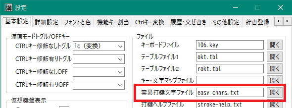

後述する履歴入力や交ぜ書き入力において、容易打鍵文字だけを含むような候補を表示しないようにしたり、
候補列の後尾に回したりするのに利用されます。

容易打鍵文字として、具体的に文字列として文字集合を指定する方法の他に、
上中下段の30x30=900文字を一括で指定したり、
それ以外も含む2打鍵文字の集合や全打鍵文字の集合を指定することもできます。
設定の詳細については、同梱の `easy_chars.txt` ファイルを参照してください。


### 辞書の自動保存と世代管理
設定した時間間隔で、辞書の自動保存を行うことができます。
自動保存を有効にする場合は、
設定ダイアログの「詳細設定」>「辞書ファイル」>「辞書の自動保存を行う」にチェックを入れてください。

自動保存を行う場合は、さらに保存の実行間隔と、実行タイミングにおける待機時間も設定します。
詳細については、設定ダイアログのツールチップを参照してください。

なお、当ツールの終了時にも辞書が自動保存されます。

保存対象の辞書ファイルは、

- 履歴ファイル (entry, recent, exclude)
- 交ぜ書きユーザー辞書、優先辞書 (kwmaze.{user,prim}.dic)
- 部首合成辞書 (kwbushu.rev, kwbushu.aut)
- 連想辞書 (kwassoc.txt)

です。

辞書の保存時には、既存の辞書ファイルが `back` ディレクトリに保存されます (履歴の recent と exclude を除く)。
バックアップファイルの名前には、末尾に世代を表す数字が付加されます。
たとえば、履歴ファイルであれば、 `back\\kwmaze.user.dic.1` のような名前で保存されます。

バックアップファイルは、さらに何世代かにわたって保存されます。古い世代ほど、末尾の数字が大きくなります。
保存する世代数はデフォルトで3世代となっています。
世代数を変更したい場合は、設定ダイアログの「詳細設定」>「辞書ファイル」>「ファイル保存世代数」で設定してください。


## 補助入力機能
KanchokuWS は漢字直接入力以外に、以下のような補助入力機能を備えています。
「標識」は、テーブルファイルに機能呼び出しを記述する際、「@」に続けて書かれる機能標識です。

|機能名|標識|説明|
|-|-|-
|自キー出力|^|当ストロークで押下したキーの文字を出力する|
|前キー出力|v|前ストロークで押下したキーの文字を出力する|
|入力履歴検索|!|縦列鍵盤による履歴候補の表示と選択|
|数文字入力履歴検索|1/?|1 は1文字の履歴候補の表示と選択<br/>? は2～3文字の履歴候補の表示と選択<br/>(ともに容易打鍵文字のみの候補を除く)|
|交ぜ書き変換|M/m|後置式の交ぜ書き変換|
|部首合成|B/b|後置式の部首合成|
|連想文字入力|A/a|Aは選択入力、aは直接入力|
|英数記号全角入力|Z/z|Zは全角変換モード、z は次の1文字のみ|
|カタカナ入力|K/k|Kはカタカナ変換モード、k は一括置換<br/>カタカナに対して一括置換するとひらがなに戻る|
|半角カタカナ変換|h|出力したカタカナを半角または全角に置換|
|次打鍵スルー|\\ |次の打鍵キー文字をそのまま出力|
|ブロッカー設定|bs|ミニバッファ末尾へのブロッカー設定または解除|

### 打鍵列への割り当て
上記機能の呼び出しは、以下の方法で打鍵列に割り当てることができます。
- テーブルファイルに「@{機能標識}」（例：`@M`）を記述する
- 設定ダイアログの「機能呼出」タブで設定する

#### 機能をテーブルファイルに記述
これは従来からある方法となります。通常面だけでなく、シフト面、拡張シフト面にも設定することができます。

例： 拡張シフトB面の「m」(漢直コード:36)に交ぜ書き変換の呼び出しを設定する
```
-B36>@M
```

なお、元祖漢直Winで使用していたテーブルファイルを(UTF-8に変換して)そのまま利用することもできますが、
その場合、上記表に示した機能標識以外を用いた機能割り当ては無効になります。

#### 打鍵列を設定ダイアログで設定
テーブルファイルには手を入れずに、
設定ダイアログの「機能呼出」タブで打鍵列を設定することもできます。
ここで設定した機能割り当ては、テーブルファイルによる設定を上書きします。
設定方法の詳細については当該タブの説明文およびツールチップを参照ください。

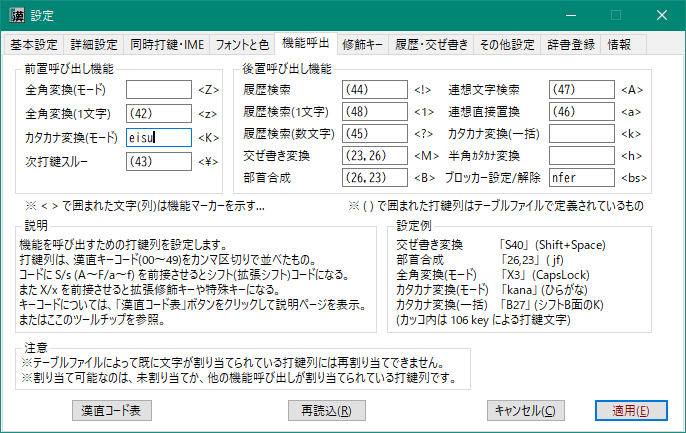

割り当てられるキーとしては、通常のストロークキー(00～49)の他に、通常シフト面(S00～S49)、
拡張シフトA面(A00～A49)～拡張シフトF面(F00～F49)、および拡張修飾キー(X1～X7)と右シフトおよび Insert の単打があります。

たとえば、106配列において、「a」は 20、「Shift+Space」は S40、「拡張シフトA+@」は A44
と記述します。
また、単打可能な拡張修飾キーは名前でも記述できます。

|キー名|X記法|名前|別名|
|-|-|-|-|
|半角/全角| X1|zenkaku|
|CapsLock|X3|caps|
|英数|X4|alnum|eisu|
|無変換|X5|nfer|muhenkan|
|変換|X6|xfer|henkan|
|ひらがな|X7|kana|
|右シフト|-|rshift|
|Insert|-|ins|insert|

### ミニバッファとブロッカー
ミニバッファは、仮想鍵盤の上部に位置するテキストボックスで、
アクティブウィンドウに送出された文字列を表示する、読み取り専用のバッファです。

履歴検索、交ぜ書き変換、部首合成など、後述するいくつかの機能は、
このミニバッファに表示されている文字列の末尾部分を採取して、
それに対して各機能を呼び出しています。

このミニバッファへの出力は、Ctrl-G(デフォルト; Ctrlキー変換または拡張修飾キーで設定可)を押すとクリアされ、
それまでに出力した文字列が採取できなくなります。

見た目ではクリアされていますが、実際には「出力文字列の末尾に採取ブロッカーを設定」しています。
内部的には、そのブロッカーを遡って出力文字列を採取しないようになっているわけです。
 「ブロッカー」は Ctrl-G の他に Enter キーでも設定されます。

この「ブロッカー」は Ctrl-Shift-G(デフォルト)で解除することができます。

ブロッカーは、@bs 標識を持つ補助入力機能によっても設定または解除することができます。

## 入力履歴検索

### 自動履歴検索
漢直モードで入力した漢字文字列およびカタカナ文字列は、自動的に履歴として登録されます。
その後、何か文字が入力されると自動的に履歴検索をして、入力された文字が先頭部とマッチする
候補を表示します。
以下は、「中」と入力したときの履歴候補表示画面です（百人一首を入力した後の履歴です）。

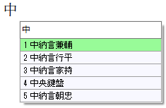

背景色が緑色になっているものは優先候補（最近使用されたもの）です。
下の設定ダイアログで「Enterキーで先頭候補を選択する」にチェックが入っていると、
ここでEnterキーを押すことで先頭候補を出力することができます。

候補を選択したい場合は、
- Ctrl-\<SELECTED> キー （「履歴検索・候補選択する」がONの場合）
- 上下矢印キー （「矢印キーで自動履歴候補の選択をする」がONの場合）
- Tab / Sfhit+Tab キー （「Tabで自動履歴候補の選択をする」がONの場合）

で選択候補を移動させてください。

または「@」(T-Code/106.key;デフォルト)を押して、後述の縦列鍵盤に移行して直接候補を選択することもできます。

履歴の自動検索を行いたくない場合は、
「設定」ダイアログの「履歴・交ぜ書き」>「自動履歴検索を行う」のチェックを外してください。


この場合でも、「履歴検索・候補選択する」にチェックを入れ適当なキーを設定しておけば、
設定したCtrl修飾キーを押すことで、任意のタイミングで履歴検索ができます。
（後述の[拡張修飾キー](#機能キーを修飾キーとして使う拡張修飾キー)によって履歴検索を呼び出すこともできます）

この設定タブでは、「何文字入力されたら自動検索を発動するか」を文字種ごとに設定できます。
他にもいろいろ設定項目があるので、マウスポインタを各項目のコントロールの上に置いて、
表示されるツールチップを参照してください。

#### ワイルドカードの利用

履歴検索のキーには、ワイルドカード(`?` と `*`)を使うことができます。
`?` は任意の1文字に、`*`は0文字以上の任意の文字列にマッチします。
たとえば、後述の履歴登録を利用して「新疆ウイグル自治区」という文字列を履歴辞書に登録しておくと、
「新?ウ*区」という入力がこれにマッチして、以下のような候補表示が得られます。


また、先頭文字が直接打鍵できないような熟語についても、
「?退」などと入力すると次のような履歴候補を得ることができます。


ただし、以下のような制限があります。
- `*`は高々1個だけ
- `*`を含む場合は、両側に4文字以下のキーが必要

### 履歴候補の縦列表示

自動履歴検索(あるいは Ctrl-Space などによる検索)では、候補が10個までしか表示されません。
それ以上の個数の候補を表示させたり、ゴミ登録されてしまった候補を削除したりするためには、
履歴候補を縦列表示させます。

この機能はデフォルト設定(T-Code/106.key)では「@」に割り当てられています。
このキーを押すと以下のような縦列鍵盤が表示されます。


右矢印キーを押すと、さらに候補が表示されます。候補を選択するには、
列位置に対応するキーを押してください。<br/>
下図は元祖漢直窓の[ドキュメント](https://github.com/kanchoku/kw/tree/master/doc) から引用した
106キーボードの仮想鍵盤ですが、上図の「打鍵列」が「1」の列に、「打鍵用」が「0」の列に対応しています。


### 履歴操作の状態遷移図


### 履歴候補の操作
#### 直近候補の検索と文字数指定
Ctrl-G などでミニバッファをクリアしてから「@」で履歴検索をすると、直近に出力した履歴候補を表示します。
（ミニバッファの末尾文字列にマッチする履歴がない場合も同様）

ここで、「↓」キーを押すと、1文字の候補だけが表示されます。さらに「↓」を押すと2文字の候補だけが表示されます。
以下同様に、8文字まではその文字長の候補だけが表示され、その次は9文字以上の候補が表示されます。
もう一度押すと最初の状態に戻ります。
逆に「↑」キーを押すと、9文字以上の表示状態になり、その後、8文字、7文字、・・・、1文字候補の表示となり、
その後は元の状態に戻ります。

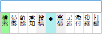
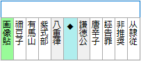


最近使用した語で、再度入力するのが面倒な語（たとえば「憂鬱」は「ゆううつ」から交ぜ書き変換する）は、
上図のように文字数指定で候補を表示させて選択するとよいでしょう。

なお、1～3文字の候補については、容易打鍵文字だけの語は候補として表示しません。
たとえば上図例で「出力」や「表示」といった語が候補に現れていなのは、
「容易打鍵文字ファイル」でこれらの文字を容易打鍵文字に設定しているためです。

候補の文字数は、下図の「履歴文数字指定キーの漢直コード」で指定したキーを押した後に
数字キーを押すことでも指定できます。


上図の設定の例だと、履歴候補表示時に「:」キーを押すと下図のような状態になり、
ここで「2」を押すと、2文字の候補だけが表示されます。

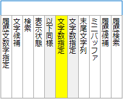

また、最初から1文字だけの履歴候補を表示する機能、2～3文字だけの履歴を表示する機能もあります。
下図の設定ダイアログを参照してください。


#### 履歴候補の削除
縦列鍵盤が表示されているときに「-」キーを押してみてください(T-Code/106.key;デフォルト)。
下図のような表示に変わります。


不要な履歴があれば、ここで対応するキーを押すことで削除できます。
たとえば「打鍵目用」を削除したい場合は、「5」の列のキーを押します。

ゴミ登録された語以外にも、機微な語や四文字言葉など、うっかり表示されて人目に触れてしまってはまずいものも
削除しておきましょう。
削除された語は `kwhist.exclude.txt` というファイルに登録して管理されるので、以後、
同じ語を使用しても履歴には残らないようになります。

削除実行用のキーは、下図のように設定ダイアログの「履歴削除キーの漢直コード」で変更することができます。


この設定の例の場合、履歴候補表示時に「[」キーを押すと上図のような削除モードになります。

### 履歴の手動登録
ひらがなを含む語や、漢字・カタカナ混在語、あるいはいったん削除した語は、手動で登録します。
登録方法には下記の3通りがあります。

- 仮想鍵盤の上部ミニバッファに文字列をコピペする
- 選択状態の文字列に対して後述の拡張修飾キーで CopyAndRegisterSelection コマンドを呼び出す
- 設定ダイアログの「辞書登録」>「履歴登録」で登録する

たとえば「お世話になっております」を履歴として登録するには、
この文字列をコピーして仮想鍵盤のミニバッファにペーストするか、
この文字列を選択状態にしておいて CopyAndRegisterSelection を呼び出すか、
あるいは「履歴登録」のところで直接入力して「登録」ボタンを押します。

ちなみに作者は、 CopyAndRegisterSelection を 「無変換」+`O` に割り当てています。


### 変換形
手動による履歴登録の応用として、「変換形」登録があります。これは、
```
キー文字列 | 変換形文字列
```
という形式で履歴登録しておくと、選択された際にキー文字列を「変換形文字列」に置換して出力する、
というものです。

たとえば、
```
DKRED|<span style="color: darkred">
```
という登録をしておいて、漢直モードで「DKR」と打つと上記候補が表示されるので、それを選択すると
`DKR` が `<span style="color: darkred">` で置換される、というわけです。

以下のような登録もできます。
```
おねす|お願いいたします
おせす|お世話になっております
あざす|ありがとうございます
```
簡易な辞書登録のようなものだと思えばよいでしょう。

下記ツイートに変換形登録の使用例を動画で投稿していますので、興味のある方は参照ください。<br/>
https://twitter.com/kanchokker/status/1476483269160243206

#### 交ぜ書き変換履歴
後述の交ぜ書き変換を実行すると、その際の「読み」と「変換形」を `|`
で結合したものを、自動的に変換形として履歴登録します。

たとえば、「み力」⇒「魅力」という交ぜ書き変換を実行したとすると、
`み力|魅力` が履歴登録されます。
ここで「み力的な人」と入力すると「み力|魅力」が履歴候補として表示され、それを選択すると、
「魅力的な人」と変換されます。つまり、変換形の履歴候補の選択では、
「読み」に相当する部分だけが変換されて、その後に「語尾」に相当する部分が付加されるというわけです。

履歴登録の対象となる語幹長の最小値、および、
語尾として許容する文字数は下記の設定画面で設定します。


##### 履歴登録の最小語幹長
交ぜ書き変換時の読みの語幹が「履歴登録の最小語幹長」で設定した数値より短い場合は、
履歴登録を行いません。

たとえば「履歴登録の最小語幹長」を 2 に設定している場合は以下のようになります：
- 「み力」⇒「魅力」で変換すると、語幹部分のペアである「み力|魅力」が登録される
- 「あう」⇒「逢う」で変換すると、語幹が「あ」で1文字なので登録されない

0 を設定すると、交ぜ書き変換の履歴登録を実行しません。

なお、読みが1文字の登録については、ひらがな以外は語尾にできません。
たとえば「に|似」が登録されていても、「彼女に会う」の「に」は候補として表示されません。
（「にあう」なら候補として表示される）

##### 履歴変換時の語尾長
「履歴変換時の語尾長」で設定した文字数を超えて入力すると履歴候補には表示されなくなります。
「み力|魅力」の例でいうと、「み力的な人々」と入力すると「み力」の後に「的な人々」と4文字が後接しているため、
許容する語尾長の3を超えているので、履歴候補には表示されなくなります。

##### 削除と再登録
登録された交ぜ書き履歴を削除する場合は、上述した履歴候補の削除機能を利用してください。
いったん削除した交ぜ書き履歴は、以降、自動登録されなくなります。
再度登録する場合は、上述の手動登録を実行してください。

下記ツイートに交ぜ書き履歴の使用例を動画で投稿していますので、興味のある方は参照ください。<br/>
https://twitter.com/kanchokker/status/1492851806946279424


## 交ぜ書き変換
KanchokuWS では後置式の交ぜ書き変換をサポートしています。
直前の出力文字列から、
「設定」-「履歴・交ぜ書き」-「読み入力の最大長」で設定した文字数までを読みとして取得し、
それにマッチする交ぜ書きエントリを検索して候補を表示します。

下図は、「金ごうぶ寺」と入力した後に交ぜ書き変換を呼び出した例です。


取得した読みに漢字が含まれている場合は、
（後述の無活用語の場合を除き）必ずその漢字を含むように変換を行います。
たとえば「ひどい目にあった」を交ぜ書き変換した場合は、「ひどい」だけでは変換を行わず、
「ひどい目」まで範囲を広げて候補検索します。

この例の場合は「ひど色目」などに変換されるのですが、これを修正するには後述の
「変換開始位置の移動」を参照してください。

### 容易打鍵文字からなる候補の劣後
容易打鍵文字ファイルに記述された容易打鍵文字だけを含むような候補は、候補列の後尾に回されます。

たとえば、容易打鍵文字として「帰」「記」「者」「社」を登録した場合、「きしゃ」の候補には
「貴社」や「汽車」などが優先的に表示され、「帰社」や「記者」は後尾に表示されます。


### 交ぜ書きブロッカー
交ぜ書き変換では通常のブロッカーの他に専用のブロッカー(その文字を越えて読みとして採取しない)も用います。

交ぜ書き変換を実行すると、通常は変換形＋(活用)語尾の後ろにブロッカーが置かれますが、
設定により、出力文字列の末尾に置くようにすることもできます。
詳細については、設定ダイアログの「履歴・交ぜ書き・他」-「変換形＋活用語尾の後にブロッカーを置く」の
ツールチップを参照してください。

後述する[拡張修飾キー](#機能キーを修飾キーとして使う拡張修飾キー)コマンドの `leftShiftBlocker` および `rightShiftBlocker` を呼び出すことで、
通常の文字力後であっても、交ぜ書きブロッカーを末尾に設定したり、左右に移動したりすることができます。

たとえば「彼女にあう」を変換すると「彼女似合う」になったりしますが、変換前に `leftShiftBlocker`
を2回繰り返すと「彼女に|あう」となるので、そこで変換すれば「彼女に会う」になります。

また、変換後の交ぜ書きブロッカーに対しても、「だいひょうしていあんする」⇒ 変換 ⇒「代表して|いあんする」
⇒ `leftShiftBlocker` ⇒「代表し|ていあんする」⇒ 変換 ⇒「代表し|提案する」
のような操作が行えます。

### 変換開始位置の移動
交ぜ書き変換中で縦列候補表示になっている時は、`<` と `>` で変換開始位置の移動となります。

たとえば、「彼女にあう」を変換して「彼女似合う」となった(「にあう」が変換対象になった)場合は、
変換直後に「>」を入力すると変換開始位置が右にシフトするので、「彼女に会う」と変換されます。

 ⇒ 

前述の「ひどい目」の例では、「い目」が後述の動的交ぜ書きにより「いろめ /色目/」にマッチするため、
最初は「ひど|色目にあう」と変換されますが、開始位置を右に移動することで、
「ひどい|目にあう」⇒「ひどい目に|遭う」などと変換できます。

交ぜ書き変換中で縦列候補表示になっている時は、拡張修飾キーで
`leftShiftBlocker`, `rightShfitBlocker`, `leftShiftMazeStartPos`, `rightShiftMazeStartPos`
を呼び出すことでも交ぜ書き開始位置を移動させることができます。

交ぜ書き変換の確定直後、あるいは「先頭候補を無条件に出力する」を有効にしている場合は、
`leftShiftMazeStartPos`, `rightShiftMazeStartPos`
を呼び出すことで交ぜ書き開始位置を移動させることができます。


### 縦列候補を表示しない
交ぜ書き変換後に、先頭の変換候補で無条件に置換してしまうことも可能です。
これを有効にするには、「履歴・交ぜ書き」>「先頭候補を無条件に出力する」にチェックを入れてください。


この場合は、変換候補の縦列表示は行われず、出力文字列の元の読みが変換形で直ちに置換されます。
他の候補に変更したい場合は、変換直後に `Esc` を打鍵していったん元の読みに戻してから、
もう一度、交ぜ書き変換を実行します。一時的に縦列候補表示になるので、別の候補を選択してください。

なお、この設定をONにしておくと、交ぜ書き変換履歴の登録がうまく行かない場合があります。
その場合は、この設定をOFFにしてください。

### 空白文字を変換開始位置とする
半角空白文字の後に読みを入力することで、変換開始位置を制御することもできます。
上記の「ひどい目にあう」の例だと「ひどい目に<空白>あう」(実際には「ひどい目に あう」)と入力してから
交ぜ書きを実行すると、一発で「ひどい目に<空白>遭う」と変換することができます。

この際に、空白文字を自動的に削除することもできます。
この機能を有効にするのは、設定ダイアログの「履歴・交ぜ書き」-「交ぜ書き変換」-
「変換後に読みの先頭の空白文字を削除」にチェックを入れてください。

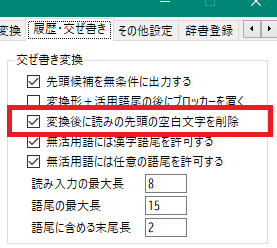

### 無活用語に対する接続語尾設定
名詞やサ変語幹に対して、漢字や任意文字を語尾として接続させることができます。

たとえば「やまたい /邪馬台/」だけが登録されている時に、「やまたい国」を
交ぜ書き変換して「邪馬台国」を得ることができます。 （漢字接続を許可した場合）

あるいは「かいはつ /開発/」だけが登録されている時に、「かいはつきき」を
交ぜ書き変換して「開発きき」を得ることもできます。 （任意文字の接続を許可した場合）

この機能を有効にするのは、設定ダイアログの「履歴・交ぜ書き」-「交ぜ書き変換」-
「無活用語には漢字語尾を許可する」あるいは「無活用語には任意の語尾を許可する」にチェックを入れてください。


ただし、意図しない変換結果になる場合もあるので、問題が多いようなら、
チェックを外してください。（例：「ひどい目にあう」⇒「ひ土井目にあう」）

### 動的交ぜ書き
ひらがなの読みとその変換形だけ用意すれば、
交ぜ書き入力された文字列にマッチするエントリをシステムのほうで自動で検索します。
たとえば、
```
かそうけんばん /仮想鍵盤/
```
という登録があったとしましょう。ここで、「か想けん盤」と打ってから「fj」(T-Code/106.key;デフォルト)と打つと、
交ぜ書き変換が呼び出され、「仮想鍵盤」に変換されます。
これは、ひらがな部分を「か.\*けん.\*」、漢字部分を「.\*想.\*盤」という正規表現に変換して、
読みと変換形の両方ともマッチするエントリを検索するという仕組みで実現しています。

後置式の特徴として、下図では、それ以外の候補も表示されています。


長い読みにマッチするものが優先候補として表示されます。
背景色が緑色のものは Enter キーを押すことでも選択できます。

動的交ぜ書き変換の仕組みによる副産物として、ワイルドカード(? と *)を使った交ぜ書きも可能です。
'?' は正規表現の '.' に、'\*' は同じく '.\*' に置換した上で上記の仕組みで検索が行われます。
たとえば「ア\*国」で交ぜ書き変換すると「アメリカ合衆国」が出力されます
(kwmaze.ipa.dic を使用している場合)。

逆にこの仕組みの弱点として、意図しない候補が出力されることもあります。
前述の「い目」⇒「色目」がその例なのですが、これは、「い目」を「い.\*」という読み検索パターンと
「.\*目」という変換形検索パターンに分けて検索するので、
「いろめ /色目/」というエントリがマッチしてしまうためです。
このような変換結果が表示された場合は、
前述の変換開始位置の移動や空白文を変換開始位置とする機能を利用して調節してください。

下記ツイートに動的交ぜ書き変換の様子を動画で投稿していますので、興味のある方は参照ください。<br/>
https://twitter.com/kanchokker/status/1474935216708145159 <br/>
https://twitter.com/kanchokker/status/1403533755701026826 <br/>
https://twitter.com/kanchokker/status/1411910765976506373 <br/>

### 活用型

読みの末尾に「/{基本形の語尾}」を付加することで、ある程度活用型を考慮した変換ができるようになります。
サポートしている活用型は以下のとおりです。変換形のほうは語尾を除いた形で登録します。

|語尾|活用型|登録例
|-|-|-|
|く|カ行五段|か/く /書/|
|ぐ|ガ行五段|こ/ぐ /漕/|
|す|サ行五段|はな/す /話/|
|つ|タ行五段|た/つ /立/|
|ぬ|ナ行五段|し/ぬ /死/|
|ぶ|バ行五段|と/ぶ /飛/|
|む|マ行五段|う/む /生/|
|る|ラ行五段|ふ/る /振/|
|る:5|ラ行五段|かえ/る:5 /帰/|
|う|ワ行五段|あ/う /会/|
|る|一段|み/る /見/|
|る:1|一段|かえ/る:1 /変え/|
|する|サ変|かいはつ/する /開発/|
|ずる|ザ変|しん/ずる /信/|
|い|形容詞|うつくし/い /美し/|
|な|形容動詞ナ型|しずか/な /静か/|
|の|形容動詞ノ型|ほんとう/の /本当/|

イ段、エ段に後接する「る」については、ある程度システムのほうで一段活用か五段活用かを
推定しますが、推定が間違う場合ものあるので、そのような場合は、語尾の後ろに「:1」や
「:5」を付加して「一段」「五段」であることを明示します。

活用する語については、交ぜ書き変換の際に語幹の後に何文字まで語尾を許容するかを設定する
ことができます。これをたとえば「4文字」に設定していると、「あっている」は「会っている」に
変換できますが、「あっていない」は「会っていない」に変換できません。ただしこの語尾長をあまり長くすると
誤変換も増えるので、適当な長さに調節してください。

### 交ぜ書き辞書
交ぜ書き辞書として、以下のものを用意してあります。

|辞書名|内容|
|-|-|
|kwmaze.slim.dic|従来の交ぜ書き辞書から非活用語を抽出したもの|
|kwmaze.inflex.dic|従来の交ぜ書き辞書から活用語を抽出したもの|
|kwmaze.ipa.dic|mecab-ipadic から交ぜ書き辞書を構築したもの|
|kwmaze.wiki.txt|Wikipedia のタイトルから交ぜ書き辞書を構築したもの|

ただし、 kwmaze.wiki.txt はサイズが大きので、パッケージの .zip には含めずに別ファイルとして用意してあります。
この辞書を使用すると、メモリを追加で400MB程度使います。
また、起動時の読み込み時間が長くなり、交ぜ書き変換にも時間がかかる場合があります。
お試しで使う場合は、右クリックメニューの「辞書読込」-「Wikipedia交ぜ書き辞書読込」をクリックしてください。
なお、読み込み中は漢直操作をしないでください。

もし起動時から Wikipedia辞書を利用する場合は、拡張子 `.txt` を `.dic` に変更してください。

### 辞書登録
既存辞書に存在しない読みと変換形を登録することができます。
登録した内容は、 kwmaze.user.dic (デフォルトの場合)に保存されます。

登録方法には下記の3通りがあります。

- 仮想鍵盤の上部ミニバッファに文字列をコピペする
- 後述の拡張修飾キーで CopyAndRegisterSelection コマンドを呼び出す
- 設定ダイアログの「辞書登録」>「交ぜ書き登録」で登録する

形式は、
```
読み <空白> /変換形/ ...
```
です。
たとえば「とうきょうとっきょきょかきょく /東京特許許可局/」を登録するには、
この文字列をコピーして仮想鍵盤のミニバッファにペーストするか、
この文字列を選択状態にしておいて CopyAndRegisterSelection を呼び出すか、
あるいは「交ぜ書き登録」のところで直接入力して「登録」ボタンを押します。

同一読みに対して複数の変換形がある場合は、それを「/」で区切って一行で記述することができます。
あるいは、1行1変化形で、同じ読みのエントリを複数回に分けて登録してもかまいません。

辞書登録については、設定ダイアログの「辞書登録」-「交ぜ書き登録」
のテキストボックスに付与したツールチップも参照ください。

## 連想文字入力
連想文字入力とは、ある一文字を別の一文字に置換するマッピング機能です。
マッピングは以下の4通りで提供されます。

1. 部首合成辞書から取得した部品<br/>
    例：恋 ⇒ 亦心
2. 自身および部品のうちの頻度が低いほうから合成可能な文字群<br/>
    例：恋 ⇒ 変奕弯・・・
3. 部首合成の実行<br/>
    例：「恋+糸 ⇒ 戀」を実行すると「恋 ⇒ 戀」が追加
4. 利用者が定義<br/>
    例： 「恋=愛」という辞書定義を記述する

### 連想文字選択入力
上記のうち、利用者が明示的にかかわるのは 3 と 4 です。
3、4を実行の上、「恋」入力後に「\\\_」(T-Code/106.key;デフォルト)を押して、連想文字入力機能を呼び出すと、
下図のような縦列鍵盤が表示されます。

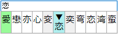

列位置に対応するキーを押すと文字が選択されて元の文字を置換します。<br/>
下図は元祖漢直窓の[ドキュメント](https://github.com/kanchoku/kw/tree/master/doc) から引用した
106キーボードの仮想鍵盤ですが、上図の「愛」が「1」の列に、「蛮」が「0」の列に対応しています。


### 連想文字直接置換
上記の縦列鍵盤を表示せずに直接第1候補で置換する機能です。
デフォルトでは「:」(T-Code/106.key)に割り当てられています。

続けて同機能を呼び出すと、上記縦列鍵盤が表示されて、候補選択モードに移行します。

同機能を連続的に呼び出した時、縦列鍵盤を表示する前に最大第5候補まで置換出力するように設定することもできます。
設定ダイアログの「その他設定」>「自動部首合成・連想直接置換」>「連想直接置換の試行回数」で設定してください。

### 辞書登録
部首合成辞書から導出できない連想文字を登録することができます。
登録した内容は、 kwassoc.txt (デフォルトの場合)に保存されます。
（なお、当辞書には、システムが自動登録したエントリも含まれます）

登録方法には下記の3通りがあります。

- 仮想鍵盤の上部ミニバッファに文字列をコピペする
- 後述の拡張修飾キーで CopyAndRegisterSelection コマンドを呼び出す
- 設定ダイアログの「辞書登録」>「連想文字登録」で登録する

形式は、
```
文字=連想文字列
```
です。
たとえば「恋=愛」を登録するには、
この文字列をコピーして仮想鍵盤のミニバッファにペーストするか、
この文字列を選択状態にしておいて CopyAndRegisterSelection を呼び出すか、
あるいは「連想文字登録」のところで直接入力して「登録」ボタンを押します。

「連想文字列」の途中に「|」を挿入しておくと、先頭から「|」までの候補は優先順固定となります。

なお、テキストボックスに何か1文字を入力しておいて「読み出し」ボタンをクリックすると、
その文字から連想される文字の並び(10文字まで)がテキストボックスに表示されます。
これを編集することで効率的な辞書登録が可能になります。

辞書登録については、設定ダイアログの「辞書登録」-「連想文字登録」
のテキストボックスに付与したツールチップも参照ください。


## 部首合成
部首合成とは、2つの文字から別の1つの文字へのマッピングの集まりです。
このマッピングを利用して、
- 2つの文字の合成(足し算)
- 文字を合成する部品の一方を取り出す(引き算)

といった演算を繰り返して、解が得られたら、それを出力する、という機能です。

KanchokuWS の部首合成は、以下のような特徴・機能をもっています。

- YAMANOBEアルゴリズム（Yアルゴ）の利用（デフォルトは非利用）
- 部品としての使用頻度の低い文字を優先
- 同一文字に対する複数の合成定義が可能
  - 先頭のものは合成と分解の両方のステップに用いられる
  - 残りは合成ステップだけで用いられる
- 各ステップごとに逆順演算を適用
- 部品から合成可能な文字を用いた足し算(再帰合成)

### 計算順序
1. 本体文字同士の足し算(合成)
1. 同逆順
1. 片方の文字に等価文字を使って足し算(合成)
1. 同逆順
1. 等価文字同士で足し算(合成)
1. 同逆順

「等価文字」とは、部首合成辞書で「AB」というように2文字だけからなる定義によって、
「A」と「B」が相互に入れ替え可能であると定義された文字のことです。

ここまでで合成文字が見つからなければ、本体文字を構成する部品を使います。

7. 引き算 (たとえば 村－木 ⇒ (木＋寸)－木 ⇒ 寸)
1. 同逆順
1. YAMANOBE_ADD （利用する場合）
1. 同逆順
1. YAMANOBE_SUBTRACT （利用する場合）
1. 同逆順
1. 一方が部品による足し算
1. 同逆順
1. YAMANOBE_ADD(Bが部品) （利用する場合）
1. 同逆順(Aが部品)
1. 両方が部品による足し算
1. 同逆順
1. 部品による引き算
1. 同逆順
1. YAMANOBE_SUBTRACT (Bが部品) （利用する場合）
1. 同逆順(Aが部品)
1. 再帰合成
1. 同逆順

~~計算過程に興味のある方は、「設定」-「詳細設定」-「開発者用設定」-「部首合成結果をログ出力する」
にチェックを入れて部首合成を実行してみてください。
bin\\kw-uni.log に計算過程がログ出力されます。ソースコードの
kw-uni\\BushuComp\\BushuDic.cpp:FindComposite() と照らしあわせてみてください。
タグ部分に -Y-ADD/-Y-SUB が含まれるのが Yアルゴ、T/U で始まるのが再帰合成です。~~

### YAMANOBEアルゴリズム
YAMANOBEアルゴリズムを端的に説明すれば「部品入れ替えによる足し算と引き算」ということになろうかと思います。

Yアルゴには、足し算と引き算があります。

足し算の例は、
「焼＋土」⇒「（火＋尭）＋土」⇒「火＋(尭＋土)」⇒「火＋堯」⇒「燒」というようなものです。

引き算の例は、「準－シ」⇒「(淮＋十)－シ」⇒「(淮－シ)＋十」⇒「隹＋十」⇒「隼」というようなものです。

YOMANOBEアルゴリズム時に予想外の合成結果となることがあるので、デフォルトではOFF(非利用)になっています。
利用するには、設定ダイアログの
「その他設定」>「部首合成・連想直接置換」>「YAMANOBEアルゴリズムを有効にする」にチェックを入れてください。

予想外の例：<br/>
「貝＋浅」⇒「貝＋戔（＝浅－シ）」⇒「賎」を期待したが、
「貝＋浅」⇒「貝＋(シ＋戔)」⇒「シ＋(貝＋戔)」⇒「シ＋賎」⇒「濺」になってしまった。

### 部品としての使用頻度の低い文字を優先
たとえば「巧」を「工＋５」で、「朽」を「木＋５ｊで定義しているとき、従来のアルゴリズムでは
「木＋巧」⇒「木＋（工＋５）」⇒「木＋工」⇒「杠」となっていました。

KanchokuWS では、辞書読み込み時に部品としての使用頻度を計算しておき、
使用頻度の低いほうの部品を優先的に使うようにしています。

上の例では、「工」よりも「５」のほうが部品しての使用頻度が低いので、
「木＋（工＋５）」⇒「木＋５」⇒「朽」となります。


### 各ステップごとに逆順演算を適用
元祖漢直窓では、まず2つの文字の順序を固定して一通りの計算を実行し、それでも解が得られなかった場合、
2つの文字の順序を入れ替えて再計算を行っていました。
 その場合、たとえば「甚＋土」は「（其＋ル）＋土」⇒「其＋土」⇒「基」が得られます。

一方、KanchokuWS のように各計算ステップごとに文字の順序入れ替え(逆順)も計算すると、
「甚＋土」は「甚＋土」⇒なし⇒「土＋甚」⇒「堪」が得られます。

どちらが良いかは一概には決められないかと思います。
元祖漢直窓の部首合成定義は、全計算ステップ終了後での逆順計算を念頭に作成されているという面もあります。
また、初期の頃のT-Code実装では、2つの文字の順序をあらかじめソートしておき、
文字順にかかわらず同じ解が出るようになっていたと記憶しています。
これについては tcode-ml で議論があり、作者も当時は「文字順序を保持した合成手順にすべき」
(つまり元祖漢直窓と同じ手順)という主張をしていました。

今回は、各ステップごとの逆順演算でしばらく使用してみて、利用者の方からの意見を聞いてみたいと思っています。

### 再帰合成(部品から合成可能な文字を用いた足し算)
元祖漢直窓では、「踏」の部首合成定義は「踏＝足＋水」になっていました。
標準 T-Code では「沓」が2ストロークで打てないので、苦肉の策としてそのような定義にしていたわけです。

でもこれだと「足 + 日」では「踏」が出せません。
そこで漢直窓Sでは、「部品から足し算で合成可能な文字も部品として使う」という方策を取り入れました。
つまり「踏＝足＋沓」という定義にしておいて、「足＋日」の組み合わせからは合成文字が得られなかった場合、
1. 「足」と「『日』から合成可能な文字」の組み合わせ
2. 「『足』から合成可能な文字」と「日」の組み合わせ

を試す、ということです。これだと「沓」は「日」から合成可能なので、
「足＋沓」から「踏」が得られるというわけです。

他にも「瞳」は従来から「瞳＝目＋童」になっていたわけですが、
そして標準 T-Code では「童」を2ストロークで打てないわけですが、
これからは「目＋立」または「目＋里」で「瞳」を合成できるわけです。

### 合成の次候補出力
部首合成の実行直後に上述の「連想直接置換」を呼び出すと、次の合成候補出力になります。
たとえば、「糸」と「工」を合成すると、第1候補として「紅」が出力されますが、
ここで「:」(T-Code/106.key;デフォルト)を押すと、次の合成候補である「縒」に置換されます。
候補が一巡すると最初の候補に戻ります。

### 部首合成ヘルプ
何らかの方法(たとえば交ぜ書き)で入力した最後の文字に対して部首合成ヘルプを表示したい場合は、
その文字を仮想鍵盤のミニバッファにコピペするか、または後述の
「[FAQ キーアサイン編](FAQ/FAQ-キーアサイン.md)」
を利用して、特殊機能 BushuCompHelp を適当なキーに割り当てて呼び出してください。
(添付の mod-conversion.txt では 「無変換+/」に割り当てられています)

### 辞書登録
新しい部首合成を登録することができます。
登録した内容は、既存の kwbushu.rev (デフォルトの場合)の末尾に追記する形で保存されます。
既存のエントリの修正はできないのでご注意ください。

設定ダイアログの「辞書登録」-「部首合成登録」で登録してください。
記述方法については、そこのテキストボックスに付与したツールチップを参照ください。

### 辞書ファイルの再読み込み
部首合成辞書に対して、多くのエントリを追加したり、既存のエントリを修正したりする場合は、
エディタなどを使って直接辞書ファイルを編集することになります。

部首合成辞書の修正が終わったら、右クリックメニューから「部首合成辞書再読込」を実行してください。

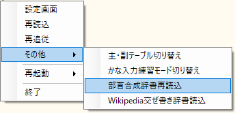

現在デコーダに保持されている部首合成辞書の内容を破棄した上で、部首合成辞書を読み込み直します。

## 自動部首合成
自動部首合成とは、一度部首合成を実行すると、次からは、
その時の文字の組み合わせ(順序も含む)を入力するだけで自動的に部首合成を呼び出すというものです。

たとえば、「和集」と入力してから部首合成を実行して「稚」に変換したとすると、
次からは「和集」と入力した時点で「稚」に変換されるようになります。
ただし、2文字目を入力する前に何か別の文字を入力したり、矢印キーなど他のキー操作を行った場合は自動合成を発動しません。

この機能を有効にするには、設定ダイアログの「その他設定」>「自動部首合成・連想直接置換」>「自動部首合成を有効にする」
をONにしてください。

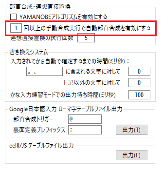

ただし、部首合成をした2文字が両方とも平仮名または片仮名の場合またはどちらかの文字が句読点の場合は、
自動部首合成の対象としません。
もし、これらの文字の組み合わせを自動部首合成の対象にしたい場合は、
「自動部首合成登録」を行ってください。

また、自動部首合成が発動した直後は、手動の部首合成を無効にしています。
これは、自動部首合成が発動したにもかかわらず、つい癖で手動部首合成を呼び出しても変な部首合成が行われないようにするためです。
本当に手動部首合成を行いたい場は、2回続けて呼び出してください。

### 特定の組み合わせを自動部首合成の対象から外す
上述のように「和集」で部首合成を実行し「稚」に変換したけれども、
「和集合」というような使い方もあるのでこれは自動合成の対象外にしたい、という場合です。
そのような場合は、「`和-集`」のように間に「`-`」(ハイフン)を挾んで入力してから部首合成を呼び出してください。
これにより、後述の辞書登録による無効化と同様の登録が行われます。

### 合成元の2文字に戻す
自動部首合成の実行直後に Escキーを押すと、合成された文字を削除して元の2文字に戻します。
たとえば、「メリ」で「刈」となるような登録がされている状態で「メリット」と入力したい場合は、
「メリ」⇒「刈」となった時点で Esc キーを押して「メリ」に戻し、続けて「ット」と入力します。

さらに続けて Esc キーを押すと、合成元の2文字の組み合わせを無効化登録して、自動部首合成の対象から外します。

### 辞書登録
自動部首合成辞書登録により、部首合成辞書にない組み合わせを登録したり、
登録済みの組み合わせを無効化したりできます。
登録方法には下記の3通りがあります。

1. 仮想鍵盤の上部ミニバッファに文字列をコピペする
1. 後述の拡張修飾キーで CopyAndRegisterSelection コマンドを呼び出す
1. 設定ダイアログの「辞書登録」>「自動部首合成登録」で登録する

形式は、A, B を部品文字、C を合成文字として、1と2の場合は
```
AB=C
```
3の場合は
```
CAB
```

です。
たとえば「県心=懸」を登録するには、
この文字列をコピーして仮想鍵盤のミニバッファにペーストするか、
この文字列を選択状態にしておいて CopyAndRegisterSelection を呼び出すか、
あるいは設定ダイアログの「辞書登録」-「自動部首合成登録」のところで直接入力して「登録」ボタンを押します。

特に、いったん無効化登録がされた組み合わせを再び有効化するには、この辞書登録で再登録する必要があります。
下図は、無効化されていた「和集」という組み合わせを、自動部首変換の対象として再登録しています。


記述方法の詳細については、そこのテキストボックスに付与したツールチップを参照ください。

## 英数記号全角入力
「`^`」(T-Code/106.key;デフォルト)を押すと全角変換モードに移行します。
当モードでの通常打鍵およびShift打鍵は、
「キー・文字マップファイル」に定義された文字を全角変換して出力します。

当モードから抜けるには、Esc または Ctrl-G を押してください。

他に、直後の1文字を全角変換する機能もあります。
「`]`」(T-Code/106.key;デフォルト)を押してください。

## カタカナ入力
ひらがなからカタカナに変換して入力する機能として、以下の3通りをサポートしています。

- 入力したひらがなをその場でカタカナに変換して出力するモード
- 直前に入力したひらがな列を一括でカタカナに変換する後置変換
- Shiftキー(または拡張修飾キー)を押しながら入力したひらがなをカタカナに変換して出力するモード

それぞれ、設定ダイアログの
- 「機能呼出」-「前置呼び出し機能」-「カタカナ変換(モード)」
- 「機能呼出」-「後置呼び出し機能」-「カタカナ変換(一括)」
- 「その他設定」-「平仮名⇒片仮名変換」-「シフト入力されたひらがなをカタカナに変換する」

のツールチップを参照ください。

## 設定ダイアログ
タスクトレイに格納されたアイコン、仮想鍵盤、またはモード標識で右クリックすると
以下のようなメニューが表示されます。


ここで「設定」をクリックすると設定ダイアログが開きます。

設定ダイアログの内容については、実際に使ってみれば分かるかと思うので、説明は省略します。
要所々々にツールチップを埋め込んであるので、それを参照ください。

テーブルファイルなどを変更した場合は、「設定」または「再読込」をクリックすると、
その内容を読み込んで内部状態を更新します（再起動は不要）。

## その他の機能
### キーボードフックとSendInputの全面採用
元祖漢直窓では、キーのフックには HotKey 機構を用い、文字の送出には主に SendMessage を用いていました。

漢直窓S は、キーのフックに Global Hook 機構を用い、文字の送出には全面的に SendInput を用いるように変更しました。
これにより、

- キー入力のカスタマイズが容易になった
- 文字列送出時に待ち時間を入れる必要がなくなった

などの改善を施しています。
とくに「待ち時間を入れなくても文字の置換に問題が生じない」というのは大きなメリットだと思います。
後置部首合成で「文字が置換されない！」と困っていた方は、是非、漢直窓S をご利用ください。


### カレットに追随する仮想鍵盤
おおむねアクティブウィンドウのカレット（Caret; 文字カーソル）位置に追随します。

- CMDプロンプト
- Word や Excel などで、矢印キーでカレットを移動した直後
- アクティブウィンドウのどの入力コントールもフォーカスを持っていない

という場合は、カレット位置が取れなくなることがあります。
カレット位置が取れない場合は、アクティブウィンドウの右下位置に仮想鍵盤を移動させます。

仮想鍵盤の表示位置は、カレット右下位置からのオフセットで指定します。
詳細については、設定ダイアログの「詳細設定」>「仮想鍵盤・モード標識」の
「カレットからの相対表示位置」や「X」「Y」のところのツールチップを参照してください。


仮想鍵盤を移動するタイミングは、「詳細設定」>「各種待ち時間」の「仮想鍵盤を移動するまでの待ち時間」と
「アクティブウィンドウ取得ループ間隔」で設定できます。詳細は、それらのツールチップを参照してください。


#### 仮想鍵盤の固定表示位置
カレットに追随するのではなく、固定位置に仮想鍵盤を表示したい場合は、下図のように「固定表示位置」を選択して
X-スクリーン座標とY-スクリーン座標を指定してください。

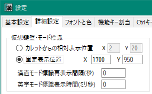

#### 一時的な固定位置表示
仮想鍵盤をマウスでドラッグすることにより、表示位置を一時的に固定させることができます。
これを解除して再びカレットに追随させるようにするには、仮想鍵盤を左クリックして漢直モードを抜けるか、
または右クリックメニューから「再追従」をクリックしてください。
または拡張シフトキーに ModeToggleFollowCaret を割り当てておき、それを呼び出しても再追従するようになります。

操作の様子は下記の動画を参照してください。

https://twitter.com/kanchokker/status/1459442675849912322

#### 相対位置や固定位置の個別設定
対象アプリ（ウィンドウ）ごとに、仮想鍵盤の表示位置（カレットからの相対位置や固定位置）を設定することができます。
設定方法は下記のとおりです。

1. 対象となるアプリのウィンドウクラス名を調べる
   - これは対象ウィンドウをアクティブにした状態で、漢直モードをONに切り替えて仮想鍵盤を表示させると、
     上部のミニバッファにウィンドウクラス名が表示されるので、それをコピーしてください。
2. kanchoku.user.ini（または kanchoku.ini）をエディタなどで開く
3. 上記のウィンドウクラス名（の先頭部）をセクション名として新しいセクションを追加する
4. 追加したセクションに下記の設定を追記する：
    - `caretOffset=xx,yy` （xx, yy はカレット右下端からの相代表示位置）
    - `vkbFixedPos=xx,yy`  (xx, yy はスクリーン座標によるX軸とY軸の座標)

たとえば、 Word の場合はウィンドウクラス名が「\_WwG」なので、次のようなセクションを追加します。
```
[_WwG]
caretOffset=50,50
```

Chrome の場合に固定位置に表示したい場合は、次のようなセクションを追加します。
この例では、Chrome の入力エリアのウィンドウクラス名の先頭部をセクション名として設定しています。
```
[Chrome_WidgetWin]
vkbFixedPos=1700,950
```

なお、セクション名は前方一致で検索されます。たとえば `[Edit]` というセクションは、
NotePad の `Edit` 以外にも、たとえばサクラエディタの `EditorClient111` にもマッチします。
完全一致で検索させたい場合は、セクション名の末尾に `$` を置いてください。

例
```
[Edit$]
caretOffset=20,20
```

5. 変更を保存したら、設定ダイアログを開き「基本設定」-「再読込」を実行してください。
これで kanchoku.\*.ini の変更が漢直窓Sに反映されます。

### 高DPIモニターへの対応
Windows のディスプレイ設定の「拡大縮小とレイアウト」のところで、
「テキスト、アプリ、その他の項目のサイズを変更する」を100%以外に設定している場合でも、
仮想鍵盤がカレット位置に追随するようになりました。

ただし、複数のモニターを接続していて、それらの表示スケールが異なる場合は注意が必要です。
そのような場合は、`ルートフォルダ\\bin\\KanchokuWS.exe.config` をエディタなどで開いて、
次のように修正してから、漢直窓Sを再起動してください。
```
    <System.Windows.Forms.ApplicationConfigurationSection>
        <!--
        <add key="DpiAwareness" value="System"/>
        -->
        <add key="DpiAwareness" value="PerMonitorV2"/>
    </System.Windows.Forms.ApplicationConfigurationSection>
```


つまり `<add key="DpiAwareness" value="PerMonitorV2"/>` のほうを有効にするわけです。
これによってモニターごとのDPI設定がカレット位置に反映されるようになります。

ただ、このような設定に変更すると、設定ダイアログの表示が崩れます。
それでもある程度は操作できますが、ストレスなく操作したい場合は、別アプリである
`SettingsWS.exe` を起動してみてください。

これは KanchokuWS から設定ダイアログだけを起動するように改造したものです。
別プロセスとして動くので、そこでの設定変更を稼動中の漢直窓Sに反映するには、
漢直窓Sから呼び出した設定ダイアログの基本設定で「再読込」を実行する必要があります。

#### 文字表示位置の調整
高DPIにした場合、仮想鍵盤での文字表示が、枠の中央からずれる場合があります。
また、高DPIでなくとも、別のフォントを選択した場合は、やはり表示がずれることがあります。

そのような場合は、設定ダイアログの「フォントと色」>「仮想鍵盤フォント」のところで、
「左余白」と「上余白」を設定してみてください。
設定方法については、設定ダイアログのフォント設定テキストボックスに付与したツールチップを参照ください。


なお「余白情報」ボタンをクリックすると下図のような現在の余白情報が表示されます。
これを参考にして余白を設定してください。


また、フォントを変更すると縦列鍵盤表示の際の高さが文字数に比べてずれることがあります。
そのような場合は、「縦列鍵盤高さ調整率」を変更してみてください。

### 打鍵ヘルプ
仮想鍵盤に表示される打鍵ヘルプには以下のものがあります。
- 第1打鍵時のヘルプ
- 第2打鍵以降を待っているときの打鍵位置の文字表示

後者は、元祖漢直窓から引き継いだ機能です。

前者には、さらに
- ストローク位置形式 ： 第1打鍵位置への文字表示
- ストロークキー形式 ： 文字に対する第1・第2打鍵を、英数モード時の文字並びで表示

の2通りが用意されています。

これには以下のようなものがあります。
これらは、仮想鍵盤表示時に Ctrl-T または Ctrl-Shift-T
（ショートカットキーは設定ダイアログで変更可）によってローテートすることができます。

|項目|方式|説明|
|-|-|-|
|1打鍵文字|位置|1打鍵で入力できる文字を打鍵位置に表示|
|シフト文字|位置|シフトキーを押しながら1打鍵で入力できる文字を打鍵位置に表示|
|追加文字|位置|オリジナルT-Code に対して追加された、最上段キーを打鍵に含み<br/> 左・左または右・右という運指となる文字群の、代表文字を表示|
|文字集合|位置|利用者が指定した文字列に含まれる文字を第1打鍵位置に表示|
|文字集合|キー|利用者が指定した文字列に含まれる文字のストロークキーを表示|
|ひらがな第1面|キー|ひらがな清音(あい～かき～わをん)のストロークキーを表示|
|ひらがな第2面|キー|ひらがな(半)濁音・促音・拗音(ぁぃ～がぎ～ゃゅょゎゐゑ)<br/>のストロークキーを表示|
|カタカナ第1面|キー|カタカナ清音(アイ～カキ～ワヲン)のストロークキーを表示|
|カタカナ第2面|キー|カタカナ(半)濁音・促音・拗音(ァィ～ガギ～ャュョヮヰヱヵヶ)<br/>のストロークキーを表示|

たとえば、デフォルトのインストール状態で、仮想鍵盤表示時に Ctrl-T を押すと次のようなヘルプが表示されます。
（Ctrl-Shift-T を押すと逆順で表示）


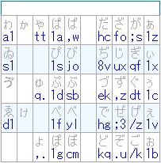

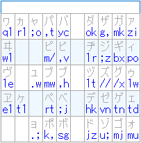


なお、副テーブルには専用の打鍵ヘルプを設定できます。設定できるのは、以下の2つのうちのどちらか1つです。
- `keyCharsPosition2` （副テーブルの1打鍵文字だけを集めた打鍵表）
- `strokePosition2` （指定文字列に含まれる文字を第1ストローク位置形式で表示する打鍵表）

#### 打鍵ヘルプファイル
どのような打鍵ヘルプをどの順序で表示するかは、`stroke-help.txt` に記述します。
記述方法の具体例については、同ファイルを参照ください。

#### 最後に出力した文字の打鍵ヘルプ表示
特殊機能 `StrokeHelp` を呼び出すと、ミニバッファに表示されている末尾文字について、
その打鍵ヘルプを表示することができます。
特殊機能の呼び出しについては、「[FAQ キーアサイン編](FAQ/FAQ-キーアサイン.md)」を参照してください。

#### ミニバッファへのコピペによるヘルプ表示
1文字をミニバッファにコピペすると、
- その文字の打鍵ヘルプ
- あるいは、部首合成ヘルプ

を表示します。
ここで打鍵ヘルプが表示された場合に、強制的に部首合成ヘルプを表示するには、
「[FAQ キーアサイン編](FAQ/FAQ-キーアサイン.md)」を参照して、
特殊機能 `BushuCompHelp` を適当なキーに割り当てて呼び出してください。

### ローマ字(またはひらがな)入力による打鍵ガイド
ローマ字(あるいはひらがな)で漢字の読みを入力すると、その読みを持つ文字の打鍵ガイドを表示する機能です。
漢直入力に入門したばかりの方にとって有用な機能だと思います。

下図は、「HANA」と入力したときの「はな」という読みを持つ文字に対する打鍵ガイドの表示例です。


ローマ字入力モード(あるいはひらがな入力モード)に入るのには次の3通りの方法があります。
1. 大文字ローマ字による打鍵ガイドがONの状態で、大文字英字を打鍵する
2. ローマ字による打鍵ガイドモードに移行する
3. ひらがなによる打鍵ガイドモードに移行する

1 の「大文字ローマ字による打鍵ガイド」をONにするには、さらに2通りの方法があります。<br/>
a. 設定ダイアログの「その他設定」-「打鍵ガイド」-「大文字ローマ字読みによる打鍵ガイドを常時有効」をONにする<br/>
b. 拡張修飾キー変換で、コマンド "UpperRomanStrokeGuide" を実行する

a は下図のように設定します。

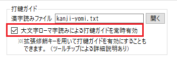

この場合は、英大文字を入力すると常にローマ字入力モードに入ってしまいます。

通常は英大文字をそのまま出力し、一時的にローマ字入力モードにしたい、という場合は、
上記設定をOFFにしておいて、b の方法を利用してください。zip に同梱してある mod-conversion.txt には
"UpperRomanStrokeGuide" の設定例（「無変換＋＼」）が記述されているので参考にしてください。

2 の場合は、拡張修飾キー変換で、コマンド "RomanStrokeGuide" を実行してください。
こちらも mod-conversion.txt に設定例（「無変換＋￥」）があるので参考にしてください。
こちらの場合は、英小文字で入力してもローマ字に変換します。
もう一度 "RomanStrokeGuide" を実行すると、 このモードから抜けます。

3 の場合は、拡張修飾キー変換で、コマンド "HiraganaStrokeGuide" を実行してください。
こちらも mod-conversion.txt に設定例（「無変換＋￥」）があるので参考にしてください。
こちらの場合は、ひらがな入力されたものから該当する漢字を検索します。
もう一度 "HiraganaStrokeGuide" を実行すると、このモードから抜けます。

打鍵ガイドが表示されている状態（小文字も含めたローマ字モードあるいはひらがなモードの場合は、
それを抜けた状態）で、表示されている文字の位置のキーを打鍵してみます。
たとえば、右下図において「離」の位置を打鍵すると、
左下図のように次の打鍵位置がピンク色で表示されます（この色は設定ダイアログで変更できます）。


#### 漢字読み定義ファイル
zip には、"kanji-yomi.txt" というファイルを同梱してあります。
常用漢字に対して、音読みはカタカナで、訓読みはひらがなで読みを与えてあります。
また、交ぜ書き辞書から抽出した漢字についても、ひらがなで読みを与えてあります。
ローマ字入力(またはひらがな入力)された読みに対して、音読みは完全一致したものだけを候補とします。
訓読みは、1文字なら完全一致、2文字以上なら先頭部分が一致したものを候補とします。

フォーマットは次のとおりです。
別の漢字読みファイルを作成したり、別の読みを追加したりする場合はこのフォーマットに従ってください。

```
漢字 <TAB> 読み ["|" 読み]...
```

### Ctrl-H や Ctrl-B,F,P,Nなどの特殊キーへの変換
漢直モードでない場合でも Ctrl修飾キーを特殊キーに変換することが可能です。
詳細は下記設定ダイアログのツールチップを参照ください。

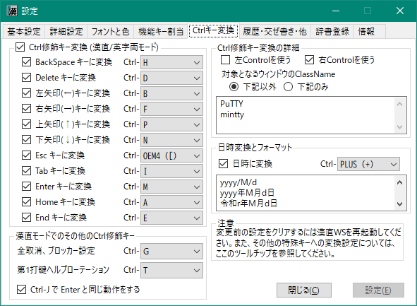

AutoHotKey 等に頼らずとも簡易に Ctrl修飾キーの変換が行えます。

### Spaceキーによる 拡張シフト機能をサポート (SandS)
漢直モードの時に、スペースキーを押しながら何か他のキーを押すとスペースキーが拡張シフトキーの働きをするという、
いわゆる「SandS」(Space and Shift)をサポートしました。
- スペースを入力したい時は、スペースキーを押してすぐ離す（スペースキー単打）
- スペースキーを長押しすると拡張シフト状態になる

有効にしたい場合は、設定ダイアログの
「その他設定」>「SandS」>「デコーダON時に SandS を有効にする」
および／または「デコーダOFF時に SandS を有効にする」
にチェックを入れてください。

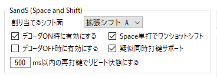

SandS はデフォルトでは通常シフト面に割り当てられています。
これを拡張シフト面に割り当てたい場合は、次項「拡張修飾キー」の説明を参照してください。

#### Space単打でワンショットシフト状態にする
これにチェックを入れると、Spaceキー単打では空白文字が入力されなくなり、
ワンショットシフト（前置シフト）状態になります。
次に何かキーを打鍵するとそのキーをシフトさせ、また通常状態に戻ります。

SandS の拡張シフト面にテーブルファイルの裏面定義を行っているような場合は、
最初にSpace単打することで裏面定義を呼び出せるようになります（Try-Code のような感じになる）。

この状態で空白を入力するには、
- 指定ms以内にもう一度Spaceを単打する
- SandSに割り当てたシフト面のどこかの打鍵に空白を定義する
- 拡張修飾キーによる変換定義で適当なキーを Space に変換する

などの方法があります。

なお、ワンショットシフト状態のときは、中央鍵盤の背景色が「副変換テーブル」使用時の色に変わります。

#### □ms以内の再打鍵で単打またはリピートを有効
ここで設定した時間(ms)以内にSpaceキーを再打鍵すると、空白文字の入力ができます。
再打鍵の際に長押しすればリピート入力になります。
これは上記の「Space単打でワンショットシフト状態にする」の設定に関わらず有効となります。

#### 疑似同時打鍵サポート
これを有効にすると多ストローク入力において SandS によるシフトの疑似同時打鍵がサポートされます。

具体的には第2打鍵が SandS によるシフト状態だった場合に、
第1打鍵も強制的にシフト状態に移行させることで実現しています。

したがって、第1打鍵のキーがシフトなしで押下された後でも、
第2打鍵を SandS でシフト状態にして打鍵すれば、第1打鍵が
シフト状態で押下されたものとして処理が行われます。

たとえば、「A, Space+B」という順序で打鍵した時に、
B の打鍵によって Space がシフト状態に変化した時点で第1打鍵の A が シフトA に置換されます。
これにより、「Space+A, B」という順序で押した場合でも「A, Space+B」
という順序で押した場合でも同じ文字が出力されるようになります。


### 機能キーを修飾キーとして使う(拡張修飾キー)
[FAQ キーアサイン編](FAQ/FAQ-キーアサイン.md) 参照。

### Google 日本語入力にインポートできるローマ字テーブルの出力
テーブルファイルと部首合成辞書を基に、Google 日本語入力でインポート可能な、
ローマ字テーブルファイルを出力することができます。

設定ダイアログの「その他設定」>「Google日本語入力 ローマ字テーブルファイル出力」のところの「出力」ボタンをクリックします。

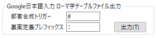

ファイルは、ルートフォルダ配下に `roman-stroke-table.txt` という名前で出力されます。

部首合成用のエントリをローマ字テーブルに出力する場合に、
テーブルファイルで定義されている文字のローマ字列と区別するために、
それらの文字と重ならないプレフィックスが必要となります。
デフォルトでは T-Code の前置部首合成のプレフィックスを使うようになっているので、
お使いのテーブルファイルに合わせて、出力に先立って変更しておいてください。

また、テーブルファイルの yomiConvert で定義した裏面文字に対するローマ字列を定義する際に、
通常面の文字のローマ字列と重ならないようにするためのプレフィックス文字列も設定できます。
このプレフィックス文字列は、 Try-Code のようにストロークに空白文字を含む場合も、
その空白文字を置換するのに使用されます。

### eelll/JS にインポートできるテーブルファイルの出力
漢直練習ツールの [eelll/JS](https://miau.github.io/eljs/eellljs.html) で
入力方式の「ユーザ定義」としてコピペできる形式のファイルを出力することができます。

設定ダイアログの「その他設定」-「eelll/JSテーブルファイル出力」のところの「出力」ボタンをクリックします。

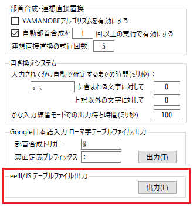

ファイルは、ルートフォルダ配下に `eelll-js-table.txt` という名前で出力されます。

### 他のキー変換ツールとの競合解消
かな入力のためのキーレイアウト変換ツールなどを当ツールと同時に使用すると、変換時の競合が発生して、
意図したキー変換が行われない場合があります。
そのような場合は、「詳細設定」-「他のキー変換ツールとの競合解消」-「extraInfo == のみを処理」
にチェックを入れてください。


ただし、この設定をした場合は、AutoHotKey 
などによるキー変換の結果も当ツールによる処理の対象外になりますので、留意ください。

### 直前打鍵位置の表示
kanchoku.user.ini で showLastStrokeByDiffBackColor=true と設定すると、
直前に打鍵した位置を仮想鍵盤上で背景色を変えて表示するようになります。

### KeyboardHookMonitor
Keyboard のグローバルフックを仕掛け、採取したキーボード入力情報を表示するツールです。
KanchokuWS の動作がおかしいと思ったときに使用してみてください。
[こちら](https://github.com/oktopus1959/KeyboardHookMonitor#readme)に説明があります。

## 既知のバグ
- 設定ダイアログを表示した状態で、アクティブウィンドウへの漢字入力ができなくなることがある
  - 常に発生するわけではなく、原因の特定に至っていない
- 交ぜ書きの辞書に同じ読みの無活用語とサ変が登録されており、それらの変換形が異なる場合において、一方の選択は他方に影響していない
  - たとえば「せんめつ /せん滅/」と「せんめつ/する /殲滅する/」があって、「せんめつ」を変換したときに表示される候補のうち、サ変のほうの変換形である「殲滅」を選択したとしても、無活用のほうの優先はやはり「せん滅」のままで変わらない。 
- 交ぜ書き開始位置の右移動と左移動を繰り返し呼び出すと表示が崩れることがある

## 今後の機能追加予定(順不同)

- 辞書ファイルの上書き警告
  - 終了時または再起動時に、読み込み時のタイムスタンプと比較して辞書ファイルのそれが新しかったら警告する
- 縦列鍵盤で、優先順位の並べ替え
  - 現在は左手小指が最優先
  - デフォルト(例：左人、右人、左中、右中の順)も用意するが、設定で変えられるようにする
- ミニバッファ編集
  - 出力先のエディタでの ← → によるカーソル移動や BS/DEL による文字削除に同期する
  - 同期がずれたら、End キーで末尾にアライン
  - カーソル位置での後置式変換が可能になる


## 引用元
- 元祖漢直窓のソースコードを全般的に参考にさせてもらっています。
  - とくにキーボードファイルのパーザはかなりの部分をそのまま引用しています。
  - 各種アイコンについても元祖漢直窓のものを流用しています。
- C# によるプログラミングでは、[DOBON.NET]()のコードスニペットを多数利用させていただいています。
- キーボードフックに関しては、下記サイトからソースを引用させていただいています：
  - https://aonasuzutsuki.hatenablog.jp/entry/2018/10/15/170958
- その他、キーポイントとなる箇所にはソース中に参照したページのURLを記しています。
- 本稿中のいくつかの図は、元祖漢直窓の[ドキュメント](https://github.com/kanchoku/kw/tree/master/doc) から引用させていただいています。
- kwbushu.rev は元祖漢直窓の kwbushu.rev を改編したものです。
- kwmaze.{slim,inflex}.dic は元祖漢直窓の kwmaze.dic を改編したものです。
- kwmaze.ipa.dic は NAIST 松本研で作成された mecab-ipadic を改編したものです。
  - mecab-ipadic のライセンスについては COPYING.mecab-ipadic を参照ください。
- kwmaze.wiki.txt は、 Wikipedia 日本語版のタイトル部分に対して読みを付与したものです。
  - 全タイトルの半分くらいが採取されています。
- kwhist.roman.txt は、国立国語研究所で作成された「UniDic」(https://clrd.ninjal.ac.jp/unidic/)
  から抽出しました。したがって当ファイルには UniDic と同じ CC BY-NC-SA ライセンスが適用されます
  (https://clrd.ninjal.ac.jp/unidic/faq.html#license)。

## 利用条件と免責
- 本プログラムおよびソースコードの利用は無償かつ自由ですが、無保証です。
  - 利用に際しては、それに起因するいかなる損害についても作者に責を負わせないことに同意ください。
  - 部首合成モジュールは新たに作成しました。したがってGPLの適用はありません。
  - 新しく追加した部首合成アルゴリズムや動的交ぜ書き方法が他の漢直ツールにも普及してくれると嬉しいです。
- 辞書その他のデータの利用については、引用元のライセンスに従ってください。

