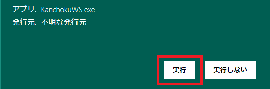

###### TOP

# KanchokuWS -- 漢直Win Spoiler -- インストールガイド
KanchokuWS (漢直WS) は、[漢直Win（漢直窓）](https://github.com/kanchoku/kw)の使い勝手を受け継ぎ、
かつ、利用者を徹底的に甘やかすことを目標として新たに開発された、
Windows 用の漢字直接入力ツールです。
また、英字配列や各種かな配列の実装プラットフォーム(エミュレータ)として利用することもできます。

本書は 漢直WS のインストール、起動および終了について説明したものです。
やりたいことから調べるには[FAQ](FAQ.md)を、
より詳細な利用方法については[利用者ガイド](MANUAL.md)を参照ください。

## 目次

- [動作環境と注意](#動作環境と注意)
    - [注意](#注意)
- [インストールとアンインストール](#インストールとアンインストール)
    - [インストール](#インストール)
    - [アンインストール](#アンインストール)
- [起動](#起動)
    - [起動時に警告が表示される場合](#起動時に警告が表示される場合)
    - [kw-uni.dll が起動できない場合](#kw-unidll-が起動できない場合)
    - [起動画面と設定ダイアログ](#起動画面と設定ダイアログ)
- [配列を選択する](#配列を選択する)
- [漢直モード（かな入力モード）に入る](#漢直モード（かな入力モード）に入る)
    - [漢直モードキーの変更](#漢直モードキーの変更)
- [漢直モードから出る](#漢直モードから出る)
- [ツールの終了](#ツールの終了)
- [アップデート](#アップデート)
- [ビルド環境](#ビルド環境)
- [利用条件と免責](#利用条件と免責)

## 動作環境と注意
動作対象環境は以下のとおりです。

Windows 10 および .NET Framework 4.8

### 注意
漢直WS は、
利用者によるキー入力情報を取得するために「**グローバルフック**」という手法を用いています。

この手法は、本来はデバッグ用途などでの一時的な使用が想定されており、
常用した場合はシステムの反応速度の低下などをもたらす可能性があります。

また、キー入力をプログラムで横取りする、という性質上、
セキュリティ上の懸念から会社などでの使用を許可されない場合もあるかもしれません。

以下は Microsoft社のドキュメント「[フックの概要](https://docs.microsoft.com/ja-jp/windows/win32/winmsg/about-hooks)」にある注意書きです。

漢直WS を利用される場合は、上記注意をご理解いただき、
末尾の「[利用条件と免責](#利用条件と免責)」に同意の上でのご利用をお願いします。

## インストールとアンインストール
### インストール
[Releaseページ](https://github.com/oktopus1959/KanchokuWS/releases/)
から最新の KanchokuWS-v*.zip をダウンロードして、適当なフォルダに展開してください。
以下のようなファイルが格納されています。以下、このフォルダを「**ルートフォルダ**」と呼称します。

### アンインストール
上記のルートフォルダを削除します。なお、レジストリは使用していません。

## 起動
bin\KanchokuWS.exe を実行します。CMDプロンプトから実行してもよいですし、
ファイルエクスプローラからダブルクリックで実行してもかまいません。

日常的に使用するのであれば、エクスプローラの右クリックメニューから
「スタートメニューにピン留めする」を実行して、
スタートメニューから起動できるようにしておくとよいでしょう。

### 起動時に警告が表示される場合
zipファイルをダウンロードして展開した直後には、以下のような警告が表示される場合があります。

この場合は、「詳細情報」をクリックして、次の画面で「実行」をクリックしてください。

### kw-uni.dll が起動できない場合
次のような画面が表示された場合は、kw-uni.dll (漢直デコーダ部)の実行に必要な環境が不足している可能性があります。

この場合は、「[vc_redist.x86.exe](https://aka.ms/vs/17/release/vc_redist.x86.exe)」をダウンロードして、
インストールしてください。
これは Visual C++ で作成されたプログラムを実行するのに必要なパッケージで、Microsoft社が提供しているものです。

詳細については、「vc_redist.x86 download」で検索をしてヒットする Microsoft のサイト
（2023年4月15日現在だと「[最新のサポートされる Visual C++ 再頒布可能パッケージのダウンロード](https://learn.microsoft.com/ja-jp/cpp/windows/latest-supported-vc-redist?view=msvc-170)」）
を参照してください。

### 起動画面と設定ダイアログ
起動すると起動画面(スプラッシュウィンドウ)が表示されます。

辞書ファイルなどの読み込みが完了すると「OK」「設定」というボタンが表示されるので、
初めての起動の場合は「設定」をクリックしてみてください。
設定ダイアログが開くので、各タブを一通り開いて見てください。
どんな機能があるか、おおよそ分かるかと思います。
（設定ダイアログは、タスクトレイのアイコンの右クリックメニューからも開くことができます）

辞書ファイルを除き、ほとんどの設定項目および設定ファイルの変更は、
「設定」または「再読込」ボタンをクリックすることで反映されます。

なお、ほとんどの設定項目にはツールチップによる説明を付与してあります。
テキストボックス、ラジオボタン、チェックボックスなど、入力用コントロールに
マウスポインタを合わせてみてください。約30秒間、その項目に対するツールチップが表示されます。

右端の「情報」タブにはバージョン番号、ビルド日時などの情報が記載されていますので、
ツールの不具合などを作者に連絡する際は、それをお伝えください。

## 配列を選択する
初期設定では「TUTR-Code」という漢直配列が設定されています。これを別の配列に変更するには、
設定ダイアログの「主テーブルファイル」のコンボボックスを開いてください。

漢直配列を選ぶ場合は、表示されたリストから適当なものを選択して「適用」をクリックします。

かな配列を選ぶ場合は、リストの上部の「..」をクリックします。下図のようなリストに変わるので、
「.\かな系」を選択します。

下図のように、かな配列の一覧が表示されるので、使用したい配列を選択して「適用」をクリックします。

## 漢直モード（かな入力モード）に入る
以下の方法で漢直モード（またはかな入力モード。以下、「漢直モード」で統一）に入ることができます。
- タスクトレイに格納されたアイコン  をクリックする
- Ctrl-￥を押す (デフォルト状態の場合。設定ダイアログから変更可能)

漢直モードに入ると、アイコンは  に変化し、
さらに下のような仮想鍵盤が表示されます。

### 漢直モードキーの変更
漢直モードに入るためのキーは、設定ダイアログの「基本設定」>「漢直モードトグル/OFFキー」で設定できます。
下図は、「変換」キー（Ctrlキーの修飾なし）を漢直モードのON/OFFキーとして設定した画面です。

主なキーについてはあらかじめコンボボックスに用意してありますのでそこから選択してください。

## 漢直モードから出る
以下の方法で漢直モードから出ることができます。
- タスクトレイに格納されたアイコン  をクリックする
- 仮想鍵盤をクリックする
- Ctrl-￥を押す (デフォルト状態の場合。設定ダイアログから変更可能)

## ツールの終了
- タスクトレイに格納されている本体アイコン
- 仮想鍵盤

のいずれかで右クリックすると、以下のようなメニューが表示されます。

終了する場合は「終了」をクリックしてください。

## アップデート
新しい漢直WSをダウンロードしたら、古い漢直WSのルートフォルダのファイルのうち、
更新日時の新しいファイルをコピーしてください。
具体的には下図のファイルをコピーすれば良いでしょう。

配列の定義ファイルなど、他にも追加・修正しているファイルがあれば、それもコピーしてください。
ただし、`kwhist.roman.txt` のように漢直WSがあらかじめ提供しているファイルを修正している場合は、
先にアップデートされたファイルとの差分を確認してからコピーしたほうが安全でしょう。

## ビルド環境
本ツールは、 Visual Studio 2022 によってビルドされています。

## 利用条件と免責
- 本プログラムおよびソースコードの利用は無償かつ自由ですが、無保証です。
  - 利用に際しては、それに起因するいかなる損害についても作者に責を負わせないことに同意ください。
  - 部首合成モジュールは新たに作成しました。したがってGPLの適用はありません。
  - 新しく追加した部首合成アルゴリズムや動的交ぜ書き方法が他の漢直ツールにも普及してくれると嬉しいです。
- 辞書その他のデータの利用については、引用元のライセンスに従ってください。

