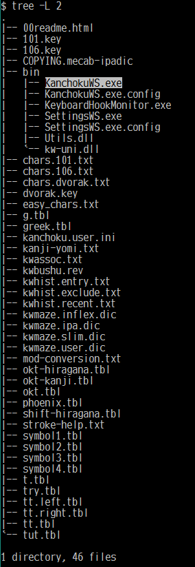
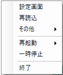
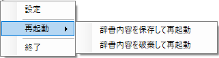
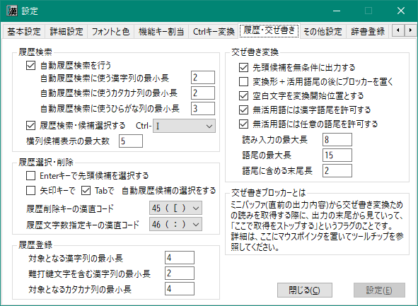
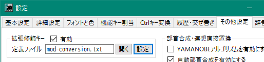

# KanchokuWS -- 漢直Win Spoiler
KanchokuWS は、[漢直Win（漢直窓）](https://github.com/kanchoku/kw)の使い勝手を受け継ぎ、
かつ、利用者を徹底的に甘やかすことを目標として新たに開発された、
Windows 用の漢字直接入力ツールです。

本稿では「KanchokuWS」と呼称していますが、「漢直窓S」「漢直WS」などの略称を用いる場合もあります。

## 目次

- [元祖漢直窓から受け継いだ機能](#元祖漢直窓から受け継いだ機能)
- [KanchokuWS で搭載された新機能](#KanchokuWS-で搭載された新機能)
- [動作環境](#動作環境)
- [インストールとアンインストール](#インストールとアンインストール)
    - [インストール](#インストール)
    - [アンインストール](#アンインストール)
- [起動](#起動)
    - [kw-uni.dll が起動できない場合](#kw-unidll-が起動できない場合)
    - [起動画面と設定ダイアログ](#起動画面と設定ダイアログ)
        - [起動画面の非表示](#起動画面の非表示)
- [漢直モードに入る](#漢直モードに入る)
    - [仮想鍵盤とモード標識](#仮想鍵盤とモード標識)
- [漢直モードから出る](#漢直モードから出る)
- [終了と再起動](#終了と再起動)
- [設定ファイル、その他各種ファイル](#設定ファイル、その他各種ファイル)
    - [kanchoku.ini の引き継ぎ](#kanchokuini-の引き継ぎ)
    - [各種ファイルの引き継ぎとUTF-8化](#各種ファイルの引き継ぎとUTF-8化)
        - [サロゲートペア](#サロゲートペア)
    - [テーブルファイル](#テーブルファイル)
        - [矢印記法](#矢印記法)
        - [外部ファイルのインクルード](#外部ファイルのインクルード)
    - [キーボードファイルによる機能キーの仮想キーコード定義](#キーボードファイルによる機能キーの仮想キーコード定義)
    - [辞書バックアップファイルの世代管理](#辞書バックアップファイルの世代管理)
- [補助入力機能](#補助入力機能)
    - [打鍵列への割り当て](#打鍵列への割り当て)
        - [テーブルファイルに記述](#テーブルファイルに記述)
        - [設定ダイアログで設定](#設定ダイアログで設定)
    - [ミニバッファとブロッカー](#ミニバッファとブロッカー)
    - [入力履歴検索](#入力履歴検索)
        - [自動履歴検索](#自動履歴検索)
        - [履歴候補の操作](#履歴候補の操作)
        - [履歴の手動登録](#履歴の手動登録)
    - [交ぜ書き変換](#交ぜ書き変換)
        - [交ぜ書きブロッカー](#交ぜ書きブロッカー)
        - [変換開始位置の移動](#変換開始位置の移動)
        - [動的交ぜ書き](#動的交ぜ書き)
        - [活用型](#活用型)
        - [交ぜ書き辞書](#交ぜ書き辞書)
        - [辞書登録](#辞書登録)
    - [連想入力](#連想入力)
        - [連想候補選択入力](#連想候補選択入力)
        - [連想直接入力](#連想直接入力)
        - [辞書登録](#辞書登録)
    - [部首合成](#部首合成)
        - [計算順序](#計算順序)
        - [YAMANOBEアルゴリズム](#YAMANOBEアルゴリズム)
        - [部品としての使用頻度の低い文字を優先](#部品としての使用頻度の低い文字を優先)
        - [各ステップごとに逆順演算を適用](#各ステップごとに逆順演算を適用)
        - [再帰合成(部品から合成可能な文字を用いた足し算)](#再帰合成部品から合成可能な文字を用いた足し算)
        - [合成の次候補出力](#合成の次候補出力)
        - [辞書登録](#辞書登録)
        - [辞書ファイルの再読み込み](#辞書ファイルの再読み込み)
    - [自動部首合成](#自動部首合成)
        - [特定の組み合わせを自動部首合成の対象から外す](#特定の組み合わせを自動部首合成の対象から外す)
        - [合成元の2文字に戻す](#合成元の2文字に戻す)
        - [辞書登録](#辞書登録)
    - [英数記号全角入力](#英数記号全角入力)
    - [カタカナ入力](#カタカナ入力)
- [設定ダイアログ](#設定ダイアログ)
- [その他の機能](#その他の機能)
    - [カレットに追随する仮想鍵盤](#カレットに追随する仮想鍵盤)
        - [仮想鍵盤の固定表示位置](#仮想鍵盤の固定表示位置)
        - [相対位置や固定位置の個別設定](#相対位置や固定位置の個別設定)
    - [高DPIモニターへの対応](#高DPIモニターへの対応)
        - [文字表示位置の調整](#文字表示位置の調整)
    - [打鍵ヘルプ](#打鍵ヘルプ)
        - [ミニバッファへのコピペによるヘルプ表示](#ミニバッファへのコピペによるヘルプ表示)
    - [Ctrl-H や Ctrl-B,F,P,Nなどの特殊キーへの変換](#Ctrl-H-や-Ctrl-BFPNなどの特殊キーへの変換)
    - [Spaceキーによる Shift機能をサポート (SandS)](#Spaceキーによる-Shift機能をサポート-SandS)
    - [CapsLock, 英数, 無変換, 変換, ひらがなキーを修飾キーとして使う](#CapsLock-英数-無変換-変換-ひらがなキーを修飾キーとして使う)
- [既知のバグ](#既知のバグ)
- [今後の機能追加予定(順不同)](#今後の機能追加予定順不同)
- [引用元](#引用元)
- [利用条件と免責](#利用条件と免責)

## 元祖漢直窓から受け継いだ機能
以下の機能は KanchokuWS でも利用可能です。

- テーブルファイルに基づく漢字直接入力
- 後置部首合成
- 後置交ぜ書き変換
- 英数記号全角入力
- カタカナ入力、カタカナ変換、半角カタカナ変換
- Shiftかな入力をカタカナ変換するモード

逆に言うと以下のような機能は受け継いでいません。

- 前置部首合成
- 前置交ぜ書き変換
- 熟語ガイド
- IME連携
- その他、いろんな機能

## KanchokuWS で搭載された新機能

- 入力履歴検索
- 動的交ぜ書き変換
- 連想入力
- 部首合成の新アルゴリズム
- UTF-8の全面採用(サロゲートペアもサポート)
- 設定ダイアログによるカスタマイズ

## 動作環境
動作対象環境は以下のとおりです。

Windows 10 および .NET Framework 4.8

## インストールとアンインストール
### インストール
[Releaseページ](https://github.com/oktopus1959/KanchokuWS/releases/)
から最新の KanchokuWS-v*.zip をダウンロードして、適当なフォルダに展開してください。
以下のようなファイルが格納されています。以下、このフォルダを「ルートフォルダ」と呼称します。



### アンインストール
上記のルートフォルダを削除します。なお、レジストリは使用していません。

## 起動
bin\KanchokuWS.exe を実行します。CMDプロンプトから実行してもよいですし、
ファイルエクスプローラからダブルクリックで実行してもかまいません。
日常的に使用するのであれば、エクスプローラの右クリックメニューから
「スタートメニューにピン留めする」を実行して、
スタートメニューから起動できるようにしておくとよいでしょう。

### kw-uni.dll が起動できない場合
次のような画面が表示された場合は、kw-uni.dll (漢直デコーダ部)の実行に必要な環境が不足している可能性があります。


この場合は、「vc_redist.x86 download」で検索をしてヒットする Microsoft のサイト
（2021年9月19日現在だと「[最新のサポートされる Visual C++ のダウンロード](https://support.microsoft.com/ja-jp/topic/%E6%9C%80%E6%96%B0%E3%81%AE%E3%82%B5%E3%83%9D%E3%83%BC%E3%83%88%E3%81%95%E3%82%8C%E3%82%8B-visual-c-%E3%81%AE%E3%83%80%E3%82%A6%E3%83%B3%E3%83%AD%E3%83%BC%E3%83%89-2647da03-1eea-4433-9aff-95f26a218cc0)」）
から、x86用の Visual C++ 再頒布可能パッケージ (vc_redist.x86.exe)をダウンロードして、
インストールしてください。
これは VC++ で作成されたプログラムを実行する際に必要となるもので、Microsoft社が提供しているものです。


### 起動画面と設定ダイアログ
起動すると起動画面(スプラッシュウィンドウ)が表示されます。


辞書ファイルなどの読み込みが完了すると「OK」「設定」というボタンが表示されるので、
初めての起動の場合は「設定」をクリックしてみてください。
設定ダイアログが開くので、各タブを一通り開いて見てください。
どんな機能があるか、おおよそ分かるかと思います。


なお、ほとんどの設定項目にはツールチップによる説明を付与してあります。
テキストボックス、ラジオボタン、チェックボックスなど、入力用コントロールに
マウスポインタを合わせてみてください。約30秒間、その項目に対するツールチップが表示されます。

#### 起動画面の非表示
起動画面は、「OK」ボタンまたは「設定」ボタンをクリックするか、漢直モードに移行するか、
あるいは、一定時間が経過すると非表示になります。
最初から非表示したい場合は、「設定」-「基本設定」-「開始・終了」-「起動画面の表示時間(秒)」を
0 に設定してください。

## 漢直モードに入る
以下の方法で漢直モードに入ることができます。
- タスクトレイに格納されたアイコン  をクリックする
- Ctrl-￥を押す (デフォルト状態の場合。設定ダイアログから変更可能)

漢直モードに入ると、アイコンは  に変化し、
さらに下のような仮想鍵盤が表示されます。


### 仮想鍵盤とモード標識

仮想鍵盤は、アクティブウィンドウのカレット位置に追随して移動します。
カレットからの相対的な表示位置を \[設定]-[詳細設定]-[仮想鍵盤・モード標識]
の「カレットからの相対表示位置」で設定することができます。

すでに漢直に習熟している方にとっては、仮想鍵盤の表示は煩わしいかと思います。
そのような場合は、\[設定]-[基本設定]-[仮想鍵盤表示]
で「モード標識」を選択して、モード標識表示に変更してみてください。

 のようなモード標識を表示するだけの状態になります。

モード標識表示時でも、 Ctrl-T を押すことで一時的に仮想鍵盤を表示することができます。

また、モード標識の表示すら不要、という場合は、 \[設定]-[詳細設定]-[仮想鍵盤・モード標識] で
- 漢直モード標識再表示間隔 = -1
- 英字モード標識表示時間 = 0

に設定してください。


## 漢直モードから出る
以下の方法で漢直モードから出ることができます。
- タスクトレイに格納されたアイコン  をクリックする
- 仮想鍵盤またはモード標識をクリックする
- Ctrl-￥を押す (デフォルト状態の場合。設定ダイアログから変更可能)

## 終了と再起動
- タスクトレイに格納されている本体アイコン
- 仮想鍵盤
- モード標識

のいずれかで右クリックすると、以下のようなメニューが表示されます。



終了する場合は「終了」をクリックしてください。
この場合、デコーダが保持している辞書の内容が自動的にファイルに保存されます。

再起動する場合は、さらに下図のようなサブメニューが表示されます。



辞書内容を保存するか、破棄するかに応じて適切なほうをクリックしてください。
たとえば、辞書ファイルを手作業で更新したので、自動保存をしたくない場合などは
「辞書内容を破棄して再起動」を選択してください。


## 設定ファイル、その他各種ファイル
ルートフォルダにある kanchoku.ini および kanchoku.user.ini が設定ファイルです。
ただ、このファイルを直接修正することはあまり必要ありません。
上述の設定ダイアログによって必要なカスタマイズは行えるようになっています。

カスタマイズの結果は kanchoku.user.ini に書き込まれます。
kanchoku.ini と kanchoku.user.ini の両方に同じエントリがある場合は、
kanchoku.user.ini のほうが優先されます。

### kanchoku.ini の引き継ぎ
インストール直後には、最低限の設定が記述された kanchoku.user.ini だけが存在しています。
元祖漢直窓を使用されている場合は、その kanchoku.ini をそのまま使うこともできます。
引き継がれる設定は、以下のとおりです。

|項目|内容|
|-|-|
|hotKey|Ctrl修飾ありの漢直モード トグルキー|
|unmodifiedHotKey|Ctrl修飾なしの漢直モード トグルキー|
|offHotKey|Ctrl修飾ありの漢直モード OFFキー|
|unmodifiedOffHotKey|Ctrl修飾なしの漢直モード OFFキー|
|tableFile|漢直方式のテーブルファイル|
|keyboard|キーボードファイル|
|bushu|部首合成辞書ファイル|
|shiftKana|Shiftでカタカナを入力|
|weakBS|BSで直前の打鍵のみを取り消す|

元祖漢直窓の kanchoku.ini を使う場合は、それを KanchokuWS のルートフォルダにコピーしてから
起動（または再起動）してください。
なお、キーボードファイルとして 106.key 以外を設定している場合は、
「設定」-「基本設定」「ファイル」-「キー・文字マップファイル」
も対応したものに変更してから起動(または再起動)してください。

### 各種ファイルの引き継ぎとUTF-8化

KanchokuWS が使用するファイルは、設定ファイルを除き、すべて UTF-8 でエンコードされています。
もし、 ShiftJIS で書かれた既存ファイルを引き継ぎたい場合は、エディタなどで
UTF-8 に変換してからルートフォルダにコピーしてください。

#### サロゲートペア
KanchokuWS はサロゲートペアもサポートしています。
- テーブルファイル
- 交ぜ書き辞書ファイル
- 部首合成辞書ファイル

などのファイルで「𠮷」や「𩸽」などの文字を使って確認してみてください。
（部首合成辞書については、部品のほうにはサロゲートペアを使えません）

### テーブルファイル
以下のテーブルファイルが用意されています。

|ファイル名|コード名|特徴|
|-|-|-|
|t.tbl|T-Code|2ストローク、カタカナあり、ひらがな・カタカナが無規則|
|tut.tbl|TUT-Code|多ストローク、カタカナなし|
|tt.tbl|TT-Code|T-Code + 多ストローク (fj/jf で拡張面に移動)|
|g.tbl|G-Code|多ストローク、カタカナあり|
|phoenix.tbl|phoenix|多ストローク、ひらがなが左右逆順も同文字、カタカナなし|
|okt.tbl|T-Code|作者個人用(T-Codeから派生)|

T-Code 以外は、ひらがな（カタカナ）が覚えやすい配置になっているものがほとんどです
（というか、T-Code が変態なだけとも言いますが） 。
TUT や phoenix のようにカタカナがテーブルファイルに存在しないものは、
カタカナ入力モードやひらがな→カタカナ変換機能を使って入力することになります。

打鍵列と文字の対応を記述するテーブルファイルの記法については、
元祖漢直Winの[ドキュメント](https://kanchoku.github.io/kw/doc/kanchoku_frame.html)の
「テーブルファイル」の項を参照ください。

#### 矢印記法
元祖漢直窓で実装されていた矢印記法をサポートしました。以下の拡張記法が使用できます。
- コード番号を「Snn」と記述すると nn のシフトコードになります。

たとえば、`-S40>@M` は「Shift+Space で交ぜ書き変換を呼び出す」ことを表します。

- コード番号を「Xn」と記述すると以下の表のような特殊キーを表すコードになります。

|コード記述|対応する特殊キー|
|-|-|
|X1|半角/全角|
|X3|CapsLock|
|X4|英数|
|X5|無変換|
|X6|変換|
|X7|ひらがな|

これにより、たとえば、`-X7>@K` と書くと、「ひらがな」キーによって「カタカナ変換モード」の
ON/OFFを切り替えられるようになります。

#### 外部ファイルのインクルード
`#include "filename"` という記述により、その場所に `filename` の内容を展開できます。
利用例としては、`okt.tbl` の末尾の
```
-47>
#include "greek.tbl"

-47>-44>
#include "symbol1.tbl"

-47>-45>
#include "symbol2.tbl"

-47>-46>
#include "symbol3.tbl"

-47>-47>
#include "symbol4.tbl"
```
と、`greek.txt`, `symbol1.tbl` などを参照ください。
なお、`symbol?.tbl` は `phoenix.tbl` から切り出したものです。

### キーボードファイルによる機能キーの仮想キーコード定義
キーボードファイルに機能キー(CapsLock, 無変換、変換、ひらがな、etc.)の仮想キーコード定義を書けるようにしました。
`keyName=vkey` という形で一行に1つの定義を記述します。vkey は 16進数です。以下、106.key での記述例です。

```
31, 32, 33, 34, 35, 36, 37, 38, 39, 30,
51, 57, 45, 52, 54, 59, 55, 49, 4f, 50,
41, 53, 44, 46, 47, 48, 4a, 4b, 4c, bb,
5a, 58, 43, 56, 42, 4e, 4d, bc, be, bf,
20, bd, de, dc, c0, db, ba, dd, e2, 00,

#esc=1b
#zenkaku=f3
#tab=09
#caps=14
#alnum=f0
nfer=eb
#xfer=1c
#kana=f2
#bs=08
#enter=0d
#ins=2d
#del=2e
#home=24
#end=23
#pgup=21
#pgdn=22
#up=26
#down=28
#left=25
#right=27
```

機能キーと keyName の対応は下記のようになります。keyName は大文字・小文字を区別しません。

|機能キー|keyName|
|-|-|
|エスケープ|Esc, Escape|
|半角／全角|Zenkaku|
|タブ|Tab|
|CapsLock|Caps, CapsLock|
|英数|Alnum, AlphaNum, Eisu|
|無変換|Nfer|
|変換|Xfer|
|ひらがな|Kana, Hiragana|
|BackSpace| BS, Back, BackSpace|
|Enter|Enter|
|Insert|Ins, Insert|
|Delete|Del, Delete|
|Home|Home|
|End|End|
|Page Up|PgUp, PageUp|
|Page Down|PgDn, PageDown|
|↑|Up, UpArrow|
|↓|Down, DownArrow|
|←|Left, LeftArrow|
|→|Right, RightArrow|

どのキーを押したときにどのような仮想キーコードが発生するかは、開発者用設定を以下のように設定して、
bin\KanchokuWS.log の出力を観察してください。


以下のような出力があれば、仮想キーコードとして 0xeb (235) が渡ってきていることが分かります。
```
DEBUH [KeyboardEventDispatcher.onKeyboardDownHandler(194)] CALLED: vkey=ebH(235), extraInfo=0
```

### 辞書バックアップファイルの世代管理
終了時（または辞書内容を保存して再起動時）には、既存の辞書ファイルが back ディレクトリに保存されます。
バックアップファイルの名前には、末尾に世代を表す数字が付加されます。
たとえば、履歴ファイルであれば、 back\\kwhist.user.txt.1 のような名前で保存されます。

バックアップファイルは、さらに何世代かにわたって保存されます。古い世代ほど、末尾の数字が大きくなります。
保存する世代数はデフォルトで3世代となっています。
世代数を変更したい場合は、「設定」-「詳細設定」-「辞書ファイル」-「ファイル保存世代数」で設定してください。


## 補助入力機能
KanchokuWS は漢字直接入力以外に、以下のような補助入力機能を備えています。
「標識」は、テーブルファイルに機能呼び出しを記述する際、「@」に続けて書かれる機能標識です。

|機能名|標識|備考|
|-|-|-
|入力履歴検索|!|縦列鍵盤による履歴候補の表示と選択|
|交ぜ書き変換|M|後置式の交ぜ書き変換|
|部首合成|B|後置式の部首合成|
|連想入力|A/a|Aは選択入力、aは直接入力|
|英数記号全角入力|Z/z|Zは全角変換モード、z は次の1文字のみ|
|カタカナ入力|K/k|Kはカタカナ変換モード、k は一括置換<br/>カタカナに対して一括置換するとひらがなに戻る|
|半角カタカナ変換|h|出力したカタカナを半角または全角に置換|
|ブロッカー設定|bs|ミニバッファの末尾文字のブロッカー設定または解除|

### 打鍵列への割り当て
上記機能の呼び出しは、以下の方法で打鍵列に割り当てることができます。
- テーブルファイルに「@{機能標識}」（例：`@M`）を記述する
- 設定ダイアログの「機能キー割当」タブで設定する

#### テーブルファイルに記述
これは従来からある方法となります。

なお、既存のテーブルファイルを(UTF-8に変換して)そのまま利用することもできますが、その場合、
上記表に示した機能標識以外を用いた機能割り当ては無効になります。

#### 設定ダイアログで設定
既存のテーブルファイルをそのまま使用したい場合は、
設定ダイアログの「設定」-「機能キー割当」タブで、打鍵列を設定するとよいでしょう。
ここでの設定は、テーブルファイルによる設定を上書きします。
設定方法の詳細については当該タブの説明文およびツールチップを参照ください。


なお、初期状態の kanchoku.user.ini には上記の機能について、デフォルトの呼び出し打鍵列が設定されています。
既存のテーブルファイルを使用する場合、これは、利用者の想定と異なった機能で上書きする可能性があります。
想定と異なる動きをする場合は、該当する機能に割り当てられている打鍵列を修正するか削除してください。

割り当てられるキーとしては、通常のストロークキーの他に、「Shift+Space」や「半角/全角」「英数」
「CapsLock」「無変換」「変換」「ひらがな」の特殊キーも使用可能です。

交ぜ書き変換については、v1.0.x では「履歴・交ぜ書き・他」タブの「交ぜ書き変換」のところで
「Shift-Spaceで交ぜ書き変換する」をONにすることで Shift-Space に割り当てていましたが、
v1.1.0以降では、上記「機能キー割当」タブの「交ぜ書き変換」に「S40」を設定するように変わりました。

### ミニバッファとブロッカー
ミニバッファは、仮想鍵盤の上部に位置するテキストボックスで、
アクティブウィンドウに送出された文字列を表示する、読み取り専用のバッファです。

履歴検索、交ぜ書き変換、部首合成など、後述するいくつかの機能は、
このミニバッファに表示されている文字列の末尾部分を採取して、
それに対して各機能を呼び出しています。

このミニバッファへの出力は、Ctrl-G(デフォルト) を押すとクリアされ、
それまでに出力した文字列が採取できなくなります。

見た目ではクリアされていますが、実際には「出力文字列の末尾に採取ブロッカーを設定」しています。
内部的には、そのブロッカーを遡って出力文字列を採取しないようになっているわけです。
 「ブロッカー」は Ctrl-G の他に Enter キーでも設定されます。

この「ブロッカー」は Ctrl-Shift-G で解除することができます。
また「Ctrl-Space」は、このブロッカーを解除してから履歴検索を行います。

ブロッカーは、@bs 標識を持つ補助入力機能によっても設定または解除することができます。

### 入力履歴検索

#### 自動履歴検索
漢直モードで入力した漢字文字列およびカタカナ文字列は、自動的に履歴として登録されます。
その後、何か文字が入力されると自動的に履歴検索をして、入力された文字が先頭部とマッチする
候補を表示します。
以下は、「中」と入力したときの履歴候補表示画面です（百人一首を入力した後の履歴です）。


背景色が緑色になっているものは優先候補（最近使用されたもの）です。
下の設定ダイアログで「Enterキーで先頭候補を選択する」にチェックが入っていると、
ここでEnterキーを押すことで先頭候補を出力することができます。

候補を選択したい場合は、
- Ctrl-Space キー （Ctrl-Space で履歴検索・候補選択する」がONの場合）
- Shift-Space キー （Shift-Space で履歴検索・候補選択する」がONの場合）
- 上下矢印キー （「矢印キーで自動履歴候補の選択をする」がONの場合）

で選択候補を移動させてください。

または「@`」(T-Code/106.key;デフォルト)を押して、後述の縦列鍵盤に移行して直接候補を選択することもできます。

履歴の自動検索を行いたくない場合は、
「設定」-「履歴・交ぜ書き」-「自動履歴検索を行う」のチェックを外してください。



「Ctrl-Space で履歴検索・候補選択する」または 「Shift-Space で履歴検索・候補選択する」
にチェックを入れておけば、それらのキーを押すことで、任意のタイミングで履歴検索ができます。

この設定タブでは、「何文字入力されたら自動検索を発動するか」を文字種ごとに設定できます。
他にもいろいろ設定項目があるので、マウスポインタを各項目のコントロールの上に置いて、
表示されるツールチップを参照してください。

#### 履歴候補の操作

自動履歴検索(あるいは Ctrl-Space などによる検索)では、候補が10個までしか表示されません。
それ以上の個数の候補を表示させたり、ゴミ登録されてしまった候補を削除したりするためには、
明示的な履歴検索を実行します。
この機能はデフォルト設定(T-Code/106.key)では「@`」に割り当てられています。
このキーを押すと以下のような縦列鍵盤が表示されます。


右矢印キーを押すと、さらに候補が表示されます。候補を選択するには、
列位置に対応するキーを押してください。<br/>
下図は元祖漢直窓の[ドキュメント](https://github.com/kanchoku/kw/tree/master/doc) から引用した
106キーボードの仮想鍵盤ですが、上図の「打鍵列」が「1」の列に、「打鍵用」が「0」の列に対応しています。


##### 直近候補の検索と文字数指定
Ctrl-G などでミニバッファをクリアしてから「@」で履歴検索をすると、直近に出力した履歴候補を表示します。
（ミニバッファの末尾文字列にマッチする履歴がない場合も同様）

ここで、「↓」キーを押すと、1文字の候補だけが表示されます。さらに「↓」を押すと2文字の候補だけが表示されます。
以下同様に、8文字まではその文字長の候補だけが表示され、その次は9文字以上の候補が表示されます。
もう一度押すと最初の状態に戻ります。
逆に「↑」キーを押すと、9文字以上の表示状態になり、その後、8文字、7文字、・・・、1文字候補の表示となり、
その後は元の状態に戻ります。


最近使用した語で、再度入力するのが面倒な語（たとえば「憂鬱」は「ゆううつ」から交ぜ書き変換する）は、
上図のように文字数指定で候補を表示させて選択するとよいでしょう。

なお、候補の文字数は、下図の「履歴文数字指定キーのHotKeyID」で指定したキーを押した後に
数字キーを押すことでも指定できます。


上図の設定の例だと、履歴候補表示時に「]」キーを押すと下図のような状態になり、
ここで「2」を押すと、2文字の候補だけが表示されます。


##### 履歴候補の削除
縦列鍵盤が表示されているときに「-=」キーを押してみてください(T-Code/106.key;デフォルト)。
下図のような表示に変わります。


不要な履歴があれば、ここで対応するキーを押すことで削除できます。
たとえば「打鍵目用」を削除したい場合は、「5」の列のキーを押します。

ゴミ登録された語以外にも、機微な語や四文字言葉など、人目に触れてはまずいものは削除しておきましょう。
削除された語は kwhist.exclude.txt というファイルに登録され、以後、同じ語を使用しても履歴には登録されません。

#### 履歴の手動登録
ひらがなを含む語や、短縮形、あるいはいったん削除した語は、手動で登録します。
登録方法には下記の2通りがあります。

- 仮想鍵盤の上部ミニバッファに文字列をコピペする
- 「設定」-「辞書登録」-「履歴登録」で登録する

たとえば「お世話になっております」を履歴として登録するには、
この文字列をコピーして仮想鍵盤のミニバッファにペーストするか、
あるいは「履歴登録」のところで直接入力して「登録」ボタンを押します。

##### 短縮形
手動による履歴の応用として、「短縮形」登録があります。これは、
```
短縮形文字列 | 本体文字列
```
という形式で履歴登録しておくと、選択された際に「本体文字列」だけが出力されて入力した短縮形を
置換する、というものです。

たとえば、
```
DKRED|<span style="color: darkred">
```
という登録をしておいて、漢直モードで「DKR」と打つと上記候補が表示されるので、それを選択すると
`DKR` が `<span style="color: darkred">` で置換される、というわけです。

### 交ぜ書き変換
KanchokuWS では後置式の交ぜ書き変換をサポートしています。
直前の出力文字列から、
「設定」-「履歴・交ぜ書き」-「読み入力の最大長」で設定した文字数までを読みとして取得し、
それにマッチする交ぜ書きエントリを検索して候補を表示します。

取得した読みに漢字が含まれている場合は、必ずその漢字を含むように変換を行います。
たとえば「ひどい目にあった」を交ぜ書き変換した場合は、「ひどい」だけでは変換を行わず、
「ひどい目」まで範囲を広げて候補検索します。

この例の場合は「ひど色目」などに変換されるのですが、これを修正するには後述の
「変換開始位置の移動」を参照してください。

#### 交ぜ書きブロッカー
交ぜ書き変換では専用のブロッカー(その文字を越えて読みとして採取しない)を用います。
交ぜ書き変換を実行すると、通常は変換形＋(活用)語尾の後ろにブロッカーが置かれますが、
設定により、出力文字列の末尾に置くようにすることもできます。
詳細については、設定ダイアログの「履歴・交ぜ書き・他」-「変換形＋活用語尾の後にブロッカーを置く」の
ツールチップを参照してください。

交ぜ書き変換直後は、"<" および ">" を打鍵することで、ブロッカーを左右に移動することができます。

たとえば、「だいひょうしていあんする」⇒「代表して|いあんする」⇒"<"⇒「代表し|ていあんする」⇒「代表し|提案する」
のような操作が行えます。


#### 変換開始位置の移動
設定ダイアログで「『>』で変換開始位置を右に移動する」をONにしている場合は、">" は変換開始位置の移動となります。

たとえば、「彼女にあう」を変換して「彼女似合う」となった(「にあう」が変換対象になった)場合は、
変換直後に「>」を入力すると変換開始位置が右にシフトするので、「彼女に逢う」と変換されます。

前述の「ひどい目」の例では、「い目」が後述の動的交ぜ書きにより「いろめ /色目/」にマッチするため、
最初は「ひど|色目にあう」と変換されますが、開始位置を右に移動することで、
「ひどい|目にあう」⇒「ひどい目に|遭う」などと変換できます。

">" を変換開始位置の移動に設定している場合でも、いったん "<" でブロッカー移動を行うと、
その後は右方へのブロッカー移動として機能します。

逆に、">" を変換開始位置の移動に設定しない場合は、ブロッカーが右端に位置している状態で ">" を打鍵すると
変換開始位置の右移動として機能します。

#### 動的交ぜ書き
ひらがなの読みとその変換形だけ用意すれば、
交ぜ書き入力された文字列にマッチするエントリをシステムのほうで自動で検索します。
たとえば、
```
かそうけんばん /仮想鍵盤/
```
という登録があったとしましょう。ここで、「か想けん盤」と打ってから「fj」(T-Code/106.key;デフォルト)と打つと、
交ぜ書き変換が呼び出され、「仮想鍵盤」に変換されます。
これは、ひらがな部分を「か.\*けん.\*」、漢字部分を「.\*想.\*盤」という正規表現に変換して、
読みと変換形の両方ともマッチするエントリを検索するという仕組みで実現しています。

後置式の特徴として、下図では、それ以外の候補も表示されています。


長い読みにマッチするものが優先候補として表示されます。
背景色が緑色のものは Enter キーを押すことでも選択できます。

動的交ぜ書き変換の仕組みによる副産物として、ワイルドカード(? と *)を使った交ぜ書きも可能です。
'?' は正規表現の '.' に、'\*' は同じく '.\*' に置換した上で上記の仕組みで検索が行われます。
たとえば「ア\*国」で交ぜ書き変換すると「アメリカ合衆国」が出力されます
(kwmaze.ipa.dic を使用している場合)。

下記ツイートに動的交ぜ書き変換の様子を動画で投稿していますので、興味のある方は参照ください。<br/>
https://twitter.com/kanchokker/status/1403533755701026826 <br/>
https://twitter.com/kanchokker/status/1411910765976506373


#### 活用型

読みの末尾に「/{基本形の語尾}」を付加することで、ある程度活用型を考慮した変換ができるようになります。
サポートしている活用型は以下のとおりです。変換形のほうは語尾を除いた形で登録します。

|語尾|活用型|登録例
|-|-|-|
|く|カ行五段|か/く /書/|
|ぐ|ガ行五段|こ/ぐ /漕/|
|す|サ行五段|はな/す /話/|
|つ|タ行五段|た/つ /立/|
|ぬ|ナ行五段|し/ぬ /死/|
|ぶ|バ行五段|と/ぶ /飛/|
|む|マ行五段|う/む /生/|
|る|ラ行五段|ふ/る /振/|
|る:5|ラ行五段|かえ/る:5 /帰/|
|う|ワ行五段|あ/う /会/|
|る|一段|み/る /見/|
|る:1|一段|かえ/る:1 /変え/|
|する|サ変|かいはつ/する /開発/|
|ずる|ザ変|しん/ずる /信/|
|い|形容詞|うつくし/い /美し/|
|な|形容動詞ナ型|しずか/な /静か/|
|の|形容動詞ノ型|ほんとう/の /本当/|

イ段、エ段に後接する「る」については、ある程度システムのほうで一段活用か五段活用かを
推定しますが、推定が間違う場合ものあるので、そのような場合は、語尾の後ろに「:1」や
「:5」を付加して「一段」「五段」であることを明示します。

活用する語については、交ぜ書き変換の際に語幹の後に何文字まで語尾を許容するかを設定する
ことができます。これをたとえば「4文字」に設定していると、「あっている」は「会っている」に
変換できますが、「あっていない」は「会っていない」に変換できません。ただしこの語尾長をあまり長くすると
誤変換も増えるので、適当な長さに調節してください。

#### 交ぜ書き辞書
交ぜ書き辞書として、以下のものを用意してあります。

|辞書名|内容|
|-|-|
|kwmaze.slim.dic|従来の交ぜ書き辞書から非活用語を抽出したもの|
|kwmaze.inflex.dic|従来の交ぜ書き辞書から活用語を抽出したもの|
|kwmaze.ipa.dic|mecab-ipadic から交ぜ書き辞書を構築したもの|
|kwmaze.wiki.dic|Wikipedia のタイトルから交ぜ書き辞書を構築したもの|

ただし、 kwmaze.wiki.dic は、インストール直後は kwmaze.wiki.txt というファイル名になっており、
そのままでは読み込まれません。この辞書はかなり大きいので、メモリを追加で400MB程度使います。
また、起動時の読み込み時間が長くなり、交ぜ書き変換にも時間がかかる場合があります。
お試しで使う場合は、右クリックメニューの「辞書読込」-「Wikipedia交ぜ書き辞書読込」をクリックしてください。
なお、読み込み中は漢直操作をしないでください。

もし起動時から Wikipedia辞書を利用する場合は、拡張子 `.txt` を `.dic` に変更してください。

#### 辞書登録
既存辞書に存在しない読みと変換形を登録することができます。
登録した内容は、 kwmaze.user.dic (デフォルトの場合)に保存されます。

登録方法には下記の2通りがあります。

- 仮想鍵盤の上部ミニバッファに文字列をコピペする
- 「設定」-「辞書登録」-「交ぜ書き登録」で登録する

形式は、
```
読み <空白> /変換形/ ...
```
です。
たとえば「とうきょうとっきょきょかきょく /東京特許許可局/」を登録するには、
この文字列をコピーして仮想鍵盤のミニバッファにペーストするか、
あるいは「交ぜ書き登録」のところで直接入力して「登録」ボタンを押します。

同一読みに対して複数の変換形がある場合は、それを「/」で区切って一行で記述することができます。
あるいは、1行1変化形で、同じ読みのエントリを複数回に分けて登録してもかまいません。

辞書登録については、設定ダイアログの「辞書登録」-「交ぜ書き登録」
のテキストボックスに付与したツールチップも参照ください。

### 連想入力
連想入力とは、ある一文字を別の一文字に変換するマッピング機能です。
マッピングは以下の4通りで提供されます。

1. 部首合成辞書から取得した部品<br/>
    例：恋 ⇒ 亦心
2. 自身および部品のうちの頻度が低いほうから合成可能な文字群<br/>
    例：恋 ⇒ 変奕弯・・・
3. 部首合成の実行<br/>
    例：「恋+糸 ⇒ 戀」を実行すると「恋 ⇒ 戀」が追加
4. 利用者が定義<br/>
    例： 「恋=愛」という辞書定義を記述する

#### 連想候補選択入力
上記のうち、利用者が明示的にかかわるのは 3 と 4 です。
3、4を実行の上、「恋」入力後に「\\\_」(T-Code/106.key;デフォルト)を押して、連想入力機能を呼び出すと、
下図のような縦列鍵盤が表示されます。


列位置に対応するキーを押すと文字が選択されて元の文字を置換します。<br/>
下図は元祖漢直窓の[ドキュメント](https://github.com/kanchoku/kw/tree/master/doc) から引用した
106キーボードの仮想鍵盤ですが、上図の「愛」が「1」の列に、「蛮」が「0」の列に対応しています。


#### 連想直接入力
上記の縦列鍵盤を表示せずに直接第1候補で置換する機能です。
デフォルトでは「:*」(T-Code/106.key)に割り当てられています。

続けて同機能を呼び出すと第2候補に置換されます。
さらに同機能を呼び出すと、上記縦列鍵盤が表示されて、候補選択モードに移行します。

#### 辞書登録
部首合成辞書から導出できない連想文字を登録することができます。
登録した内容は、 kwassoc.txt (デフォルトの場合)に保存されます。
（なお、当辞書には、システムが自動登録したエントリも含まれます）

登録方法には下記の2通りがあります。

- 仮想鍵盤の上部ミニバッファに文字列をコピペする
- 「設定」-「辞書登録」-「部首連想登録」で登録する

形式は、
```
文字=連想文字列
```
です。
たとえば「恋=愛」を登録するには、
この文字列をコピーして仮想鍵盤のミニバッファにペーストするか、
あるいは「交ぜ書き登録」のところで直接入力して「登録」ボタンを押します。

「連想文字列」の途中に「|」を挿入しておくと、先頭から「|」までの候補は優先順固定となります。

辞書登録については、設定ダイアログの「辞書登録」-「部首連想登録」
のテキストボックスに付与したツールチップも参照ください。


### 部首合成
部首合成とは、2つの文字から別の1つの文字へのマッピングの集まりです。
このマッピングを利用して、
- 2つの文字の合成(足し算)
- 文字を合成する部品の一方を取り出す(引き算)

といった演算を繰り返して、解が得られたら、それを出力する、という機能です。

KanchokuWS の部首合成は、以下のような特徴・機能をもっています。

- YAMANOBEアルゴリズム（Yアルゴ）の標準採用
- 部品としての使用頻度の低い文字を優先
- 同一文字に対する複数の合成定義が可能
  - 先頭のものは合成と分解の両方のステップに用いられる
  - 残りは合成ステップだけで用いられる
- 各ステップごとに逆順演算を適用
- 部品から合成可能な文字を用いた足し算(再帰合成)

#### 計算順序
1. 本体文字同士の足し算(合成)
1. 同逆順
1. 片方の文字に等価文字を使って足し算(合成)
1. 同逆順
1. 等価文字同士で足し算(合成)
1. 同逆順

「等価文字」とは、部首合成辞書で「AB」というように2文字だけからなる定義によって、
「A」と「B」が相互に入れ替え可能であると定義された文字のことです。

ここまでで合成文字が見つからなければ、本体文字を構成する部品を使います。

7. 引き算 (たとえば 村－木 ⇒ (木＋寸)－木 ⇒ 寸)
1. 同逆順
1. YAMANOBE_ADD
1. 同逆順
1. YAMANOBE_SUBTRACT
1. 同逆順
1. 一方が部品による足し算
1. 同逆順
1. YAMANOBE_ADD(Bが部品)
1. 同逆順(Aが部品)
1. 両方が部品による足し算
1. 同逆順
1. 部品による引き算
1. 同逆順
1. YAMANOBE_SUBTRACT (Bが部品)
1. 同逆順(Aが部品)
1. 再帰合成
1. 同逆順

計算過程に興味のある方は、「設定」-「詳細設定」-「開発者用設定」-「部首合成結果をログ出力する」
にチェックを入れて部首合成を実行してみてください。
bin\\kw-uni.log に計算過程がログ出力されます。ソースコードの
kw-uni\\BushuComp\\BushuDic.cpp:FindComposite() と照らしあわせてみてください。
タグ部分に -Y-ADD/-Y-SUB が含まれるのが Yアルゴ、T/U で始まるのが再帰合成です。

#### YAMANOBEアルゴリズム
YAMANOBEアルゴリズムを端的に説明すれば「部品入れ替えによる足し算と引き算」ということになろうかと思います。

Yアルゴには、足し算と引き算があります。

足し算の例は、
「焼＋土」⇒「（火＋尭）＋土」⇒「火＋(尭＋土)」⇒「火＋堯」⇒「燒」というようなものです。

引き算の例は、「準－シ」⇒「(淮＋十)－シ」⇒「(淮－シ)＋十」⇒「隹＋十」⇒「隼」というようなものです。


#### 部品としての使用頻度の低い文字を優先
たとえば「巧」を「工＋５」で、「朽」を「木＋５ｊで定義しているとき、従来のアルゴリズムでは
「木＋巧」⇒「木＋（工＋５）」⇒「木＋工」⇒「杠」となっていました。

KanchokuWS では、辞書読み込み時に部品としての使用頻度を計算しておき、
使用頻度の低いほうの部品を優先的に使うようにしています。

上の例では、「工」よりも「５」のほうが部品しての使用頻度が低いので、
「木＋（工＋５）」⇒「木＋５」⇒「朽」となります。


#### 各ステップごとに逆順演算を適用
元祖漢直窓では、まず2つの文字の順序を固定して一通りの計算を実行し、それでも解が得られなかった場合、
2つの文字の順序を入れ替えて再計算を行っていました。
 その場合、たとえば「甚＋土」は「（其＋ル）＋土」⇒「其＋土」⇒「基」が得られます。

一方、KanchokuWS のように各計算ステップごとに文字の順序入れ替え(逆順)も計算すると、
「甚＋土」は「甚＋土」⇒なし⇒「土＋甚」⇒「堪」が得られます。

どちらが良いかは一概には決められないかと思います。
元祖漢直窓の部首合成定義は、全計算ステップ終了後での逆順計算を念頭に作成されているという面もあります。
また、初期の頃のT-Code実装では、2つの文字の順序をあらかじめソートしておき、
文字順にかかわらず同じ解が出るようになっていたと記憶しています。
これについては tcode-ml で議論があり、作者も当時は「文字順序を保持した合成手順にすべき」
(つまり元祖漢直窓と同じ手順)という主張をしていました。

今回は、各ステップごとの逆順演算でしばらく使用してみて、利用者の方からの意見を聞いてみたいと思っています。

#### 再帰合成(部品から合成可能な文字を用いた足し算)
元祖漢直窓では、「踏」の部首合成定義は「踏＝足＋水」になっていました。
標準 T-Code では「沓」が2ストロークで打てないので、苦肉の策としてそのような定義にしていたわけです。

でもこれだと「足 + 日」では「踏」が出せません。
そこで漢直窓Sでは、「部品から足し算で合成可能な文字も部品として使う」という方策を取り入れました。
つまり「踏＝足＋沓」という定義にしておいて、「足＋日」の組み合わせからは合成文字が得られなかった場合、
1. 「足」と「『日』から合成可能な文字」の組み合わせ
2. 「『足』から合成可能な文字」と「日」の組み合わせ

を試す、ということです。これだと「沓」は「日」から合成可能なので、
「足＋沓」から「踏」が得られるというわけです。

他にも「瞳」は従来から「瞳＝目＋童」になっていたわけですが、
そして標準 T-Code では「童」を2ストロークで打てないわけですが、
これからは「目＋立」または「目＋里」で「瞳」を合成できるわけです。

#### 合成の次候補出力
部首合成の実行直後に上述の「連想直接入力」を呼び出すと、次の合成候補出力になります。
たとえば、「糸」と「工」を合成すると、第1候補として「紅」が出力されますが、
ここで「:*」(T-Code/106.key;デフォルト)を押すと、次の合成候補である「縒」に置換されます。
候補が一巡すると最初の候補に戻ります。

#### 辞書登録
新しい部首合成を登録することができます。
登録した内容は、既存の kwbushu.rev (デフォルトの場合)の末尾に追記する形で保存されます。
既存のエントリの修正はできないのでご注意ください。

設定ダイアログの「辞書登録」-「部首合成登録」で登録してください。
記述方法については、そこのテキストボックスに付与したツールチップを参照ください。

#### 辞書ファイルの再読み込み
部首合成辞書については、部品の連鎖を考慮して複数のエントリを同時に修正することがあるかと思います。
そのような場合は、エディタなどを使って直接辞書ファイルを修正することになります。

部首合成辞書の修正が終わったら、右クリックメニューから「部首合成辞書再読込」を実行してください。


現在デコーダに保持されている部首合成辞書の内容を破棄した上で、部首合成辞書を読み込み直します。

### 自動部首合成
自動部首合成とは、一度部首合成を実行すると、次からは、
その時の文字の組み合わせ(順序も含む)を入力するだけで自動的に部首合成を呼び出すというものです。

この機能を有効にするには、設定ダイアログの「辞書登録・その他」-「自動部首変換を有効にする」
をONにしてください。


ただし、部首合成をした2文字が両方とも平仮名または片仮名の場合は、自動部首合成の対象としません。
もし、これらの文字の組み合わせを自動部首合成の対象にしたい場合は、「自動部首合成登録」を
行ってください。

#### 特定の組み合わせを自動部首合成の対象から外す
たとえば「非オ」で部首合成を実行し「排」に変換したけれども、これは自動合成の対象外にしたい、という場合です。
そのような場合は、「非-オ」のように間に「-」(ハイフン)を挾んで入力してから部首合成を呼び出してください。
これにより、後述の辞書登録による無効化と同様の登録が行われます。

#### 合成元の2文字に戻す
自動部首合成の実行直後に「連想直接入力」を呼び出すと、合成された文字を削除して元の2文字に戻します。
たとえば、「メリ」で「刈」となるような登録がされている状態で「メリット」と入力したい場合は、
「メリ」⇒「刈」となった時点で「連想直接入力」を呼び出して「メリ」に戻し、続けて「ット」と入力します。

#### 辞書登録
自動部首合成辞書登録により、部首合成辞書にない組み合わせを登録したり、
登録済みの組み合わせを無効化したりできます。

設定ダイアログの「辞書登録・その他」-「自動部首合成登録」で登録してください。
記述方法については、そこのテキストボックスに付与したツールチップを参照ください。

### 英数記号全角入力
「^~」(T-Code/106.key;デフォルト)を押すと全角変換モードに移行します。
当モードでの通常打鍵およびShift打鍵は、
「キー・文字マップファイル」に定義された文字を全角変換して出力します。

当モードから抜けるには、Esc または Ctrl-G を押してください。

他に、直後の1文字を全角変換する機能もあります。
「]}」(T-Code/106.key;デフォルト)を押してください。

### カタカナ入力
ひらがなからカタカナに変換して入力する機能として、以下の3通りをサポートしています。

- 入力したひらがなをその場でカタカナに変換して出力するモード
- 直前に入力したひらがな列を一括でカタカナに変換する後置変換
- Shiftキーを押しながら入力したひらがなをカタカナに変換して出力するモード

それぞれ、設定ダイアログの
- 「機能キー割当」-「前置呼び出し機能」-「カタカナ変換(モード)」
- 「機能キー割当」-「後置呼び出し機能」-「カタカナ変換(一括)」
- 「辞書登録・その他」-「その他変換・機能」-「Shift入力された平仮名をカタカナに変換する」

のツールチップを参照ください。

## 設定ダイアログ
タスクトレイに格納されたアイコン、仮想鍵盤、またはモード標識で右クリックすると
以下のようなメニューが表示されます。


ここで「設定」をクリックすると設定ダイアログが開きます。

設定ダイアログの内容については、実際に使ってみれば分かとかと思うので、説明は省略します。
要所々々にツールチップを埋め込んであるので、それを参照ください。


## その他の機能
### カレットに追随する仮想鍵盤
おおむねアクティブウィンドウのカレット位置に追随します。

- CMDプロンプト
- Word や Excel などで、矢印キーでカレットを移動した直後
- アクティブウィンドウのどの入力コントールもフォーカスを持っていない

という場合は、カレット位置が取れなくなることがあります。
カレット位置が取れない場合は、アクティブウィンドウの右下位置に仮想鍵盤を移動させます。

仮想鍵盤の表示位置は、カレット右下位置からのオフセットで指定します。
詳細については、下図の「カレットからの相対表示位置」や「X」「Y」のところのツールチップを参照してください。


#### 仮想鍵盤の固定表示位置
カレットに追随するのではなく、固定位置に仮想鍵盤を表示したい場合は、下図のように「固定表示位置」を選択して
X-スクリーン座標とY-スクリーン座標を指定してください。


#### 相対位置や固定位置の個別設定
対象アプリ（ウィンドウ）ごとに、仮想鍵盤の表示位置（カレットからの相対位置や固定位置）を設定することができます。
設定方法は下記のとおりです。

1. 対象となるアプリのウィンドウクラス名を調べる
   - これは対象ウィンドウをアクティブにした状態で、漢直モードをONに切り替えて仮想鍵盤を表示させると、
     上部のミニバッファにウィンドウクラス名が表示されるので、それをコピーしてください。
2. kanchoku.user.ini（または kanchoku.ini）をエディタなどで開く
3. 上記のウィンドウクラス名（の先頭部）をセクション名として新しいセクションを追加する
4. 追加したセクションに下記の設定を追記する：
    - `caretOffset=xx,yy` （xx, yy はカレット右下端からの相代表示位置）
    - `vkbFixedPos=xx,yy`  (xx, yy はスクリーン座標によるX軸とY軸の座標)

たとえば、 Word の場合はウィンドウクラス名が「\_WwG」なので、次のようなセクションを追加します。
```
[_WwG]
caretOffset=50,50
```

Chrome の場合に固定位置に表示したい場合は、次のようなセクションを追加します。
この例では、Chrome の入力エリアのウィンドウクラス名の先頭部をセクション名として設定しています。
```
[Chrome_WidgetWin]
vkbFixedPos=1700,950
```

5. 変更を保存したら、設定ダイアログを開き「基本設定」-「再読込」を実行してください。
これで kanchoku.\*.ini の変更が漢直窓Sに反映されます。

### 高DPIモニターへの対応
Windows のディスプレイ設定の「拡大縮小とレイアウト」のところで、
「テキスト、アプリ、その他の項目のサイズを変更する」を100%以外に設定している場合でも、
仮想鍵盤がカレット位置に追随するようになりました。

ただし、複数のモニターを接続していて、それらの表示スケールが異なる場合は注意が必要です。
そのような場合は、`ルートフォルダ\\bin\\KanchokuWS.exe.config` をエディタなどで開いて、
次のように修正してから、漢直窓Sを再起動してください。
```
    <System.Windows.Forms.ApplicationConfigurationSection>
        <!--
        <add key="DpiAwareness" value="System"/>
        -->
        <add key="DpiAwareness" value="PerMonitorV2"/>
    </System.Windows.Forms.ApplicationConfigurationSection>
```


つまり `<add key="DpiAwareness" value="PerMonitorV2"/>` のほうを有効にするわけです。
これによってモニターごとのDPI設定がカレット位置に反映されるようになります。

ただ、このような設定に変更すると、設定ダイアログの表示が崩れます。
それでもある程度は操作できますが、ストレスなく操作したい場合は、別アプリである
`SettingsWS.exe` を起動してみてください。

これは KanchokuWS から設定ダイアログだけを起動するように改造したものです。
別プロセスとして動くので、そこでの設定変更を稼動中の漢直窓Sに反映するには、
漢直窓Sから呼び出した設定ダイアログの基本設定で「再読込」を実行する必要があります。

#### 文字表示位置の調整
高DPIにした場合、仮想鍵盤での文字表示が、枠の中央からずれる場合があります。
また、高DPIでなくとも、別のフォントを選択した場合は、やはり表示がずれることがあります。

そのような場合は、設定ダイアログの「フォントと色」-「仮想鍵盤フォント」のところで、
「左余白」と「上余白」を設定してみてください。
設定方法については、設定ダイアログのフォント設定テキストボックスに付与したツールチップを参照ください。


### 打鍵ヘルプ
仮想鍵盤に表示される打鍵ヘルプには以下のものがあります。
- 第1打鍵時のヘルプ
- 第2打鍵以降を待っているときの打鍵位置の文字表示

後者は、元祖漢直窓から引き継いだ機能です。

前者には、さらに
- ストローク位置形式 ： 第1打鍵位置への文字表示
- ストロークキー形式 ： 文字に対する第1・第2打鍵を、英数モード時の文字並びで表示

の2通りが用意されています。

これには以下のようなものがあります。
これらは、仮想鍵盤表示時に Ctrl-T または Ctrl-Shift-T
（ショートカットキーは設定ダイアログで変更可）によってローテートすることができます。

|項目|方式|説明|
|-|-|-|
|追加文字|位置|オリジナルT-Code に対して追加された、最上段キーを打鍵に含み<br/> 左・左または右・右という運指となる文字群の、代表文字を表示|
|シフト文字|位置|シフトキーを押しながら1打鍵で入力できる文字を打鍵位置に表示|
|文字集合|位置|利用者が指定した文字列に含まれる文字を第1打鍵位置に表示|
|文字集合|キー|利用者が指定した文字列に含まれる文字のストロークキーを表示|
|ひらがな第1面|キー|ひらがな清音(あい～かき～わをん)のストロークキーを表示|
|ひらがな第2面|キー|ひらがな(半)濁音・促音・拗音(ぁぃ～がぎ～ゃゅょゎゐゑ)<br/>のストロークキーを表示|
|カタカナ第1面|キー|カタカナ清音(アイ～カキ～ワヲン)のストロークキーを表示|
|カタカナ第2面|キー|カタカナ(半)濁音・促音・拗音(ァィ～ガギ～ャュョヮヰヱヵヶ)<br/>のストロークキーを表示|

たとえば、デフォルトのインストール状態で、仮想鍵盤表示時に Ctrl-T を押すと次のようなヘルプが表示されます。
（Ctrl-Shift-T を押すと逆順で表示）


どのような打鍵ヘルプをどの順序で表示するかは、stroke-help.txt に記述します。
記述方法の具体例については、同ファイルを参照ください。

#### ミニバッファへのコピペによるヘルプ表示
1文字をミニバッファにコピペすると、
- その文字の打鍵ヘルプ
- あるいは、部首合成ヘルプ

を表示します。

### Ctrl-H や Ctrl-B,F,P,Nなどの特殊キーへの変換
漢直モードでない場合でも Ctrl修飾キーを特殊キーに変換することが可能です。
詳細は下記設定ダイアログのツールチップを参照ください。


AutoHotKey によるキー変換機能に満足できない方、具体的には
- Ctrl-H を BS に変換してリピート入力していると、時々、変換されずに「h」が入力される
- とくに困るのが Ctrl-P で、上矢印に変換しているのに、いきなり印刷になってしまう

というような方は試してみてください。

### Spaceキーによる Shift機能をサポート (SandS)
漢直モードの時に、スペースキーを押しながら何か他のキーを押すとスペースキーがShiftキーの働きをするという、
いわゆる「SandS」(Space and Shift)をサポートしました。
- スペースを入力したい時は、スペースキーを押してすぐ離す
- スペースキーを長押しするとShiftキーを長押ししているのと同じ状態になる
  - ただし、スペースキーを長押し時に Ctrl+□ を押すと Shift 状態は無視して Ctrl+□ が入力される

有効にしたい場合は、設定ダイアログの
「辞書登録・その他」-「その他変換・機能」-「デコーダON時に SandS を有効にする」
および／または「デコーダOFF時に SandS を有効にする」
にチェックを入れてください。

### CapsLock, 英数, 無変換, 変換, ひらがなキーを修飾キーとして使う
CapsLock, 英数, 無変換, 変換, ひらがなの5つのキーを修飾キーとして使用し、
これらのキーと漢直ストロークキーを同時に押した時に、
Esc, Tab, BackSpace, Enter, Insert, Delete, Home, End, PageUp, PageDown, UpArrow, DownArrow, LeftArrow, RightArrow
キーのいずれかのキーに変換することができます。使用できるキー名については、
[キーボードファイルによる機能キーの仮想キーコード定義](#キーボードファイルによる機能キーの仮想キーコード定義)
を参照してください。

また、下記の特殊機能の呼び出しも割り当てることができます。

|呼び出し名|機能|
|-|-|
|ModeToggle|漢直モードのトグル|
|Activate|漢直モードに入る|
|Deactivate|漢直モードから出る|
|FullEscape|入力途中状態をクリアし、ミニバッファ末尾にブロッカーを置く|
|Unblock|ミニバッファ末尾のブロッカーを解除する|
|HistNext|履歴を先頭から選択|
|HistPrev|履歴を末尾から選択|
|helpRotate|ストロークヘルプの正順回転|
|helpUnRotate|ストロークヘルプの逆順回転|
|DateRotate|日付の正順入力|
|DateUnrotate|日付の逆順入力|

この機能を使用する場合は、下図のように「辞書登録・その他」-「その他変換・機能」で「修飾キー変換ファイル」に
修飾キー変換の定義ファイル名を設定してください。



例として「mod-conversion.txt」というファイルを用意してありますので、
記述方法についてはそのファイルを参照してください。
ファイル名の変更やファイル内に記述した定義の修正は、
漢直窓Sの再起動または「基本設定」タブで「再読込」をクリックすると有効となります。


## 既知のバグ
- 設定ダイアログを表示した状態で、アクティブウィンドウへの漢字入力ができなくなることがある
  - 常に発生するわけではなく、原因の特定に至っていない


## 今後の機能追加予定(順不同)

- 辞書ファイルの上書き警告
  - 終了時または再起動時に、読み込み時のタイムスタンプと比較して辞書ファイルのそれが新しかったら警告する
- 縦列鍵盤で、優先順位の並べ替え
  - 現在は左手小指が最優先
  - デフォルト(例：左人、右人、左中、右中の順)も用意するが、設定で変えられるようにする
- 英数字入力モード
  - 英数字文字列も履歴検索の対象となる
- 打鍵ヘルプ
  - ローマ字入力に対して、その読みを持つ漢字・ひらがなを第1打鍵位置に表示する
  - 難打鍵文字(容易打鍵文字以外)を第1打鍵位置に表示する
  - 出力文字に対するヘルプ呼び出し(ストローク、部首合成)
- 矢印記法における第1打鍵分散のサポート
  - `-*>-n>{ ・・・ }` により、`{ ・・・ }` 内の文字を第2打鍵 `n` について定義する。TUT の空白キーによる記号入力のイメージ。
- ミニバッファ編集
  - 出力先のエディタでの ← → によるカーソル移動や BS/DEL による文字削除に同期する
  - 同期がずれたら、End キーで末尾にアライン
  - カーソル位置での後置式変換が可能になる
- 漢索窓連携
  - Ctrl-^ とかで、現在選択されている文字列を漢索窓にコピペする


## 引用元
- 元祖漢直窓のソースコードを全般的に参考にさせてもらっています。
  - とくにキーボードファイルのパーザはかなりの部分をそのまま引用しています。
  - 各種アイコンについても元祖漢直窓のものを流用しています。
- C# によるプログラミングでは、[DOBON.NET]()のコードスニペットを多数利用させていただいています。
- その他、キーポイントとなる箇所にはソース中に参照したページのURLを記しています。
- 本稿中のいくつかの図は、元祖漢直窓の[ドキュメント](https://github.com/kanchoku/kw/tree/master/doc) から引用させていただいています。
- kwbushu.rev は元祖漢直窓の kwbushu.rev を改編したものです。
- kwmaze.{slim,inflex}.dic は元祖漢直窓の kwmaze.dic を改編したものです。
- kwmaze.ipa.dic は NAIST 松本研で作成された mecab-ipadic を改編したものです。
  - mecab-ipadic のライセンスについては COPYING.mecab-ipadic を参照ください。
- kwmaze.wiki.txt は、 Wikipedia 日本語版のタイトル部分に対して読みを付与したものです。
  - 全タイトルの半分くらいが採取されています。

## 利用条件と免責
- 本プログラムおよびソースコードの利用は無償かつ自由ですが、無保証です。
  - 利用に際しては、それに起因するいかなる損害についても作者に責を負わせないことに同意ください。
  - 部首合成モジュールは新たに作成しました。したがってGPLの適用はありません。
  - 新しく追加した部首合成アルゴリズムや動的交ぜ書き方法が他の漢直ツールにも普及してくれると嬉しいです。
- 辞書その他のデータの利用については、引用元のライセンスに従ってください。

